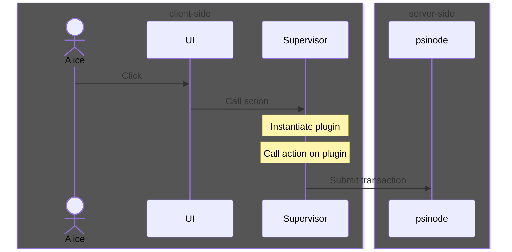
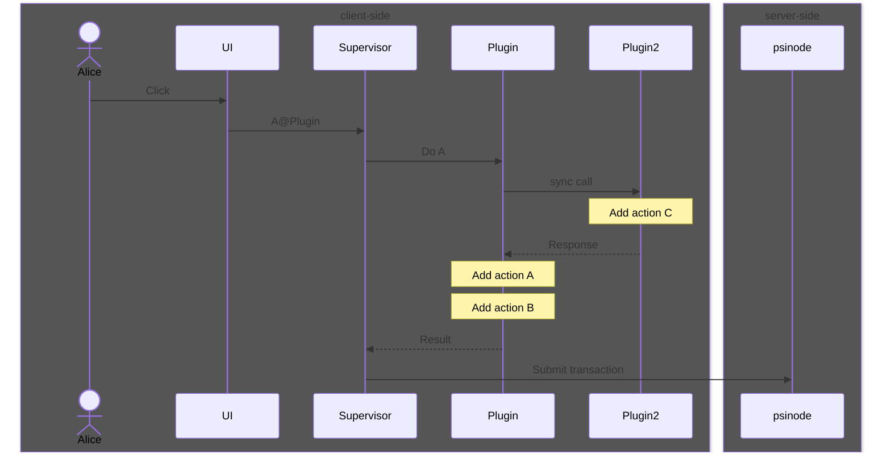

# Plugins

Plugins manage client-side user interactions and enable external integrations with psibase apps. Typically, they are stored in and served from a service and they run within a users's browser.

Similar to services, they run within a WebAssembly VM, except that they run on the client-side rather than on the server-side. This gives them unique capabilities that are unavailable to services, such as the ability to directly interact with the user and work with private user data.

## Plugin anatomy

Plugins are compiled to and stored on the server as [WebAssembly Components](https://component-model.bytecodealliance.org/). This gives them statically-analyzable capability-based security through the use of explicit import and export declarations written in the [WIT](https://component-model.bytecodealliance.org/design/wit.html) interface description language (IDL).

This means that plugins are only able to execute functionality that is explicilty provided to them and they are only able to be interacted with via an explicitly exported function interface. This import and export interface are defined at compile-time, and therefore we can confirm before execution that these programs don't perform undesirable activities (e.g. "calling home" to some server to export private user data and violate user privacy).

Furthermore, the fact that they are WebAssembly components means that plugin development benefits from all independent efforts on component development tooling. Plugins can be written in any language that is able to be used to write WebAssembly components, which opens up plugin development to a growing number of potential "guest languages" such as Rust, C/C++, Go, Javascript, and others.

## Plugin mechanics

The user interface of one app can use a front-end library to send a message to the [supervisor](./supervisor.md), attempting to call an action on a plugin. The plugin is then downloaded from the corresponding service and instantiated in the browser.

Plugins have many capabilities at their disposal, such as client-side storage management, making synchronous calls to other plugins, and adding actions into transactions. All of this functionality is available in libraries that are dynamically generated by bindings-generators in whatever language is being used to author the plugin.

### Synchronous calls

Plugins can synchronously call functionality exported by other app's plugins. This allows for psibase apps to engage in OAuth-like interactions and in general operate in a more modular way than is typically available to Web3 applications.

### Transactions

Transactions contain the data and authentication payload necessary to execute an action on a service. Transactions may contain multiple actions. Plugins are unable to see the entire transaction being constructed and are only aware of the actions they have explicitly added.

Actions are added to transactions in a FIFO queue. For example, the following sequence diagram will finally submit a transaction containing actions in the order: C, A, B.

## Plugin Benefits

### Security and user experience

In other Web3 application frameworks, front-ends are untrusted by the authenticator ("wallet"). Therefore, the authenticator requires that any transaction proposed by an application front-end must be explicitly confirmed by the user. However, the authenticator does not understand the payload, as it contains packed data that is specific to the callee context.

With psibase apps, authentication works differently. There is no external authenticator. In general, when a front-end of an application is calling into its own plugin to execute a transaction on its own service, there is no explicit user-confirmation needed, because the identity of the actor responsible for proposing the transaction is already known to have been served directly from the service that is the target of the transaction. In other words, the UI itself _is_ the authenticator for any transactions sent to the server.

Plugins are themselves permitted to define how to acquire explicit user confirmation in cases where external applications are accessing their functionality. Typically, this should look similar to a standard OAuth flow, where the user given a context-aware authorization window in which to evaluate whether they consent to the proposed transaction. This "context-aware" property means that each app is responsible for defining its own user experience as it relates to transaction authorization. This is important not only for user experience, but also for security, so that it is clear to what a user is consenting. Contrast this with a traditional Web3 application experience wherein the authentication prompt is opaque and context-unaware, and users rarely know exactly what they are signing and instead rely on the reputation of the user-interface that generated the proposed transaction.

Therefore, it is anticipated that the number of authentication prompts will be signficantly reduced for psibase apps, and furthermore, those prompts that remain will be context-aware rather than context-unaware, allowing for a much more secure and user-friendly authentication experience.

### Dynamic updates

Plugins are dynamically linked at runtime to facilitate potentially complex interactions between a user and many applications. This dynamic linkage means that an application can update its plugin with changes and bugfixes without breaking downstream applications by maintaining a consistent API.

For example, in a traditional Web3 context, a smart contract API update could break all downstream user-interfaces that interacted with an older version of the smart contract. In psibase, a service action interface could change and all foreign integrations that depend on the updated application will continue to function without requiring any changes since all integration happens through its plugin.

### Composability

In general, this plugin architecture allows for unprecedented collaboration between Web3 apps. With psibase apps, a website or application can access resources or execute code hosted by other apps on behalf of a user.

For example, if a user has provided her address or credit card information in one application, other applications can make use of this data without requiring the user to re-enter the same information. And all of this information can remain client-side, protecting user privacy.

### Simplicity

Interactions with services can get complex. It often requires the specialized knowledge of the development team to know how to correctly integrate with it. For apps on a psibase network, the development team will have created a plugin that abstracts the complexity of the interactions with the service into a streamlined user-facing API that can be used to much more easily integrate with the service.

For example, consider an application that requires the user to submit a custom zero-knowledge proof in order to call a particular service action. This would ordinarily likely require the use of complicated cryptographic libraries to generate a proof of the correct type and format expected by the service. In the case of a psibase app, the zero-knowledge app would have a plugin used by their own UI that does the proof generation. This plugin would automatically be available for use by other third-party applications to exercise the same functionality for simpler integration.

### Private user data

Blockchains typically only have public data. If private client-side data is collected, it's siloed in the application that does the collection. Libraries built on top of client-side synchronous calls can be used to create a private client-side data layer for application to leverage private user data.

## Local data storage

### Access to client-side data

The psibase plugin host provides a key-value interface for plugins to use for read/write operations to manage client-side storage. Every plugin has its own independent key space, and can only directly read/write its own data. Data may be shared between plugins only if explicilty exposed through the plugin's API.

### Host-dependent data backing

It is up to the host platform to determine how to implement the key-value interface. For example, in the current implementation of the host:plugin for the web platform, the key-value implementation uses LocalStorage as its data backing, because it is a synchronous interface which is easiest to integrate with wasm.

Note: This imposes a major restriction on the amount of local data storage available for psibase plugins: Currently there is [a hard limit](https://developer.mozilla.org/en-US/docs/Web/API/Storage_API/Storage_quotas_and_eviction_criteria#web_storage) for the total amount of data stored in LocalStorage across all psibase apps in a given browser, since storage across all apps is managed by a single domain. This restriction will be lifted in a future implementation of plugin storage that uses a different data backing layer such as IndexedDB.

### API

The current API for key-value operations allows one to select one of multiple different databases for reading/writing. There are two persistence modes: Non-Transactional and Transactional.

- Non-Transactional - Writes to a Non-Transactional database are independent of any other operations. They are immediately persisted.
- Transactional - Writes to a Transactional database are dependent on the success of the current operation, including the success of any scheduled server-side actions. If anything fails, then writes to the Transactional database will be rolled back.

There are three different settings for data-duration that may be used:

- Ephemeral - An ephemeral database is wiped at the start of every new execution context. This data never persists longer than the currently executing callstack.
- Session - Data stored into a session database will persist until the end of the current session. A session is defined by the host implementation.
- Persistent - Data stored into a persistent database will persist until explicitly deleted.

| Data Duration | Non-Transactional | Transactional |
| ------------- | ----------------- | ------------- |
| Ephemeral     | N/A               | N/A           |
| Session       | Valid             | Valid         |
| Persistent    | Valid             | Valid         |

### Persistence

When a plugin writes private user data, it is immediately persisted.

### Concurrency

All reads/writes are currently synchronous, with no concurrency.

### Synchronization across devices

Plugins all run within the domain of the supervisor, which ensures that all plugin data is written-to/read-from a storage backing tied to the supervisor domain. Cloning storage in the supervisor domain between top-level domains is a way to synchronize plugin data across devices.
