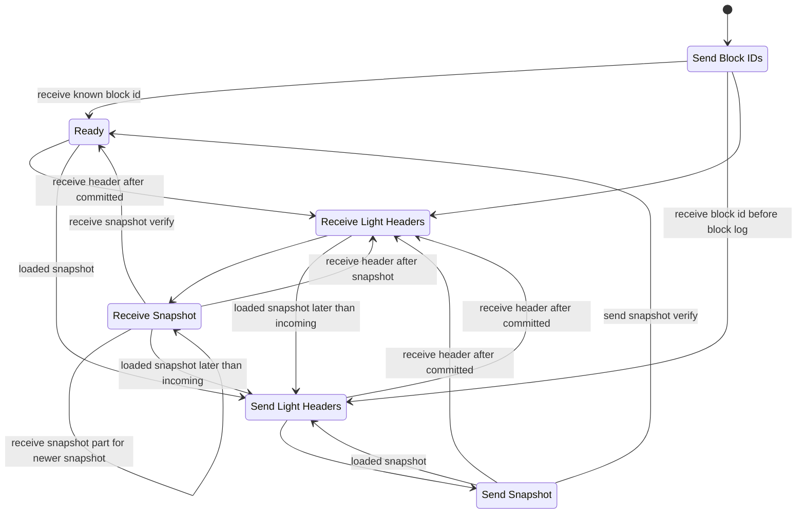

# Synchronization

The synchronization algorithm determines when blocks are sent to a peer.

## Goals

High-level:
- Connected nodes MUST converge to the same chain
- The amount of data sent SHOULD be minimized

This leads to the following rules:
- A block MUST NOT be sent to the peer unless its parent was known to the peer at some previous time
- A block which is possible to commit, but which is not yet committed MUST NOT be discarded
- A block SHOULD NOT be sent to the peer unless it is in the current best chain
- A block SHOULD NOT be sent to a peer that already has it
- A snapshot MUST be sent if synchronization is impossible without it
- A snapshot MAY be sent if it is smaller than the blocks that would need to be sent to synchronize

## Identifying a Common Block

When two nodes connect, they first find a common ancestor, which will be the base for synchronization. If both nodes have complete block logs the common ancestor must exist.

If a node has a truncated block log, then `logStart` is the first block such that the node has all the blocks in `[logStart, HEAD]`.

Each node sends a series of block IDs to its peer. This sequence is terminated by a committed block ID. The message includes a flag marking the last block. If the block log is empty, the special id 0000000000000000000000000000000000000000000000000000000000000000 is sent as the committed block ID.

If the list sent by the peer contains a block in the current chain (after `logStart`), synchronization will start at that block. If this ID was not already sent, echo it back to the peer.

If the the peer's committed block is before `logStart` and we have not already found a common ancestor, send a snapshot.

## Sending Snapshots

A snapshot can be sent when the connection starts if the peer is too far behind. It can also be sent any time the node loads a snapshot that it received over another connection.

When sending a snapshot we first send a series of block headers that are sufficient to validate the producers of the snapshot. Then we send the snapshot contents, and finally, the snapshot checksum and signature.

## States

