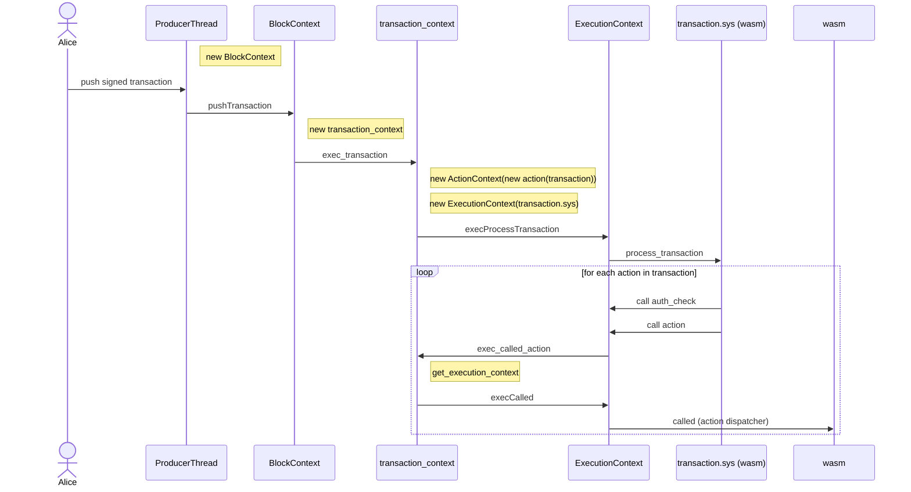

# Transaction Execution

## Threads

Several threads are used in running node-related processes. E.g. block production, rpc, etc..

## Shared State

All threads share SharedState. When a thread needs access to a SystemContext, it asks SharedState for one, and then returns it back to SharedState when it’s done.

## System Context

A SystemContext provides access to the SharedDatabase, a WasmCache (a cache of compiled wasms), and some execution memory.

## Block Context

A thread creates a BlockContext when it’s either producing or replaying a block, and passes a reference to the SystemContext to it. A block context also contains the database.

For example, a producing node would be creating block_contexts at the block interval, and then when a transaction is received, the node would call pushTransaction on it.

In pushTransaction, a block context will create a transaction_context for the signed transaction, passing in a reference to itself, and call execute_transaction on it.

At the end of the block_contexts life, it’s either committed, or destroyed.

## Transaction Context

A transaction context represents a transaction while it’s being executed. There are three methods that could be called on it:
1. exec_transaction() - Called when we want to execute a full signed transaction
2. exec_called_action() - Called when an action calls another action “inline,” so it executes in the same transaction context
3. execServe - Called during rpc

The purpose of exec_transaction is not to read through and execute all actions in a transaction, because in PsiBase that happens in a contract, not in native code. Therefore, all it does is start up the execution context for transaction.sys (the contract that handles transaction execution), create a single action which contains the entire transaction, and sends it to the transaction.sys execution context.

A transaction context contains a cache of execution contexts. That way if sync calls are made to the same contract more than once in a transaction, the target contract execution context is only started up once.

## Execution Context

An execution context represents an executing contract. This object is basically responsible for communicating across the native/wasm boundary with contracts. It defines the interface of functions that a wasm is allowed to call back into native code, and it knows about the four wasm entry points. 

It has a function that exposes the four wasm entry points to the outside world:
1. execProcessTransaction(ActionContext& actionContext) - Only called once per transaction. Executes process_transaction on the transaction.sys wasm.
2. execCalled(uint64_t callerFlags, ActionContext& actionContext) - Calls the “called” wasm entry point whenever a particular action is called. This is the action dispatcher.
3. execVerify(ActionContext& actionContext);
4. execServe(ActionContext& actionContext);

## Transaction.sys wasm

This is a core contract with the unique process_transaction endpoint.
process_transaction - For each action in the transaction, call an auth_check for the action, then call the action. To call anything, the transaction.sys wasm needs to call back into the native code so the native code can dispatch the actions to the correct ExecutionContext.

## Sequence diagram

