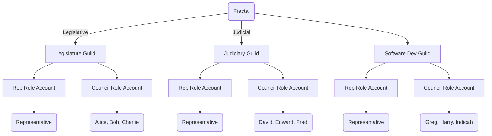

# Introduction
The **Fractals** package enables the creation of self-governing communities with separated powers (legislative, judicial) and dynamic, role-based authorization via `auth-dyn`.

# Authorization

Fractals makes heavy use of the `auth-dyn` auth service for Fractal & Guild administration. 

Each guild has 3 accounts
- Guild Account.
- Representative Role Account.
- Council Role Account.

Each of these accounts have a dynamic policy returned by the Fractals service for use with the `auth-dyn` service. 

## Fractal Account
The Fractal account is generally not intended to act as a sender for actions. Instead, such actions should originate from the appropriate guild account (e.g., the legislative guild for policy changes or the judicial guild for enforcement decisions).
That said, if the Fractal account is used as a sender, its authorization policy will resolve exclusively to the legislative guild account.

## Guild Account
The guild account is administered by the representative (rep) role account, if a representative is currently appointed.
Otherwise, the council role account.

The guild account is expected as sender across all actions on behalf of a Guild, except for actions specific to its council or representative. E.g. `resign_g_rep` and `remove_g_rep`.

## Representative (Rep) Role Account
This policy resolves to a single authorizer: the current elected representative of the guild.
If no representative is elected, the policy returns an empty authorizer set, effectively freezing the account until a rep is appointed.

## Council Role Account
This policy always resolves to the guild's council members, requiring a 2/3 multisig threshold for authorization.
