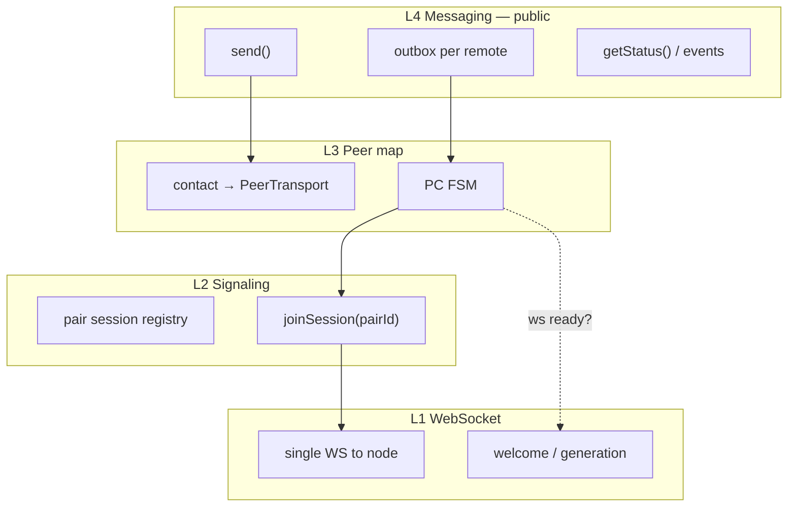
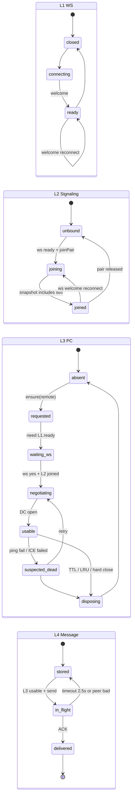
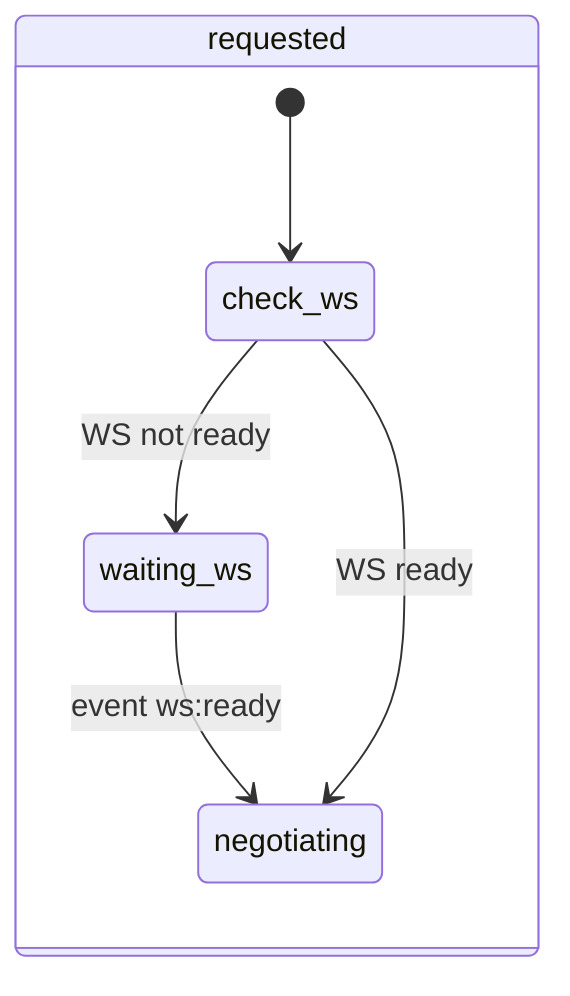
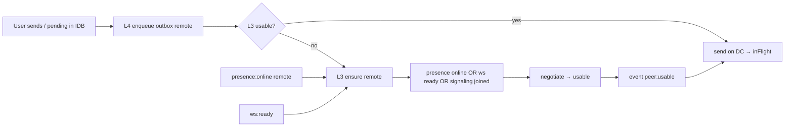
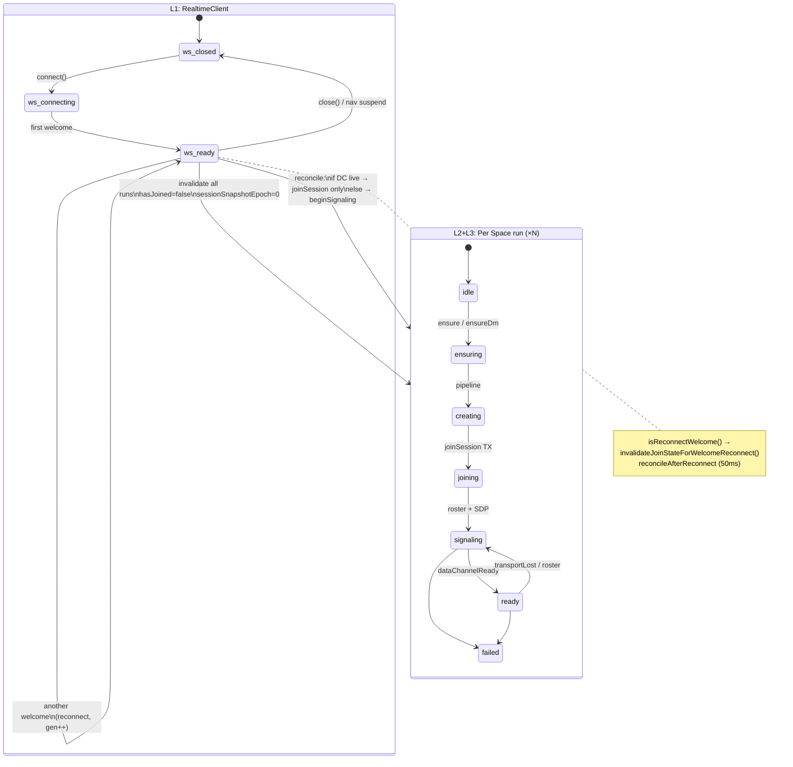
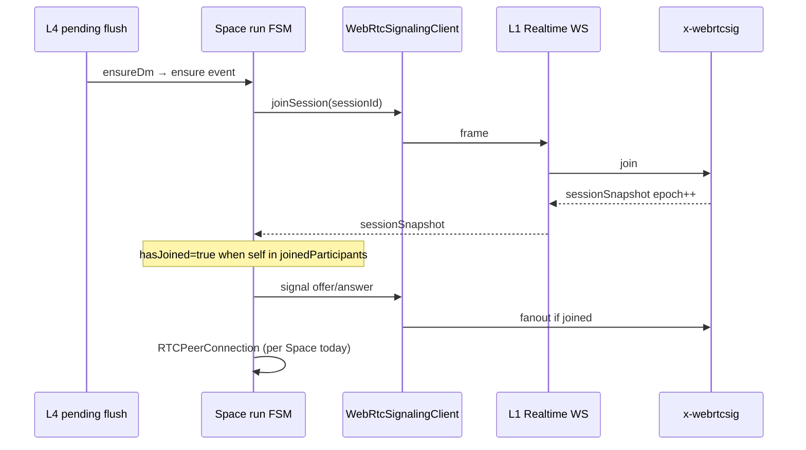
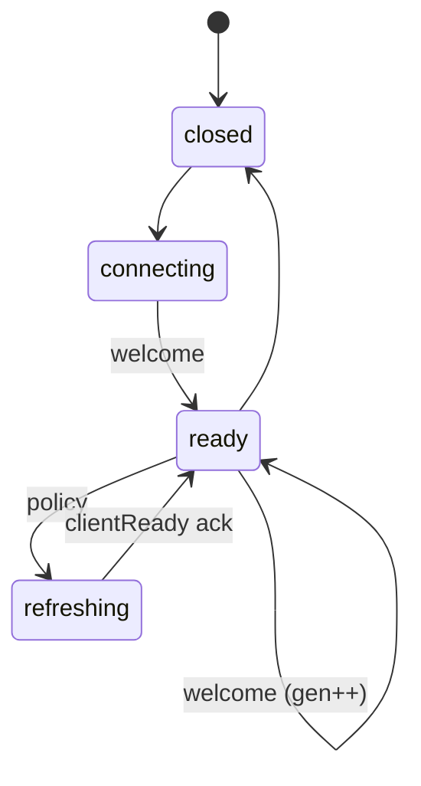
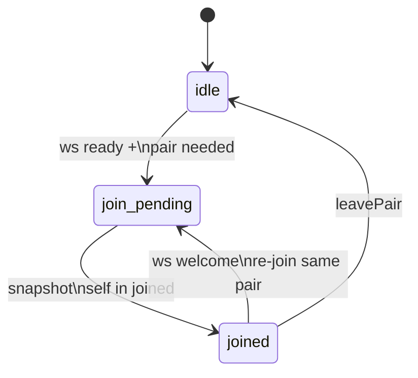
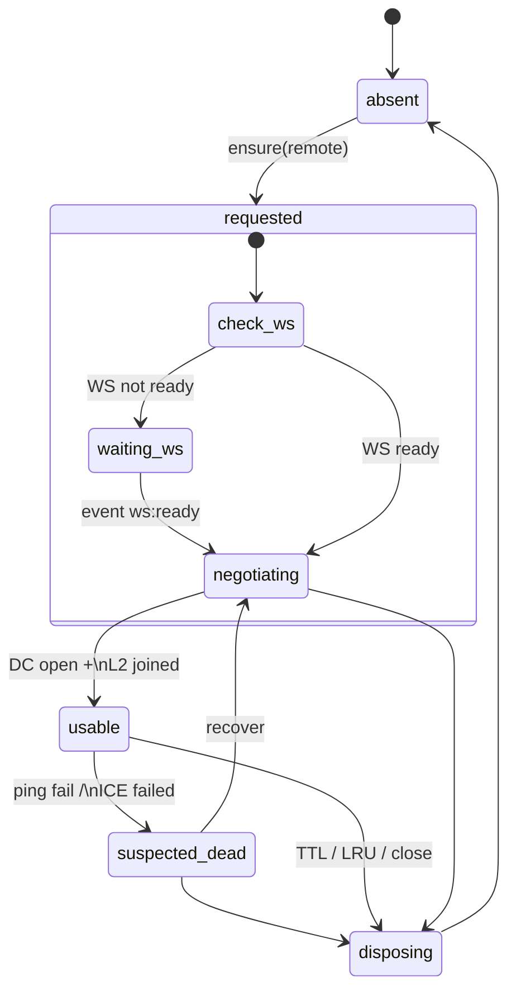
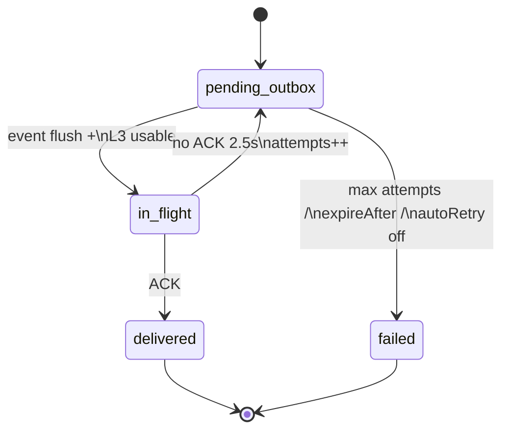

# Chat-data transport: one PC per remote user

Design direction for post–delivery-gate work on `mm/webrtc-refactor`. Living doc — update as we decide signaling/API shape.

## Summary

**Today:** transport is organized **per Space** (DM Space or group Space). The same two accounts in a DM Space and in a group Space negotiate **separate** `RTCPeerConnection`s and **separate** x-webrtcsig `wrtc:*` sessions.

**Proposed:** transport is organized **per remote account**. The app keeps a map `**remoteAccount → PeerConnection`** (keyed by Contacts / account name). Outbound chat-data is sent on the PC for that contact; every frame carries **space/thread metadata** so the receiver routes into the correct UI thread.

**Group example (you + UserB + UserC):** two entries in the map → two PCs. A group message is sent **once per remote peer** (lookup B’s PC, lookup C’s PC), not once per group Space leg duplicated by session.

This **does not** reduce group to a single connection total (mesh still needs N−1 PCs for N participants). It **does** eliminate duplicate PCs between the **same two humans** across DM + group (and across two DM Spaces with the same person, if that ever exists).

---

## Locked decisions (2026-06-04)


| Parameter              | Value                                                                                                                                                                                    |
| ---------------------- | ---------------------------------------------------------------------------------------------------------------------------------------------------------------------------------------- |
| **PC idle TTL**        | **5 minutes** since last use (send, receive, focus on any Space with that contact)                                                                                                       |
| **Max warm PCs**       | **10**; LRU prune when adding 11th                                                                                                                                                       |
| **Signaling session**  | **Pair-only** (`wrtc:pair(…)`), not per-Space                                                                                                                                            |
| **Initiator (pair)**   | **Lexicographic account order** (stable for life of pair)                                                                                                                                |
| **ACK**                | Per `**(clientMsgId, recipientAccount)`**                                                                                                                                                |
| **In-flight → outbox** | **~2.5s** (5 × 500ms) without app-level ACK                                                                                                                                              |
| **autoRetry**          | **5 valid attempts** max per `(clientMsgId, recipient)` — see [Valid attempt](#valid-attempt-counting)                                                                                   |
| `**expireAfter`**      | **None** — no time-based give-up on pending messages                                                                                                                                     |
| **History / catch-up** | Send **only when recipient is `presence: online`** (same gate as valid attempt)                                                                                                          |
| **Group pending UI**   | Per-recipient ACK; show `**Pending (k/n)`** — *k* recipients not yet `DELIVERED`, *n* = group size (incl. self) or recipient count — see [Group pending display](#group-pending-display) |
| **PC health**          | **No periodic timers**; assume good while `usable`. On send/ACK failure → **ping-pong** on data channel; if bad → `suspected_dead`, messaging returns affected msgs to outbox            |
| **Pending flush**      | **Event-driven only** (peer `usable`, recipient `presenceOnline`, outbox enqueue, WS `ready`) — **no** `ensureDm` / 3s background throttle                                               |
| **Meet**               | **Same PC per remote** as chat; media = `addTrack` on that PC (see [Meet](#meet-same-pc-recommendation))                                                                                 |
| **Migration**          | **No interim** Space-run patches (P1/P2/P3); build transport stack                                                                                                                              |
| **Multi-tab**          | **One peer map per tab** (see [Multi-tab](#multi-tab-one-map-per-tab))                                                                                                                   |


---

## Abstract layers (stack)

Apps (Chat, hypothetical 3rd party) see only **L4**. Lower layers are implementation details.

```text
                    ┌──────────────────────────────┐
                    │  L4  Messaging (public API)   │  content, status, retry policy
                    │      outbox / inFlight / ACK  │
                    └──────────────┬───────────────┘
                                   │ ensure(remote), send(bytes), events
                    ┌──────────────▼───────────────┐
                    │  L3  Peer map (per contact)   │  PC FSM, TTL, cap 10
                    └──────────────┬───────────────┘
                                   │ joinPair, signal, needs ws.ready
                    ┌──────────────▼───────────────┐
                    │  L2  Signaling (pair session) │  joinSession, roster, SDP route
                    └──────────────┬───────────────┘
                                   │ frames on socket
                    ┌──────────────▼───────────────┐
                    │  L1  Realtime WebSocket       │  welcome, presence, clientReady
                    └──────────────────────────────┘
```




**Anti-pattern we are removing:** `executePendingFlushPlan` → `**ensureDm`** with **3s throttle** while a group is focused. That used **time** to guess when background work was safe. **Replacement:** L4 subscribes to **events** — `peerBecameUsable(B)`, `presenceOnline(B)`, `messageEnqueued(B)`, `wsReady` — and calls `peerMap.ensure(B)`; no throttle.

---

## Layer FSMs and cross-layer wiring

Each layer exposes an FSM. **Edges between layers are events**, not shared mutable flags on Space runs.




**Cross-layer triggers (event table)**


| Event                              | Source            | Target action                                                                  |
| ---------------------------------- | ----------------- | ------------------------------------------------------------------------------ |
| `ws:ready`                         | L1                | L2: re-`joinSession` all active pairs; L3: resume `waiting_ws` → `negotiating` |
| `ws:welcome(reconnect)`            | L1                | L2: re-join pairs; L3: **keep** `usable` PCs, refresh signaling only           |
| `signaling:joined(pair)`           | L2                | L3: continue negotiation for that remote                                       |
| `peer:usable(remote)`              | L3                | L4: **flush `outbox[remote]`** (no timer)                                      |
| `presence:online(remote)`          | L1                | L3: `ensure(remote)`; L4: attempt flush if outbox non-empty                    |
| `message:enqueued(remote)`         | L4                | L3: `ensure(remote)`                                                           |
| `message:ack(clientMsgId, remote)` | L4 (inbound wire) | L4: mark delivered                                                             |
| `peer:suspected_dead(remote)`      | L3                | L4: move that remote’s `in_flight` → `outbox`                                  |
| `send:no_ack(remote, msg)`         | L4                | L3: **ping-pong**; on fail → `suspected_dead`                                  |


**L3 gate on L1 (WS check)** — explicit in the PC FSM:




While `waiting_ws`, L3 does **not** poll on an interval; it holds the transition until L1 emits `ws:ready` (or the `ensure` is cancelled if the message is deleted).

---

## Layer APIs

### L1 — `RealtimeTransport` (WebSocket)

```typescript
interface RealtimeTransport {
  connect(): void;
  close(): void;
  readonly isReady: boolean;
  readonly welcomeGeneration: number;
  on(event: "ready" | "welcome" | "closed" | "presence", handler): Unsubscribe;
  send(frame: ClientFrame): void; // clientReady, ping, etc.
}
```

### L2 — `PairSignaling` (x-webrtcsig)

```typescript
interface PairSignaling {
  /** Stable id: e.g. wrtc:pair(lowerAccount,higherAccount) */
  joinPair(local: string, remote: string): void;
  leavePair(pairId: string, reason: string): void;
  signal(pairId: string, payload: OutboundSignal): void;
  readonly isJoined: (pairId: string) => boolean;
  on(event: "pairJoined" | "pairSnapshot" | "remoteSignal", handler): Unsubscribe;
}
```

Pair roster replaces per-Space `sessionSnapshot` for **transport**; Space membership for **authorization** stays on objective/Spaces (L4 validates envelopes).

**Roster renegotiation:** `RosterRenegotiationCoordinator` owns roster-driven renegotiation (`presence_online`, `peer_joined`, `roster_kick`, `joinsIdle(completedPairId)`). It debounces per-remote notifications (~150ms), reads L3 roster snapshots, and chooses `ensure`, `resendOffer`, `retriggerHandshake`, or recovery — instead of fanning `kickNegotiation` from multiple stack/bridge call sites. `kickNegotiation` remains an internal L3 escape hatch; polite peers already joined on L2 never re-`joinPair` from a kick.

### L3 — `PeerTransportRegistry`

```typescript
interface PeerTransportRegistry {
  ensure(remoteAccount: string, reason: EnsureReason): void;
  getState(remoteAccount: string): PeerState; // absent | waiting_ws | negotiating | usable | suspected_dead | disposing
  send(remoteAccount: string, bytes: Uint8Array): SendResult; // ok | peer_not_ready | ws_not_ready
  on(event: "usable" | "suspected_dead" | "disposed", handler): Unsubscribe;
  /** Application ping; not a wall-clock health poll */
  ping(remoteAccount: string): Promise<boolean>;
}
```

### L4 — `MessagingService` (public — Chat and 3rd-party apps)

**Design note:** Your sketch (`send(recipient, payload)`, `getStatus`) is the right *shape*. Suggested refinements:


| Topic             | Suggestion                                                                                                                                    |
| ----------------- | --------------------------------------------------------------------------------------------------------------------------------------------- |
| **Payload**       | Structured `SendRequest`, not opaque `string` — must include `**spaceUuid`** (thread), `**body**`, optional `**clientMsgId**` for idempotency |
| **Status**        | `**PENDING`** | `**DELIVERED**` | `**FAILED**` — see [Message status](#message-status-pending-delivered-failed)                               |
| `**spaceUuid**`   | **L4 / app thread id** (objective Space UUID) — not L1; see [spaceUuid](#spaceuuid-thread-id-not-transport)                                   |
| **Group send**    | One `send()` with `recipients: string[]` → L4 fans out to N outboxes internally                                                               |
| **autoRetry**     | Default **true**; event-driven retries — see [autoRetry](#autoretry-event-driven-not-polling)                                                 |
| **Subscriptions** | `onStatusChange(msgId)` and/or `watchPending(spaceUuid)` so UI does not poll `getStatus`                                                      |


```typescript
type MessageStatus = "PENDING" | "DELIVERED" | "FAILED";

interface SendRequest {
  spaceUuid: string;
  recipient: string;           // DM: one peer
  // recipients?: string[];     // group: fan-out inside L4
  body: unknown;               // app-defined JSON-serializable
  clientMsgId?: string;        // idempotency; server generates if omitted
  autoRetry?: boolean;         // default true
}

interface MessagingService {
  send(req: SendRequest): Promise<{ msgId: string }>;
  sendGroup(req: SendRequest & { recipients: string[] }): Promise<{ msgId: string }>;

  getStatus(msgId: string): MessageStatus;
  onStatusChange(handler: (msgId: string, status: MessageStatus) => void): Unsubscribe;

  /** Inbound from wire — wired by Chat adapter, not by storefront apps */
  onInbound(handler: (envelope: InboundEnvelope) => void): Unsubscribe;
}
```

**Internal L4 (not public):** `outbox[remote]`, `inFlight[(msgId, remote)]`, ACK handler, in-flight ACK wait (~2.5s), membership check on `spaceUuid`, durable store (see [Persistence](#persistence-unified-outbox)).

### Composition — `stack` and `bridge`

L1–L4 are **library modules** under `transport/`. Two higher-level pieces wire them for Chat:

| Piece | File | Role |
| ----- | ---- | ---- |
| **Stack** | `transport/stack.ts` | **Composition root** — constructs L1–L4, connects cross-layer events, routes pair `sessionSnapshot` / `signal` frames to the correct peer PC |
| **Bridge** | `transport/chat-transport-bridge.ts` | **Chat adapter** — replaces `ChatDataSessionOrchestrator`; owned by `use-chat-socket.ts` via `createChatTransportBridge()` |

```text
use-chat-socket.ts
       │
       ▼
 ChatTransportBridge          ← callbacks: inbound message, history sync, ACK, peer usable
       │
       ▼
 createChatTransportStack()  ← messaging + peerRegistry + pairSignaling + realtime + signaling
       │
       ├── L4 MessagingService
       ├── L3 PeerTransportRegistry
       ├── L2 PairSignaling
       └── L1 RealtimeTransport  →  RealtimeClient (shared-ui)
```

#### `createChatTransportStack` — stack

Factory that returns a **`ChatTransportStack`** handle:

```typescript
type ChatTransportStack = {
  messaging: MessagingService;
  pairSignaling: PairSignaling;
  peerRegistry: PeerTransportRegistry;
  realtime: RealtimeTransport;
  signaling: WebRtcSignalingClient;
  wireRealtimeHandlers(handlers): void;
};

createChatTransportStack(opts: {
  localAccount: string;
  chainId: string;
  realtimeClient: RealtimeClient;
  iceServers: IceServerConfig[] | null;
  isSpaceMember?: (spaceUuid, account) => boolean;
  onInboundBytes?: (remote, bytes) => void;  // optional; default → L4 ACK path
}): ChatTransportStack;
```

**Responsibilities:**

- Wrap the shared `RealtimeClient` in L1 `RealtimeTransport`.
- Create `WebRtcSignalingClient` with **deferred-SDP gate** (`bindSessionJoinedGate`): outbound signals wait until server `sessionSnapshot` confirms self in `joinedParticipants`.
- Track **pair join state** per `wrtc:pair:*` session id; on `sessionSnapshot`, set joined + `flushDeferredSignals`.
- Route inbound **`signal`** frames for pair sessions → `peerRegistry.handleRemoteSignal(remote, frame)`.
- Wire **L3 `onInboundBytes`** → L4 `handleWireFromRemote` (chat messages + ACKs) unless `onInboundBytes` override is supplied (bridge uses override for history sync).
- Expose **`wireRealtimeHandlers()`** so the hook can register on the same `RealtimeClient` without duplicating handler tables.

**Not responsible for:** React state, timeline UI, objective Space loading. **Meet** adds A/V tracks on the same pair PC via {@link SharedMeetPeer} (see [Meet](#meet-same-pc-recommendation)).

#### `ChatTransportBridge` — bridge

Class constructed with **`ChatTransportBridgeDeps`** (getter refs for realtime, self, chainId, iceServers + inbound/ACK callbacks). Replaces the deleted Space-run orchestrator.

```typescript
class ChatTransportBridge {
  start(): void;                    // create stack, wire callbacks, hydrate outbox
  dispose(): void;
  suspendForNavigation(): void;
  resumeAfterNavigation(): void;
  setFocusedSpace(spaceUuid): void;

  /** Maps members → ensurePeer for each remote (legacy ensureChatDataSession name). */
  ensureChatDataSession(spaceUuid, members): void;
  ensurePeer(remote, reason?): void;
  onPeerOnline(account): void;

  sendHistorySync(spaceUuid, peerAccount, envelope): boolean;
  sendGroupHistorySync(spaceUuid, peerAccount, envelope): boolean;

  invalidateJoinStateForWelcomeReconnect(): void;  // no-op; L2 re-joins pairs
  reconcileAfterReconnect(): void;                 // hydrate outbox only

  installDebugGlobal(): void;   // window.__chatMessagingDebug
  readonly messaging: MessagingService | null;
  readonly peerRegistry: PeerTransportRegistry | null;
}
```

**Responsibilities:**

- **`start()`** — call `createChatTransportStack`, subscribe L4 `onInbound` / `onRecipientDelivered`, L3 `usable` → `onPeerUsable` (history push), `messaging.hydrateFromStorage()` on load.
- **`handleInboundWire`** — demux data-channel payloads: `chatHistorySync` → app callback; `chatMessage` / `messageAck` → L4.
- **Send path in Chat** — `use-chat-socket` calls `messaging.send()` / `sendGroup()` directly (not `bridge.sendChatMessage`).
- **Legacy seam** — `ensureChatDataSession(spaceUuid, members)` ensures **one PC per remote member** (not per Space); no objective `createSession` for transport.
- **Navigation** — `suspendForNavigation` blocks new `ensurePeer`; `resumeAfterNavigation` re-hydrates outbox.
- **Debug** — exposes `window.__chatMessagingDebug` (`getOutbox`, `getPeerMap`, `getMessaging`) for e2e.

**Hook entry:** `hooks/chat/use-chat-orchestrator.ts` exports `createChatTransportBridge()`.

#### `transport/` module map

| File | Layer |
| ---- | ----- |
| `types.ts` | Shared constants (`PEER_IDLE_TTL_MS`, `MAX_VALID_ATTEMPTS`, …) |
| `pair-id.ts` | `pairSessionId`, lex initiator helpers |
| `event-bus.ts` | Internal pub/sub |
| `l1-realtime-transport.ts` | L1 |
| `l2-pair-signaling.ts` | L2 |
| `l3-peer-registry.ts` | L3 |
| `l4-messaging-service.ts` | L4 |
| `stack.ts` | Composition |
| `chat-transport-bridge.ts` | Chat adapter |
| `index.ts` | Barrel exports |

### Message status: `PENDING`, `DELIVERED`, `FAILED`


| Status          | Meaning                                                                                                                                                                                                                                                                     |
| --------------- | --------------------------------------------------------------------------------------------------------------------------------------------------------------------------------------------------------------------------------------------------------------------------- |
| `**PENDING`**   | Message is still ours to deliver: in **durable outbox** (not yet sent or waiting for retry), in `**in_flight`** (sent on wire, awaiting peer ACK), or blocked because **WS / PC not ready** (still `PENDING` — not a separate public state).                                |
| `**DELIVERED`** | Recipient returned an **app-level ACK** for this `(clientMsgId, recipient)` (group: per-recipient ACK; message may be `DELIVERED` to Bob but still `PENDING` for Carol until her ACK).                                                                                      |
| `**FAILED`**    | We **gave up** for that recipient. Set when `**autoRetry: false`** and a send error occurs, when `**validAttempts >= 5**` (see below), or **hard reject** (invalid `spaceUuid` / not a member). No `expireAfter`. UI shows failed + `errorReason`; user may retry manually. |


`FAILED` is **not** “in-flight for 2.5s” — that returns the row to **outbox** and stays `**PENDING`**.

### `spaceUuid`: thread id, not transport

`**spaceUuid` is an L4 (Messaging) / Chat app concept** — the objective **Space** id for a DM or group **thread** the UI renders. Chat already has this from the `chat` objective service.


| Layer                              | Knows `spaceUuid`?                                                                                                                                        |
| ---------------------------------- | --------------------------------------------------------------------------------------------------------------------------------------------------------- |
| **L4 Messaging**                   | **Yes** — routes UI, indexes pending per thread, puts it on the wire envelope                                                                             |
| **L3 Peer / L2 Signaling / L1 WS** | **No** — they move opaque bytes between accounts; envelope is inside the data channel payload                                                             |
| **Node (objective)**               | **Yes** for **authorization** (who may post to a Space) — separate from transport; L4 checks membership **client-side** on inbound (decided: client-only) |


Third-party apps using `MessagingService` must obtain `spaceUuid` from the same Space APIs Chat uses; the messaging layer does not invent threads.

### Valid attempt counting

A **valid attempt** is a send try where `**presence[recipient] === "online"`** at attempt start (and PC/WS ready). Attempts while recipient is offline **do not increment** `validAttempts` — the row waits in outbox until `presence:online`.

**History sync** (catch-up to a late joiner) uses the same rule: **do not push history** until that recipient is online.

### `autoRetry`: event-driven, not polling

`**autoRetry: true` (default)** means: keep the row in the **durable outbox** until `DELIVERED` or `**validAttempts >= 5`**. Retries are **event-triggered**, not polled.

**Retry attempt flow**

1. Row in **outbox** for `remote`.
2. **Event** fires (esp. `presence:online` + `peer:usable`) → if recipient **online**, try send.
3. Success on wire → **in_flight**; start **ACK wait** (~2.5s).
4. **ACK received** → `DELIVERED` for that recipient.
5. **No ACK in ~2.5s** → increment `**validAttempts`**, row back to **outbox** (still `PENDING`), optional L3 **ping-pong**.
6. **Another event** (recipient still/again online) → step 2, until 5 valid attempts → `**FAILED`**.

**Events that trigger a send attempt** (same list as flush):


| Event                     | Why                               |
| ------------------------- | --------------------------------- |
| `message:enqueued`        | User just sent                    |
| `peer:usable(remote)`     | Pipe ready                        |
| `presence:online(remote)` | Recipient may ACK                 |
| `ws:ready`                | Signaling path restored           |
| `signaling:joined(pair)`  | SDP path cleared                  |
| `peer:recovered`          | After `suspected_dead` → `usable` |


`**autoRetry: false`:** one **valid** attempt when recipient online; on failure → `**FAILED`**.

The **2.5s** timer only detects missing ACK for the current flight; the **next** valid attempt waits for an **event** above.

### Group pending display

For a group message with recipients `{B, C}` (sender self = A, *n* = 3 participants):

- Track `**DELIVERED`** per `(clientMsgId, recipient)`.
- UI badge: `**Pending (k/n)**` where **k** = count of recipients (excluding self) not yet `DELIVERED`. Example: B acked, C not → `**Pending (1/3)`** if *n* counts all participants including self, or `**Pending (1/2)*`* if *n* counts only outbound targets — **pick one convention in Chat UI** (recommend: **k/total targets**, e.g. `Pending (1/2)` for 2 remote members; show full thread context in tooltip).

`MessagingService` should expose `getPendingCount(msgId): { delivered: number; total: number }` for the composer badge.

---

## Meet: same PC recommendation

**Recommendation: one `RTCPeerConnection` per remote for both chat-data and Meet.**


| Approach                                 | Verdict                                                                                                                                                                                                          |
| ---------------------------------------- | ---------------------------------------------------------------------------------------------------------------------------------------------------------------------------------------------------------------- |
| **Same PC, data channel + media tracks** | **Preferred.** WebRTC allows one PC with a labeled data channel (chat envelopes) plus `addTrack` for A/V when a call starts. No second ICE for the same human.                                                   |
| **Separate PC for Meet**                 | Duplicate ICE, glare risk, and the exact bug class we are eliminating. Only justified if browsers or our stack cannot renegotiate tracks without killing the data channel — **verify during impl**, not assumed. |


**Rules:** Starting Meet **upgrades** the existing pair PC (add tracks), does not create a parallel map entry. Ending Meet removes tracks; **chat data channel stays** if still `usable`. Meet signaling can remain a distinct *purpose* on the pair session until server merges purposes.

---

## Multi-tab

**v1 assumption: one active Chat tab per account.** No leader election or multi-map coordination in scope. Document in manual QA only.

---

## Initiator: why lex order (Q2)

**Use lexicographic account name order** (lower account initiates offers). Alternatives like “first Space that needed the link” vary with UI navigation and cause initiator flips when the same pair meets in DM vs group — **H34 glare**. Lex order is deterministic, session-independent, and needs no shared memory of which Space opened first.

---

## Event-driven delivery (replaces `ensureDm` + throttle)




No `setInterval`, no `lastMeshNudgeMs` throttle for “background DM while group focused.”

---

## Glossary (terms that collide today)

### `welcome` (WS layer — L1)

First (and every subsequent) `**{ t: "welcome" }**` frame on the open websocket after connect/reconnect. Carries ICE servers, server time, your account. Client increments `**welcomeGeneration**` (`welcomeCount` in `RealtimeClient`). `**isReconnectWelcome()**` is true when generation > 1.

**Not** the same as a Space snapshot. Triggers `invalidateJoinStateForWelcomeReconnect()` in Chat today because **server `joinSession` rows are per socket** — stale joins must not authorize outbound SDP on a dead socket.

### `sessionSnapshot` (signaling server frame — L2)

Server broadcast `**{ t: "sessionSnapshot", sessionId, epoch, joinedParticipants, pendingParticipants }`** for one **x-webrtcsig session** (`wrtc:…` tied to a Space). Ground truth for who has **joined that session on the server** vs who is authorized but still **pending**.

- `**joinedParticipants`:** accounts with a live `joinSession` on some socket for this session.
- `**pendingParticipants`:** in session auth list but not joined on any socket.
- `**epoch`:** server sets to `joined_participants.len()` so clients detect roster **changes** monotonically (`signaling.rs`). Used with client-side `**sessionSnapshotEpoch`** to ignore stale/out-of-order frames (H12).

### `sessionSnapshotEpoch` (client per Space run — L2)

On each **Space run** (`DmSpaceRun` / `GroupSpaceRun`): last applied `**sessionSnapshot.epoch`**. If a frame arrives with `epoch <= sessionSnapshotEpoch` (with a narrow exception for departures — H17), it is ignored so roster does not regress.

`**invalidateJoinStateForWelcomeReconnect` sets this to `0**`, which temporarily makes the next snapshot look “new” and can reorder roster processing — part of the matrix failure mode.

### `ChatDataSessionSnapshot` (client UI snapshot — not the server frame)

Per-Space `**run.snapshot**`: `{ phase, sessionId, dataChannelReady, meshPeerReady?, lastError }` for React/UI. Phases: `idle | ensuring | creating | joining | waiting-peer | signaling | ready | failed`.

**Do not confuse** with server `sessionSnapshot` frames.

### `hasJoined` / `joinSession` (L2, today on Space run)

- `**joinSession`:** client→server “attach this **socket** to this **sessionId**.”
- `**hasJoined`:** client believes server roster includes **self** in `joinedParticipants` (from server `sessionSnapshot`, **not** merely after sending `joinSession`).

Outbound SDP is **deferred** until `hasJoined` (see `WebRtcSignalingClient` gate + `flushDeferredSignals`).

### `ensureDm` / `ensureGroup` (L4→L2 leak today)

Not a transport primitive. A **pending-flush plan action** from `planPendingFlush` → `executePendingFlushPlan`:

- `**ensureDm`:** calls `ensureDmChatDataSession(spaceUuid, members)` → creates Space run if missing → dispatches FSM `**ensure`** → may pipeline, `**beginSignaling**`, `**joinSession**`, create PC.
- `**ensureGroup`:** same via `ensureGroupChatDataSession`.

So “ensureDm” really means **“nudge the whole Space stack so maybe the data channel becomes ready.”** In the target design this becomes `**peerMap.ensure(recipient)`** + **outbox flush**, not Space FSM negotiation.

### Background DM **throttling** (H28) — **removed**

When the **focused** conversation is a **group**, `shouldThrottleBackgroundDmEnsure` blocks `**ensureDm`** for **other** DM Spaces unless forced — at most one nudge per `**lastMeshNudgeMs`** (default **3s**). This is **timer-based policy** replacing what should be **events** (`peer:usable`, `presence:online`). **Not carried forward.**

---

## State diagrams

### Today (coupled) — WS + welcome + invalidate + Space run




**Signaling session (L2) parallel track** (per Space, not shown as separate FSM today):




### Target — separated layers (L1–L4)

**L1 — WebSocket**




**L2 — Pair signaling** (was missing in this subsection; see also [cross-layer diagram](#layer-fsms-and-cross-layer-wiring))




On `welcome` while L1 `ready`: L2 re-`joinSession` for all active pairs; L3 keeps `usable` PCs; L4 flushes outboxes when L3 emits `usable`.

**L3 — Peer PC (per remote contact)**




**L4 — Messaging (per message × recipient)**




**Cross-layer:** `PeerMap` **requested → usable** emits `peer:usable` → L4 drains `outbox[remote]`. L4 never calls `joinSession`.

### Is there an FSM per PC today?

**Partially, but not as a clean public layer.**


| What exists                                                            | Role                                                                                                                                |
| ---------------------------------------------------------------------- | ----------------------------------------------------------------------------------------------------------------------------------- |
| `**transitionRun` / Space run FSM** (`chat-data-run-state-machine.ts`) | Per **Space**, not per PC. States: `idle…ready`. Commands: `beginSignaling`, `joinSession`, `disposeAllPeers`.                      |
| `**PeerSlotState`** in run FSM                                         | Logical `absent | connecting | ready` per remote in **group** — not the WebRTC object.                                              |
| `**ChatDataWebRtcPeer`**                                               | ICE/SDP/data channel; callbacks `onDataChannelOpen`, `transportLost`. **No** exported FSM; orchestrator pokes it from run commands. |
| **No global “wait your turn”**                                         | Competing `beginSignaling` / `ensure` / welcome invalidate causes races; fixes are ad-hoc ignores (`run event ignored`, H15, H34).  |


**Target:** L3 PC FSM is **authoritative** for whether L4 may send. L2 join registry is authoritative for whether L3 may emit SDP. Queued work **waits** or **cancels** via layer APIs, not by mutating unrelated Space runs.

---

## Persistence: unified outbox

**Decision:** one **durable client seam** via `chat-durable-store.ts` (`chainScopedStorageKey` + JSON read/write). **No separate history-sync persistence step** for unsent messages — the outbox **is** the source of truth across reload, tab crash, and browser kill.

| Queue / store | Module | Purpose |
|---------------|--------|---------|
| Outbound messages | `pending-message-store.ts` | L4 outbox rows (`PENDING` / `FAILED`) |
| Inbound ack backlog | `pending-ack-store.ts` | Wire `messageAck` targets not yet sent |
| Inbound acceptance deferral | `inbound-acceptance-queue.ts` | Messages received before contacts load; flushed → `acknowledgeInbound` |
| History-sync push retry | `history-sync-push-queue.ts` | Failed `chatHistorySync` pushes; drained on `peer:usable` |

**On `send()`:** write row immediately (status `PENDING`, `attempts`, `lastAttemptAt`, optional `expireAfter`, `spaceUuid`, `recipients`, body). UI thread history view reads from the same store (sent + pending rows) or a derived index — avoid a second write path that can diverge.

**On `DELIVERED`:** mark row delivered / prune from outbox per existing `pending` store rules (`sent` rows not persisted).

**On reload:** hydrate L4 from storage → for each remote with pending rows, emit `message:enqueued` / schedule `ensure(remote)` when WS ready.

**Not L1:** persistence is entirely **client tab**; the node does not store outbox rows.

Plugin KV / IndexedDB upgrade can replace localStorage behind the same store interface later (see `pending-message-store` Plan C2 note).

---

## Where layers run (threading / async)

Browser WebRTC and WebSocket APIs are **main-thread-bound**, but **work must not block the UI**.


| Layer            | Execution model                                                                                                                                                                                        |
| ---------------- | ------------------------------------------------------------------------------------------------------------------------------------------------------------------------------------------------------ |
| **L4 Messaging** | `send()` **returns quickly** after durable write (`Promise<{ msgId }>`). Delivery runs via internal async queue + event handlers. UI subscribes to `onStatusChange`, never awaits transport in render. |
| **L3 Peer map**  | `ensure(remote)` returns `**Promise<void>`** (resolves when `usable` or terminal failure). ICE/SDP callbacks on main thread; state updates debounced to microtasks.                                    |
| **L2 Signaling** | Frame handlers async; `joinPair` / `signal` no-op or queue if `!ws.isReady`.                                                                                                                           |
| **L1 WS**        | Single connection; `connect()` → `Promise` when first `ready`. Reconnect backoff internal to L1.                                                                                                       |


**Pattern:** Chat calls `await messaging.send({...})` only for “accepted into outbox,” not for “peer received.” Long work = **Promises + events**, not synchronous ladders in React effects.

**No worker thread for WebRTC in v1** — unnecessary complexity; keep orchestration off the critical UI path via non-blocking APIs.

---

## Welcome policy (WS layer)

On new `welcome` / new socket generation:

1. **L1** completes `clientReady`; increments generation.
2. **L2** re-issues `joinSession` for every session that still needs server-side join (pair or Space scoped per migration phase).
3. **L3** for each map entry: if PC `**usable`**, keep PC, refresh signaling binding only; if `**negotiating**`, continue or resendOffer; if `**suspected_dead**`, enter recovery — **do not** reset unrelated Space epochs.
4. **L4** for any remote with non-empty outbox: `peerMap.ensure(remote)` and flush when usable (**pending-first**, no H28 throttle on that path).

---

## Why this is the better default (aligned)


| Benefit                     | Explanation                                                                                                                                                |
| --------------------------- | ---------------------------------------------------------------------------------------------------------------------------------------------------------- |
| **Fewer connections**       | No second ICE/DTLS/data-channel stack to the same peer because the UI opened another Space type.                                                           |
| **Simpler mental model**    | “I have a pipe to Bob” + “messages are labeled by thread” vs “every Space has its own parallel pipe to Bob.”                                               |
| **Faster thread switching** | Reuse warm PC when returning to a DM (pairs well with **idle TTL** — see README *Future transport*).                                                       |
| **Less signaling churn**    | One negotiation lifecycle per peer pair per tab, not per Space.                                                                                            |
| **Initiator stability**     | Polite/impolite is per peer pair, not re-derived per Space roster snapshot → fewer cross-space glare bugs (see H34-class issues in `webrtc-debugging.md`). |


For chat-data on a Contacts-centric app (DMs + groups with the same people), **this is a superior design** for the transport layer. The UI already thinks in contacts; the stack should match.

---

## Clarification vs earlier pushback

Some earlier notes were easy to misread:

- **“Groups need multiple connections”** — still true, but compatible with this design: a 3-person group needs **two** PCs from you (to B and to C), looked up by account, not “one PC for the whole group.”
- **“One PC per user doesn’t work for group”** — meant **you cannot collapse a group to a single peer connection total**, not that groups can’t use a per-contact PC map.
- **Duplicate elimination** — your DM + group with B and C scenario goes from **up to 4** peer legs (1+1 DM + 2 mesh) to **2** when only those three people exist (one to B, one to C). That is the main win.

---

## Proposed app shape (high level)

```
Contacts / account name  →  ChatDataPeerTransport (RTCPeerConnection + data channel[s])
Space / thread           →  routing metadata on every wire message (spaceUuid, purpose, etc.)
```

**Send path**

1. User sends in Space S to recipients {B, C, …}.
2. Resolve recipient list (DM: one contact; group: all members except self).
3. For each recipient R: `transport = peerMap.get(R)` (create/connect if missing).
4. `transport.send({ spaceUuid: S, …payload })`.

**Receive path**

1. Data channel `onmessage` on B’s transport.
2. Parse `spaceUuid` (and message type).
3. Dispatch to the correct Space store / UI thread for that Space.

**Peer map as source of truth**

The `**contacts → PeerTransport`** map is the authoritative set of open peer connections in this tab. UI and orchestration ask the registry (“do we have a live PC to Bob?”), not per-Space run objects. Spaces only carry **pending outbound**, **history**, and **routing metadata**; they do not own duplicate PCs.

**Lifecycle + idle expiry (planned)**


| State           | Rule                                                                                                                                                                                               |
| --------------- | -------------------------------------------------------------------------------------------------------------------------------------------------------------------------------------------------- |
| **Create**      | First need to talk to R: pending message to any Space with member R, user opens a thread with R, or explicit prefetch policy.                                                                      |
| **Keep warm**   | Entry stays in map for `**IDLE_TTL`** (e.g. 2–5 minutes, TBD) after last successful send/receive **or** last thread focus involving R — allows switching DM ↔ group ↔ DM without full ICE restart. |
| **Refresh TTL** | Any outbound/inbound chat-data on that PC; optionally bump when user focuses any Space that includes R.                                                                                            |
| **Dispose**     | TTL elapsed **and** no pending for any Space that needs R **and** not in active Meet with R; or hard close (logout, leave Chat, unrecoverable `failed`).                                           |


While an entry exists, the same PC serves **all** Spaces that need that contact. Expiry removes the map entry and disposes the PC; next send recreates it.

This replaces H28-style “tear down non-selected DM immediately when pending drained” as the default. Immediate teardown remains a **pressure valve** (memory cap, max warm peers), not the common path.

**Why this pairs with per-peer**

Welcome reconnect and multi-thread churn hurt most when join/PC state is **per Space** and gets bulk-invalidated. A peer-centric registry + TTL makes “return to thread with Bob” reuse one negotiation, and makes debugging (“3 entries in the map”) tractable.

---

## Historical: interim P1/P2/P3 (superseded)

**Decision:** do **not** patch the Space-run stack. Matrix / delivery-gate green comes from **v2** (this doc). The analysis below remains useful for **welcome** behavior in v2.

Old matrix / welcome analysis (reference)

The delivery-gate **matrix** spec failed when alice had a **background DM** (pending to bob) while **focused on group**, a **new websocket welcome** arrived (`welcomeGeneration` N→N+1), and the background DM never reached `dataChannelReady` within 240s.

**What the spec does (relevant slice):** alice sends DM to offline bob, creates/opens group, sends group message, bob returns in a fresh browser and opens DM; alice must flush DM pending while still in group context (in-chat thread switch, no `leaveChatToHome`).

**What the logs show:** `welcome reconnect: invalidate join` on **both** DM and group runs; `flush pending: data channel not ready` on the DM Space; new `ws-open` + `joinSession` on group; background DM stays in `signaling` until timeout.

### Why welcome matters at all (constraint)

x-webrtcsig `**joinSession` is per websocket socket**. A new `welcome` on a new socket means server-side joins on the old socket are dead. The client **must** call `joinSession` again on the new socket before the server accepts outbound signals. Some “invalidate join” step is required.

The bug class is not “re-join is wrong” — it is **how aggressively** we tear down *client* state (hasJoined, snapshot epoch, PCs, background scheduling) while doing that.

### Current behavior (today)

1. `**invalidateJoinStateForWelcomeReconnect()`** (on reconnect welcome): for **every** Space run, if `joinedWelcomeGeneration !== welcomeGeneration` → `hasJoined = false`, `joinSessionRequested = false`, `**sessionSnapshotEpoch = 0`**.
2. `**reconcileAfterReconnectNow()**`: repeats the same clears, then per run: if **data channel already open** → `joinSession` only, skip peer dispose (H20); else if peer online → `beginSignaling`; else `signalingDeferred`.
3. **Group** `beginSignalingGroup` has an extra branch: **live mesh DC** → re-`joinSession` without tearing down mesh (H21 “welcome refresh”).
4. **DM** has no equivalent “welcome refresh” if PC is mid-negotiation or join is cleared while DC not ready.
5. **H28:** pending flush `ensureDm` for **non-focused** Spaces is throttled while a group is focused → background DM recovery after welcome can be slow or starved.

So: group-focused alice gets welcome bump → DM run loses join + epoch → DM still not `dataChannelReady` → pending flush blocked → matrix assertion times out.

### Product option (recommended direction) — what it means

**Product option** = fix **client transport policy** so multi-space + welcome reconnect matches user expectations, **without** weakening the matrix e2e (no forced `leaveChatToHome`, no shorter repro).

It is **not** a server change (though server snapshot-to-pending-sockets already helps). It is **not** “ignore welcome” — we still re-`joinSession` on the new socket.

Pick one or combine sub-policies:


| ID     | Policy                          | Behavior                                                                                                                                                                                                  | Tradeoff                                                                        |
| ------ | ------------------------------- | --------------------------------------------------------------------------------------------------------------------------------------------------------------------------------------------------------- | ------------------------------------------------------------------------------- |
| **P1** | **Scoped invalidate**           | On welcome, only reset join/epoch for runs that had joined on the **old** welcome gen **and** lack a live data channel. Runs with **open DC** → re-`joinSession` only (mirror H20 reconcile + H21 group). | Mid-negotiation runs still need P2/P3.                                          |
| **P2** | **DM welcome refresh**          | Same as group “live mesh” path: if DM PC exists and negotiation in flight, **do not** zero `sessionSnapshotEpoch`; **do** `joinSession` on new socket; continue negotiation / resendOffer.                | Slightly more complex DM FSM.                                                   |
| **P3** | **Pending-priority recovery**   | After welcome, **immediately** `beginSignaling` / `joinSession` for every run with **pending outbound** (bypass H28 background throttle for e.g. 10s or until flush completes).                           | More ICE work on unfocused threads during recovery; acceptable for correctness. |
| **P4** | **Focused vs background tiers** | **Focused** Space: full P1+P2. **Background** with pending: P3 only (minimal invalidate). **Background** idle: may lazy re-join until TTL or send.                                                        | Clear product rules; matches per-peer TTL later.                                |


**Suggested default bundle for a design decision:** **P1 + P2 + P3** (aggressive correctness for pending + live DC preservation). **P4** documents who gets priority when P3 competes with focused group mesh.

**Explicit non-choice (e2e-only):** `leaveChatToHome` before group (H18 workaround) or shorter timeouts — rejects the product scenario the matrix is meant to lock in.

### How this converges with per-peer + TTL

Long term, **welcome** should:

- Re-`joinSession` on the **signaling plane** for each **pair** (or pair session id) that still has a map entry or pending work.
- **Not** dispose PCs in the contact map solely because welcome gen changed — only if the PC is actually dead (`connectionState` failed / closed).
- **Pending** on any Space bumps peer map TTL and triggers **P3-style** recovery for that contact.

That makes H36 a **special case of peer-registry policy**, not a one-off matrix hack.


**v2 equivalent:** `ws:welcome` → L2 re-join pairs; L3 keep `usable` PCs; L4 flush `outbox[remote]` on `peer:usable` / `presence:online` — no throttle.

---

## What still has to be designed (not reasons to reject the vision)

These are **migration and protocol** work, not arguments that per-peer is worse:

### 1. x-webrtcsig session model

**Decided: pair-only** (`wrtc:pair(…)`). Server + client stop using per-Space `wrtc:*` for chat-data transport (objective Spaces remain for auth and storage).

### 2. Group fan-out on the wire

Mesh without a server relay: the **sender** still sends the same logical message **once per remote PC** (B and C). That is correct and minimal for outbound. Receivers do not get duplicate copies from a single sender on one leg.

Confirm framing: one serialized payload + per-peer send, or small envelope `{ spaceUuid, body }` per datachannel message.

### 3. One data channel vs many

Per PC: either a single data channel with multiplexed frames (preferred for simplicity) or labeled channels per Space. Single channel + metadata is enough if all frames are typed.

### 4. Meet / av-call

**Same PC per remote**; Meet adds media tracks to that PC (see [Meet](#meet-same-pc-recommendation)).

### 5. Failure isolation (tradeoff, accepted)

One dead PC to Bob stalls **all** Spaces that need Bob until recovery. Per-Space PCs isolated failures but cost duplicate ICE. **Product choice:** prefer fewer, warmer pipes; recovery policy per peer (shared `transport-recovery`).

### 6. Permissions and abuse

Objective/Space permissions remain on the **objective** layer; transport only delivers labeled frames. Receiver must ignore frames for Spaces they’re not a member of (server already authorizes membership; client validates).

### 7. Multi-tab

Still **one tab ↔ one peer map** (or explicit leader-tab election). Second tab to same account should not create duplicate PCs to the same remote — out of scope for v1 but note in requirements.

---

## Non-goals (v1 of this refactor)

- Replacing group mesh with a central SFU/relay (still P2P mesh, fewer redundant legs).
- Cross-node federation (same-node Contacts only in v1).
- Multi-tab leader election (document single active tab for v1).

---

## Migration sketch (transport — no dual-write)

1. **Server:** pair session ids + signal fanout per pair (`wrtc:pair:lower:higher`; see `sessions.rs`).
2. **Client:** implement L1–L4 under `transport/`; **`createChatTransportStack`** wires layers; **`ChatTransportBridge`** adapts for `use-chat-socket.ts` (calls `MessagingService` for send/receive).
3. **Delete** Space-run transport FSM, `ensureDm`/`ensureGroup` flush path, H28 throttle. *(Done.)*
4. Wire e2e delivery-gate against `MessagingService` + events.
5. Meet: migrate to track add/remove on existing pair PC. *(Done — `SharedMeetPeer` + `ChatDataWebRtcPeer.startMeetMedia`.)*

---

## Open questions (remaining)

- **Pair id string** exact format on x-webrtcsig (e.g. `wrtc:pair:alice:bob`)
- **Group badge denominator:** `k/(recipients)` vs `k/(all participants)` — recommend former; confirm in Chat UI
- **History sync byte cap** per catch-up burst (late joiner) — TBD in [Test plan](#test-plan)

---

## Resolved (from discussion)

- Pair-only signaling; lex initiator; ACK per `(clientMsgId, recipient)`
- **5 valid attempts** (online-only); **no `expireAfter`**
- History/catch-up waits until recipient **online**
- Group `**Pending (k/n)`** per-recipient delivery counts
- In-flight ACK wait ~2.5s; retries **event-driven**; PC health via ping-pong on ACK miss
- `FAILED` = 5 valid attempts exhausted / autoRetry off / hard reject
- `spaceUuid` = L4 thread id (objective Space); not L1/L2/L3
- **Persistence:** unified outbox in chain-scoped localStorage (`pending-message-store` seam); no separate unsent-history path
- **Security:** inbound membership check client-only
- **Pair id:** canonical lex ordering of account names
- `lastUsedAt`: send + receive + focus
- Meet on same PC (tracks on existing pair) — aligned
- Big-bang transport, no interim P1/P2/P3
- **v1 single tab** — no multi-tab design
- Event-driven flush; no `ensureDm` throttle
- Layers async via Promises/events; `send()` fast after persist
- **`IDLE_TTL`:** 5 min; **max warm:** 10 LRU
- **Implementation:** `transport/stack.ts` (composition), `transport/chat-transport-bridge.ts` (Chat hook adapter)

---

## Test plan

**North star (primary deliverable):** A user composes a message and **every intended recipient eventually sees it in the correct thread**, in **send-timestamp order**, without manual refresh. If this fails, the app is not shippable — transport correctness is measured only through **visible delivery outcomes**.

**Principle:** Define **outcomes** first, then map tests to layers. No manual QA gate for basic send/receive before merge.

### Outcome catalog (what “pass” means)


| ID      | Outcome                                   | User-visible signal                                                                                     |
| ------- | ----------------------------------------- | ------------------------------------------------------------------------------------------------------- |
| **O1**  | DM, both online                           | Message in receiver thread within bounded time                                                          |
| **O2**  | DM, recipient offline at send             | Sender shows pending; after recipient online + opens chat, message appears on both sides without resend |
| **O3**  | Group, all online                         | Every member’s thread shows the message; order by send time                                             |
| **O4**  | Group, one member offline                 | Online members receive; offline member receives on rejoin (pending + history)                           |
| **O5**  | Nav out of Chat and back                  | Prior messages still visible; new sends work; outbox drains                                             |
| **O6**  | DM + group same session (no leave Chat)   | No lost pending; same contact not double-negotiated (one PC per pair)                               |
| **O7**  | Background DM pending while group focused | DM pending delivers when peer returns (matrix scenario)                                                 |
| **O8**  | Late joiner group                         | New member sees history sent while they were away (after online)                                        |
| **O9**  | Tab reload / crash recovery               | Durable outbox survives; pending messages deliver after reload                                          |
| **O10** | Meet on same PC (smoke)                   | Chat send still works after short Meet accept/hangup on same thread                                     |


Each outcome is **independently assertable** in Playwright via `expectThreadMessage`, pending badge, and `getPendingCount` hooks (add helpers as needed).

### Test pyramid

```text
                    ┌─────────────────────┐
                    │  Slow live-chain e2e │  O1–O9, real ICE timing
                    │  (delivery gate v2)  │
                    └──────────┬──────────┘
                               │
                    ┌──────────▼──────────┐
                    │  Fast live-chain     │  30-step churn, race discovery
                    │  (random-churn v2)   │
                    └──────────┬──────────┘
                               │
         ┌─────────────────────┼─────────────────────┐
         │                     │                     │
┌────────▼────────┐  ┌─────────▼─────────┐  ┌────────▼────────┐
│ Layer integration│  │ MessagingService  │  │ Pair signaling  │
│ (sim WS + PC)    │  │ outbox + attempts │  │ server vitest   │
└────────┬────────┘  └─────────┬─────────┘  └────────┬────────┘
         │                     │                     │
         └─────────────────────┼─────────────────────┘
                               │
                    ┌──────────▼──────────┐
                    │  Unit: FSM per layer │  L1–L4 transition tables
                    └─────────────────────┘
```

### Track A — Unit & integration (Vitest, no chain)

**Run:** `yarn vitest run src/apps/chat/lib` (+ new `src/apps/chat/transport/` modules).


| Module                | What to test                                                                                                                                                         |
| --------------------- | -------------------------------------------------------------------------------------------------------------------------------------------------------------------- |
| **L1 WS FSM**         | `closed → connecting → ready`; reconnect `welcome` gen++; `on("ready")` subscribers                                                                                  |
| **L2 Pair signaling** | `join_pending → joined`; re-join on welcome; deferred signal flush                                                                                                   |
| **L3 Peer map FSM**   | `waiting_ws` until event; `usable`; TTL/LRU cap 10; `suspected_dead` on ping fail                                                                                    |
| **L4 Messaging**      | Persist on send; **valid attempt** only when `presence online`; **5 cap → FAILED**; in-flight 2.5s → outbox; per-recipient ACK; `**getPendingCount`**; group fan-out |
| **Stack**             | `createChatTransportStack`: pair join gate, signal → peer routing, L3↔L4 inbound bytes |
| **Bridge**            | `ChatTransportBridge.start`: hydrate, inbound demux (history vs message/ACK), debug global |
| **Cross-layer**       | Table-driven: event sequence → expected `getStatus` / mock `send` calls (no timers except ACK wait in fake clock tests)                                              |
| **Persistence**       | Reload hydrate; `sent` rows pruned; quota error path                                                                                                                 |


Use **fake timers** only for in-flight ACK wait tests, not for retry scheduling.

### Track B — Fast live-chain (race & FSM battle test)

**Purpose:** Compress steps **back-to-back** to tear holes in FSM wiring (welcome during nav, thread switch, multi-recipient partial ACK). **Not** the primary timing truth for ICE.

**Based on:** existing `chat-group-three-party-random` / `e2e:random-churn:decaf` (30 steps, seed `0xdecafbad`).

**v2 adaptations:**


| Step type                        | Assert                            |
| -------------------------------- | --------------------------------- |
| `homeNav` / re-enter Chat        | O5 — composer enabled; WS `ready` |
| DM send                          | O1/O2 — thread or pending         |
| Group send                       | O3 — all online actors            |
| Thread switch DM↔group           | O6/O7 — no wedged pending         |
| Forced `welcome` (optional hook) | PCs stay `usable`; outbox drains  |


**Scripts (to add):**

```bash
yarn e2e:random-churn:mesh      # 1×30 steps, strict fail-fast, ~3–8 min
yarn e2e:random-churn:stress    # 30 steps, collect all failures, CI nightly optional
```

**Pass:** zero step failures; no “Reconnecting…” stuck; no duplicate inbound text.

### Track C — Slow live-chain (delivery gate v2)

**Purpose:** Real waits for negotiation, presence, and delivery — the **authoritative** “messages actually arrive” suite.

**Run:** single worker, fresh chain (`global-setup`), rebuilt Homepage + XWebRtcSig.

**Proposed specs** (replace legacy `e2e:delivery-gate` when v2 lands):


| Spec file                             | Outcomes   | Notes                                          |
| ------------------------------------- | ---------- | ---------------------------------------------- |
| `v2-dm-both-online.spec.ts`           | O1         | Baseline                                       |
| `v2-dm-offline-then-online.spec.ts`   | O2         | Bob never opens DM until after send            |
| `v2-dm-send-before-peer-join.spec.ts` | O2 variant | Alice sends before bob opens thread            |
| `v2-group-all-online.spec.ts`         | O3         | Three-party                                    |
| `v2-group-offline-member.spec.ts`     | O4, O8     | Browser close + rejoin                         |
| `v2-nav-churn.spec.ts`                | O5         | home ↔ chat ↔ home, pending + new send         |
| `v2-multi-thread-matrix.spec.ts`      | O6, O7     | DM pending + in-chat group switch (old matrix) |
| `v2-outbox-reload.spec.ts`            | O9         | `reload` after offline send                    |
| `v2-meet-chat-smoke.spec.ts`          | O10        | Optional phase 2                               |


```bash
yarn e2e:delivery-gate   # Track C, 1 worker, serial
```

**Timing:** generous Playwright timeouts (120–240s per assertion where ICE needed); **no** artificial 3s throttle — waits are `expectThreadMessage` / `waitForPendingCleared` predicates.

**Conditions explicitly covered (your list):**

1. Nav into Chat, out, back — `v2-nav-churn`
2. DM and group sends — all specs
3. Offline + online recipients — `v2-dm-offline`, `v2-group-offline`
4. Late joiner history — `v2-group-offline-member` + assert historical bodies

### CI merge gate (autonomous definition of done)


| Gate               | Command                                 | Required on PR               |
| ------------------ | --------------------------------------- | ---------------------------- |
| Unit + integration | `yarn vitest run` (chat + transport) | **Yes**                      |
| Fast churn         | `yarn e2e:random-churn:mesh`                | **Yes** (after transport bootstrap) |
| Delivery gate      | `yarn e2e:delivery-gate`             | **Yes**                      |
| Stress churn 10×   | `PSIBASE_E2E_RANDOM_CHURN_RUNS=10`      | Nightly / pre-release        |


**Agent autonomy:** Implementation is done when all three required gates pass on a **fresh chain** without human browser use. First human smoke is confirmatory only.

### Test helpers to build (enables autonomous e2e)


| Helper                                             | Use                    |
| -------------------------------------------------- | ---------------------- |
| `waitForMessageDelivered(page, text, { space? })`  | O1–O4                  |
| `waitForPendingBadge(page, { k, n })`              | Group partial delivery |
| `waitForPendingCleared(page, clientMsgId?)`        | O2, O7                 |
| `assertOutboxAfterReload(page, expectedTexts[])`   | O9                     |
| `navLeaveChatAndReturn(page)`                      | O5                     |
| `setPresenceOffline(browserContext)` / wait online | O2, O4                 |


Expose `window.__chatMessagingDebug` in dev builds: `getOutbox()`, `getPeerMap()`, `getValidAttempts(msgId)` — e2e reads without log scraping.

### Open test-plan items (defaults for autonomous work)


| Item                         | Recommendation                                    | Need PM override?            |
| ---------------------------- | ------------------------------------------------- | ---------------------------- |
| Slow spec timeout budget     | 240s per major assertion; 900s suite cap          | No                           |
| Replace vs parallel old gate | **Replace** when v2 ships; delete Space-run specs | No (aligned with big-bang)   |
| Meet in v2 gate v1           | **O10 optional** phase 2                          | OK to defer                  |
| History sync cap             | 500 messages or 1MB per burst in test env         | Implement reasonable default |
| Churn seed                   | Fixed `0xdecafbad` on PR; rotate in nightly       | No                           |


---

## Related docs

- `README.md` — *Future transport* backlog (idle TTL, pooling mention).
- `webrtc-debugging.md` — incident log through delivery-gate (H29–H36).
- `e2e/README.md` — chain lifecycle, existing churn scripts.
- `e2e/FUTURE-TESTS.md` — superseded by this section for v2.

