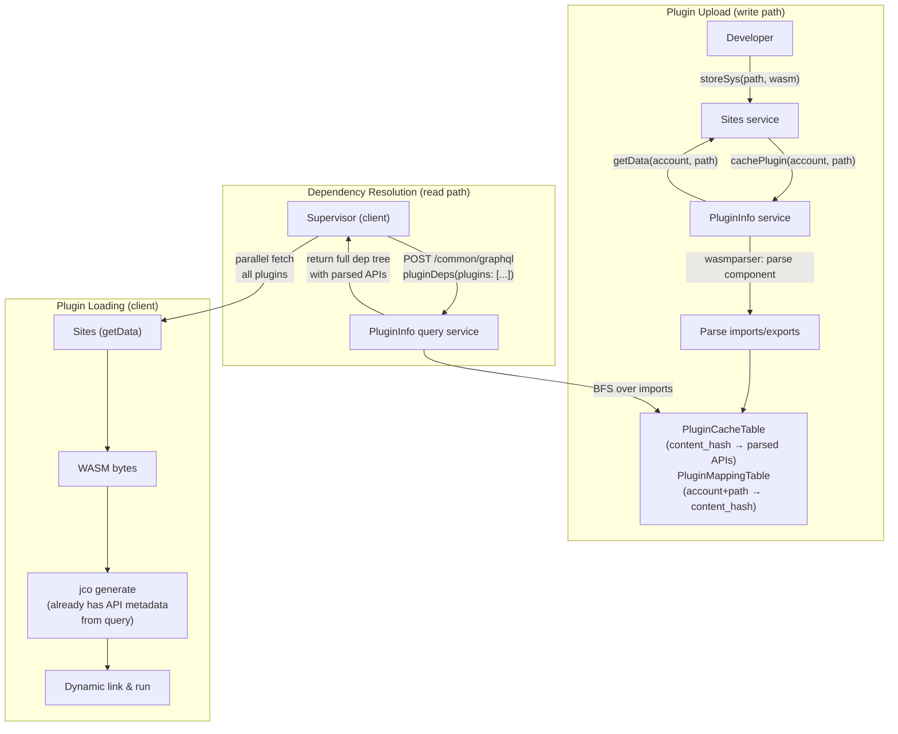
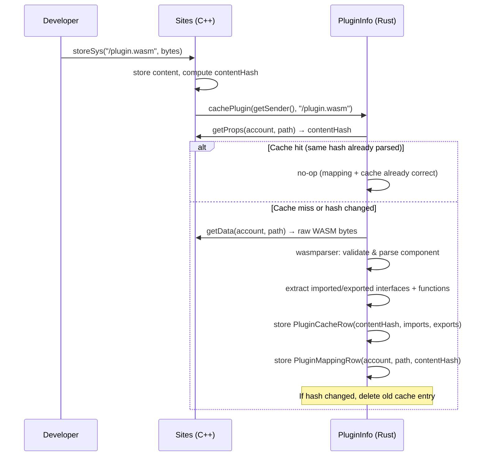
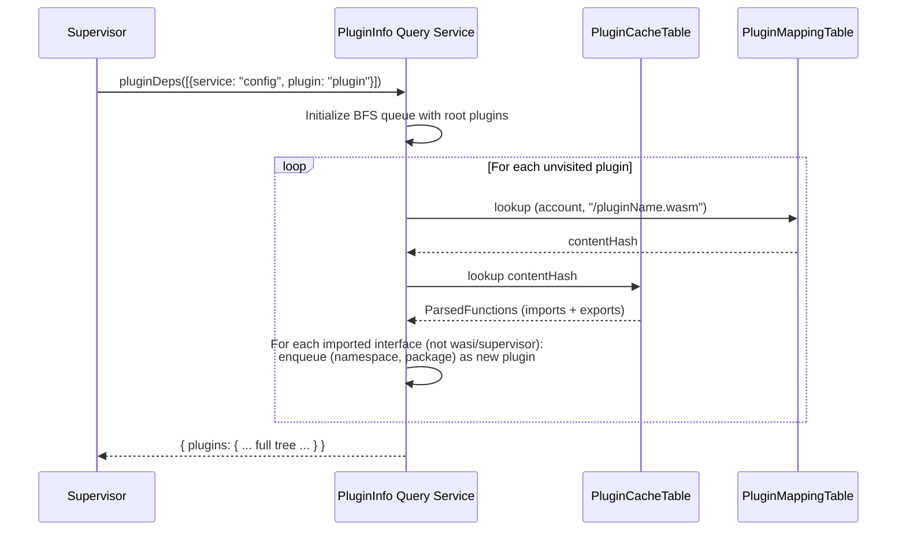
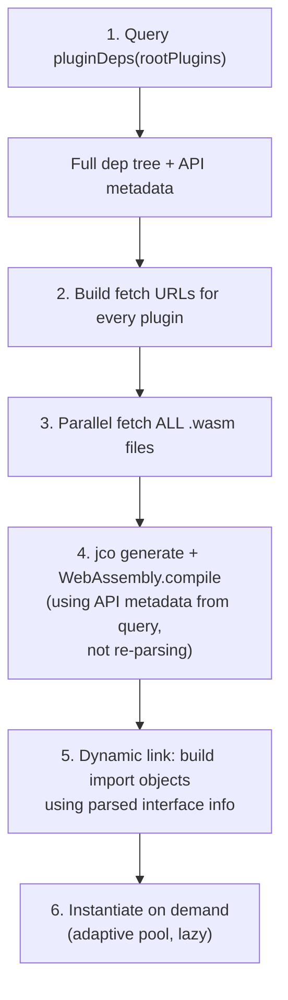

# Server-Side Plugin Dependency Resolution

## Motivation

The current plugin loading model is a **waterfall of fetches**. The Supervisor downloads an app's direct plugin dependencies (depth N), parses each WASM component client-side to discover its imports (depth N+1), fetches those, parses again to find N+2, and so on. Each round-trip adds latency proportional to the depth of the dependency tree.

This also exacerbates the [WASM virtual address space exhaustion problem](wasm-plugin-memory-plan.md): every plugin must be individually compiled/instantiated client-side, even if all the client really needs upfront is the dependency graph. Moving the parsing to the server eliminates client-side parsing entirely and enables the client to fetch all plugins in a single parallel burst.

### Current model (waterfall)

```
Client                              Chain
  |                                   |
  |-- fetch app plugin (depth 0) ---->|
  |<---- wasm bytes ------------------|
  |  parse imports → discover deps    |
  |-- fetch depth-1 deps ------------>|
  |<---- wasm bytes ------------------|
  |  parse imports → discover deps    |
  |-- fetch depth-2 deps ------------>|
  |<---- wasm bytes ------------------|
  |  ... repeat until leaves ...      |
  |                                   |
  | finally: link & run               |
```

Round-trips = depth of dependency tree. For Config app: depth ~5-8 = 5-8 sequential fetch rounds.

### Proposed model (single query + parallel fetch)

```
Client                              Chain
  |                                   |
  |-- GraphQL: pluginDeps(app) ------>|
  |<---- full dependency tree --------|
  |                                   |
  |-- fetch ALL plugins in parallel ->|
  |<---- all wasm bytes --------------|
  |                                   |
  | link & run                        |
```

Round-trips = 2 (one query + one parallel fetch burst). Constant regardless of tree depth.

---

## Architecture



### Components

1. **`PluginInfo` service** (Rust, runs on-chain) — Receives `cachePlugin(account, path)` calls from Sites whenever a `.wasm` file is uploaded, updated, or removed. Parses the WASM component using `wasmparser` to extract imported and exported interfaces/functions. Stores the parsed metadata in two tables:
   - **`PluginCacheTable`**: keyed by content hash → parsed imports/exports. Content-addressable so identical plugins uploaded by different accounts share one cache entry.
   - **`PluginMappingTable`**: keyed by (account, path) → content hash. Maps a specific plugin location to its cached parse result.

2. **`PluginInfo` query service** (Rust, GraphQL) — Exposes a `pluginDeps` query that accepts a list of root plugins and returns the full transitive dependency tree. Performs BFS: for each plugin, looks up its cached imports, identifies cross-plugin dependencies (filtering out `wasi:*`, `supervisor:*`, `host:*`), enqueues unvisited deps, and returns the complete graph.

3. **Sites service** (C++, existing) — Modified to call `PluginInfo::cachePlugin()` whenever a `.wasm` file is stored via `storeSys`, `hardlink`, or `remove`.

4. **Supervisor** (client-side, TypeScript) — Modified to call `pluginDeps` before fetching any plugins, then fetches all WASM files in parallel, then links and runs.

---

## GraphQL API

### Query

```graphql
query {
  pluginDeps(plugins: [
    { service: "config", plugin: "plugin" }
  ]) {
    plugins {
      pluginKey        # "config:plugin"
      info {
        importedFuncs {
          interfaces {
            namespace    # "transact"
            package      # "plugin"
            name         # "hookHandlers"
            funcs { name, dynamicLink }
          }
          funcs { name, dynamicLink }
        }
        exportedFuncs { ... }
        deps             # ["transact:plugin", "accounts:plugin", ...]
      }
    }
  }
}
```

### Response shape

The response contains every plugin in the transitive closure, keyed by `service:pluginName`. The `deps` array for each plugin lists its direct dependencies (also as `service:pluginName` keys), so the client can reconstruct the full graph if needed.

---

## Data flow detail

### Write path (plugin upload)



### Read path (dependency resolution)



---

## What the client does with the response



Key insight: the API metadata returned by `pluginDeps` includes the full interface/function signatures. The client can use this to build import proxy objects *before* transpilation, potentially simplifying or eliminating the client-side WIT parsing step that currently happens during `jco generate`.

---

## Open questions

### 1. How does the client currently discover root plugins? (RESOLVED)

Root plugins are always **explicitly specified by the calling app** through two entry points:

- **`supervisor.functionCall(args)`** — `args` contains `{ service, plugin, ... }`. The `plugin` field defaults to `"plugin"` if omitted (`buildFunctionCallRequest` applies the default). The Supervisor's `entry()` calls `preload([{ service, plugin }])` with that single plugin as the root.
- **`supervisor.preLoadPlugins(plugins)`** — the app provides an explicit list of `{ service, plugin? }` pairs. Again, `plugin` defaults to `"plugin"` if omitted.

The waterfall then discovers transitive dependencies by parsing each plugin's WIT imports: `namespace` becomes the service, `package` becomes the plugin name (`getDependencies()` in `plugin.ts`). The fetch URL is built as `siblingUrl(null, service, "/${plugin}.wasm")`.

**Plugin names are NOT always `"plugin"`.** System plugins include `host:auth` and `host:prompt` (fetching `/auth.wasm` and `/prompt.wasm`). WIT-derived dependencies use the WIT package name — e.g., a WIT import of `foo:bar/...` yields `{ service: "foo", plugin: "bar" }`, fetching `/bar.wasm`.

**Impact on this design**: The `pluginDeps` GraphQL query already accepts `[{ service, plugin }]` pairs, which maps directly. The query service's BFS already uses `iface.package` as the plugin name. No changes needed — the API shape is correct.

### 2. Host plugins (`host:*`) — are they deps or special-cased?

The current code filters out `host:*` from the dependency BFS. Host plugins (common, auth, crypto, db, types, prompt) are system plugins loaded separately. But they still need to be loaded on the client.

**Question**: Should the `pluginDeps` response include host plugins in the tree, or should the client continue to treat them as always-loaded system plugins? Currently they're system-pinned in the instance pool.

### 3. Auth plugins — dynamic discovery

Auth plugins are discovered at runtime based on the logged-in user's auth service. They're not statically known from the app's dependency tree.

**Question**: How should auth plugin deps be handled? Options:
- Separate `pluginDeps` call after login
- Include all known auth plugins in the response
- Auth plugins are simple enough (shallow deps) that the current waterfall is acceptable for them

### 4. `dynamic_link` and dynamic dispatch — impact on the dependency tree

The parser detects functions whose first parameter is an `own<plugin-ref>` resource (from `host:types`). These are marked `dynamic_link: true`.

**Technical findings**: `plugin-ref` is a WIT resource defined in `Host/plugin/types/wit/world.wit` that holds `(service, plugin, intf)` — a runtime reference to an arbitrary plugin interface. It's used in the Transact `hook-handlers` interface, where auth plugins are called dynamically:

```wit
on-user-auth-claim: func(plugin: plugin-ref, ...) -> ...
on-tx-transform: func(plugin: plugin-ref, ...) -> ...
```

These calls are dispatched at runtime via `syncCallDyn` on the Supervisor, meaning the target plugin is **not statically knowable** from WIT imports. The server-side BFS will find all static dependencies, but dynamic_link calls can reach plugins outside that tree.

**Question**: How should the dependency tree handle dynamic edges? Options:
- Ignore them (the auth plugin discovery is already a separate concern — see question 3)
- Mark dynamic_link functions in the response so the client knows which calls might reach outside the pre-resolved tree
- The current approach already handles this: auth plugins are loaded separately during Phase 2 of preload

### 5. Package size constraint

The staged `PROGRESS.MD` notes that the PluginInfo package is currently too big to boot because Sites depends on it (making it an essential package). Essential packages have strict size limits.

**Options under consideration**:
- Split the query service into a separate package (unclear if cargo-psibase supports two packages for one service)
- Drop `async_graphql` dependency and use a plain REST endpoint instead
- Make Sites' dependency on PluginInfo optional (call only if PluginInfo is deployed)

### 6. Should the response include download URLs or content hashes?

Currently the response contains parsed API metadata but not the actual WASM bytes or their hashes. The client still needs to know where to fetch each plugin.

**Question**: Should each entry in the response include:
- A download URL (e.g., `https://{service}.chain/plugin.wasm`)?
- A content hash (so the client can cache and skip re-downloading unchanged plugins)?
- Both?

### 7. Cache invalidation on plugin removal

When a plugin is removed via `Sites::remove()`, `pluginCache()` is called which should clean up the mapping and cache tables. But if other accounts uploaded the same content (same hash), the cache entry should be retained.

**Question**: Is there reference counting on `PluginCacheRow`, or is it safe to delete on any removal? Currently the code deletes the cache entry when a mapping's hash changes, which could delete a cache entry still referenced by another account.

### 8. Can the client skip client-side WASM parsing? (RESOLVED)

There are actually **two** separate parsing steps happening client-side today:

**A. The Supervisor's own `component_parser.wasm`** — a WASM component loaded via `loadBasic()` that parses each plugin's bytes to extract `ComponentAPI` (importedFuncs, exportedFuncs). Used for:
- **Dependency discovery** (`getDependencies()`) — walking `importedFuncs.interfaces` to find which other plugins to fetch (drives the waterfall)
- **Import proxy construction** (`getProxiedImports()`) — building the import map that tells jco how to wire cross-plugin calls

**B. jco's internal parsing during `generate()`** — jco takes raw WASM component bytes and internally parses them to extract core `.wasm` modules and generate canonical ABI JavaScript bindings (lifting/lowering, memory management, string encoding, resource tracking).

**Answer**:
- **(A) YES — the client-side `component_parser.wasm` can be eliminated.** The server's `PluginInfo` provides the same `ParsedFunctions` data. The client can use the server metadata to build import proxy objects without loading the parser at all. This saves one WASM instantiation plus per-plugin parse time.
- **(B) NO — jco's `generate()` cannot be skipped.** The `generate()` function always takes raw WASM bytes; there is no API to pass pre-parsed metadata. It must parse the component internally to extract core modules and generate the JS glue code. The WASM bytes must still be fetched and passed to `generate()`.
- A future optimization could **pre-transpile on the server** (run `jco generate` server-side and serve the JS + core `.wasm` files directly), but that's a much larger change with import-map-per-context complications.

---

## Relationship to the WASM memory work

This design is **complementary** to the lazy instantiation work (Iterations 1-3 in `wasm-plugin-memory-plan.md`), not a replacement:

| Concern | Server-side deps solve? | Lazy instantiation solves? |
|---------|------------------------|---------------------------|
| Waterfall fetch latency | Yes — single query + parallel fetch | No |
| Client-side parsing cost | Partially — API metadata pre-computed | No |
| Virtual address space exhaustion | Partially — fewer simultaneous compiles during waterfall | Yes — pool caps concurrent instances |
| Plugin count scaling | Yes — O(1) round-trips regardless of depth | Yes — O(budget) concurrent instances |

Both are needed for a robust solution at scale.

---

## Implementation roadmap

### Phase 1: PluginInfo service (partially done)
- [x] `parse.rs` — WASM component parser using `wasmparser`
- [x] `tables.rs` — `PluginCacheTable` and `PluginMappingTable`
- [x] `lib.rs` — `cachePlugin` action (called by Sites)
- [x] `lib.rs` — `getPluginCache` action
- [x] Sites integration — `pluginCache()` called on `storeSys`, `hardlink`, `remove`
- [ ] Fix package size issue (too big to boot as essential package)
- [ ] Enable the Sites→PluginInfo call (currently commented out)

### Phase 2: Query service
- [x] `query-service/lib.rs` — `pluginDeps` GraphQL query with BFS resolution
- [x] `query-service/types.rs` — GraphQL types
- [ ] Fix package size issue (async_graphql dependency)
- [ ] Add content hash to response
- [ ] Integration testing

### Phase 3: Client-side integration
- [ ] Supervisor: call `pluginDeps` on preload
- [ ] Supervisor: parallel-fetch all plugins from response
- [ ] Remove or simplify the multi-round dependency resolution in `plugin-loader.ts`
- [ ] Use server-provided API metadata to build import proxies (if feasible)

### Phase 4: Optimization
- [ ] Client-side caching with content hashes (skip re-fetching unchanged plugins)
- [ ] Evaluate whether jco's client-side WIT parse can be skipped
- [ ] Static linking exploration (pre-link on server, serve a single composed artifact)
