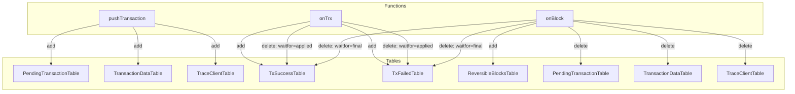
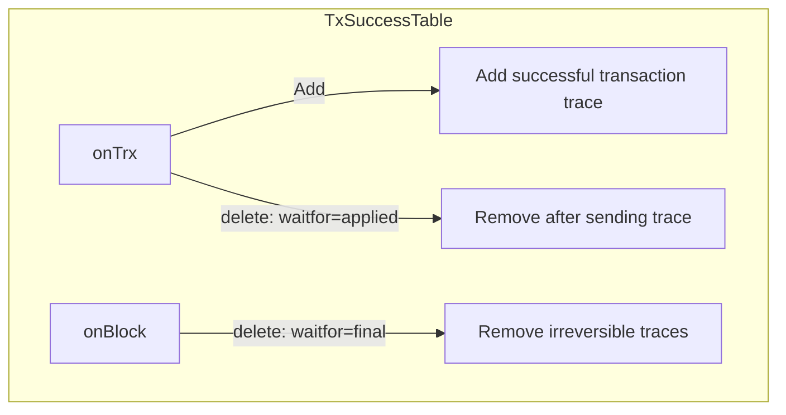
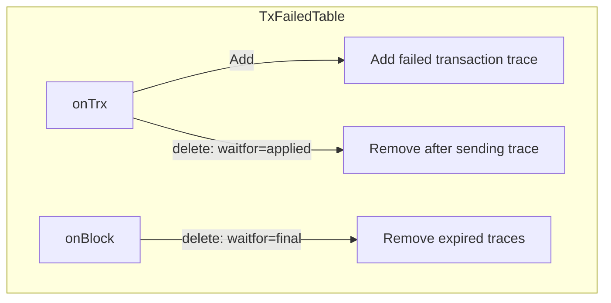

# Table details

# RTransact Table Operations

## Table Operations Overview

## RTransact Tables

### PendingTransactionTable

Example:

| id        | expiration           | ctime                | sequence |
| --------- | -------------------- | -------------------- | -------- |
| abc123... | 2023-12-01T00:00:00Z | 2023-11-01T00:00:00Z | 1        |
| def456... | 2023-12-02T00:00:00Z | 2023-11-02T00:00:00Z | 2        |
| ghi789... | 2023-12-03T00:00:00Z | 2023-11-03T00:00:00Z | 3        |

### TransactionDataTable

Example:

| id        | trx                |
| --------- | ------------------ |
| abc123... | SignedTransaction1 |
| def456... | SignedTransaction2 |
| ghi789... | SignedTransaction3 |

### TxSuccessTable

Example:

| id        | blockNum | trace             |
| --------- | -------- | ----------------- |
| abc123... | 1        | TransactionTrace1 |
| def456... | 2        | TransactionTrace2 |
| ghi789... | 3        | TransactionTrace3 |

Note: Deletion can occur in two places:
- In `onTrx` when `waitfor=applied` (immediate deletion after sending trace)
- In `onBlock` when `waitfor=final` (deletion after transaction becomes irreversible)

### TxFailedTable

Example:

| id        | trace             |
| --------- | ----------------- |
| abc123... | TransactionTrace1 |
| def456... | TransactionTrace2 |
| ghi789... | TransactionTrace3 |

Note: Deletion can occur in two places:
- In `onTrx` when `waitfor=applied` (immediate deletion after sending trace)
- In `onBlock` when `waitfor=final` (deletion after transaction is expired)

### ReversibleBlocksTable

Example:

| blockNum | time                 |
| -------- | -------------------- |
| 1        | 2023-11-01T00:00:00Z |
| 2        | 2023-11-02T00:00:00Z |
| 3        | 2023-11-03T00:00:00Z |

### TraceClientTable

| id        | clients                        |
| --------- | ------------------------------ |
| abc123... | [{"socket": 1, "json": true}]  |
| def456... | [{"socket": 2, "json": false}] |
| ghi789... | [{"socket": 3, "json": true}]  |

### AvailableSequenceTable

Example:

| nextSequence |
| ------------ |
| 1001         |
| 1002         |
| 1003         |

### UnappliedTransactionTable

Example:

| nextSequence |
| ------------ |
| 1000         |
| 1001         |
| 1002         |

### JWTKeyTable

