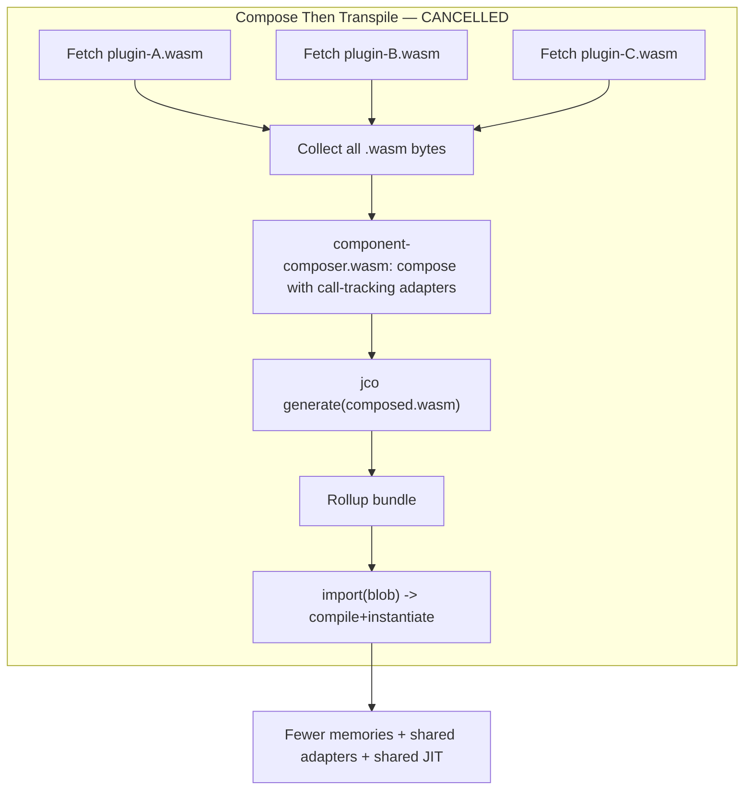

# WASM Plugin Memory — Investigation History & Findings Archive

This document preserves the full record of investigation, testing, and decision-making for the WASM plugin memory work. It substantiates the decisions in the active plan (`wasm-plugin-memory-plan.md`).

**Timeline**: 2026-04-11 through 2026-04-14
**Conversation transcript**: [WASM memory plan](a0a46358-7a86-4b1a-be3a-0690cc981e4a)

---

## Phase 1: Problem Identification

### Initial symptom

Loading apps (particularly Config) in Brave/Chrome triggers:

> `WebAssembly.instantiate(): Out of memory: Cannot allocate Wasm memory for new instance`

### Root cause analysis

Standard memory measurement tools showed misleadingly small numbers:

- **Browser Task Manager**: ~350KB per tab (measures committed physical RAM, not virtual reservations)
- `**performance.measureUserAgentSpecificMemory()`**: Failed in Brave (fingerprinting protection); measures committed memory anyway
- **DevTools heap snapshots**: Largest retained size ~63KB (shows JS wrappers, not virtual address space)

The root cause is **virtual address space exhaustion**, not physical RAM or JS heap:

- Each `WebAssembly.Memory` object reserves ~6-10GB of virtual address space for guard regions (enables fast bounds-check-free execution)
- Guard pages don't consume physical RAM — only virtual address space
- V8 enforces a 1 TiB limit via `WasmAllocationTracker::ReserveAddressSpace()` in `v8/src/wasm/wasm-memory.cc`
- The OS may also enforce limits via `vm.max_map_count` (Linux default: ~65K mappings)

### Instrumentation

Two measurement patches were developed:

**Attempt 1: `WebAssembly.Memory` constructor monkey-patch** (in `main.ts`)
- Result: **No calls logged.** V8 creates Memory objects internally during `WebAssembly.instantiate()`, bypassing the JS constructor.
- Learning: The JS `WebAssembly.Memory` constructor is only called when JS code explicitly creates a Memory. For modules that declare their own memory, instantiation creates it internally.

**Attempt 2: `WebAssembly.instantiate` monkey-patch** (in `main.ts`)
- Result: **Successfully logged all instantiations.**
- Code placed at top of `main.ts`, before any imports:

```typescript
let _wasmInstanceCount = 0;
const _origInstantiate = WebAssembly.instantiate;
WebAssembly.instantiate = function (...args: any[]) {
    _wasmInstanceCount++;
    const isModule = args[0] instanceof WebAssembly.Module;
    console.log(
        `[wasm-mem] instantiate #${_wasmInstanceCount}`,
        isModule ? "(from Module)" : "(from bytes)",
    );
    return (_origInstantiate as any).apply(WebAssembly, args);
} as typeof WebAssembly.instantiate;
(globalThis as Record<string, unknown>).__wasmInstanceCount = () =>
    _wasmInstanceCount;
```

**jco core file count logging** (in `loader.ts`, after `generate()`):

```typescript
const wasmFiles = transpiledFiles.filter(([n]) => n.endsWith(".wasm"));
console.log(
    `[wasm-mem] ${debugFileName}: jco produced ${wasmFiles.length} core .wasm file(s) from ${transpiledFiles.length} total files`,
);
```

**Note for Brave/Chrome users**: Type `allow pasting` into the DevTools console before pasting code.

### Baseline numbers (Config app)

Single Config app page load:
- **26 plugins** transpiled by jco
- **49 core `.wasm` files** produced (most plugins produce 2: 1 core + 1 WASI adapter)
- **97 `WebAssembly.instantiate` calls**
- `host.plugin.js` appears 6 times (host service has auth, prompt, types, db, crypto, common plugins)

Accumulation across navigations (same tab, 4 supervisor iframe reloads):
- Load 1 (Config): 76 instantiations
- Load 2 (prompt navigation): 76 instantiations
- Load 3 (prompt + auth): 85 instantiations
- Load 4 (Config full with packages/setcode/staged-tx): 97 instantiations
- **Total: 334 instantiations across session**

---

## Phase 2: Composition Feasibility Testing

### Hypothesis

Composing N WASM component plugins into a single component before jco transpilation would reduce the number of `WebAssembly.Memory` objects, directly addressing virtual address space exhaustion.

### Tools used

- `wac` v0.9.0 (`cargo install wac-cli --locked`) — successor to deprecated `wasm-tools compose`
- `jco` v1.10.2 (`npx @bytecodealliance/jco@1.10.2 transpile`)
- `wasm-tools` v1.240.0 (`wasm-tools print`, `wasm-tools dump`, `wasm-tools component wit`)

### Test methodology

1. Copy all plugin `.wasm` files from `build/components/`, renaming to kebab-case (required by wac)
2. Compose groups of plugins using `wac plug` (flat composition) or iterative bottom-up composition
3. Transpile both separate and composed outputs with `jco transpile`
4. Count `.core.wasm` files produced
5. Inspect each `.core.wasm` for memory ownership: `(memory ...)` definition vs `(import "env" "memory" ...)` import
6. Compare Memory object counts

A reproducible script was created: `feasibility-compose-test.sh` in the repo root.

### Initial results (MISLEADING — later corrected)

First test with flat `wac plug` of 19 plugins:

| Metric | Separate | Composed | Reduction |
|--------|----------|----------|-----------|
| instantiate calls | 41 | 11 | 74% |
| Memory objects | 21 | 6 | 72% |

This appeared to show a dramatic improvement. **However, this was a measurement error.**

### Critical discovery: `wac plug` silently drops unreachable plugins

`wac plug` only resolves the **root component's direct imports**. It does NOT do transitive dependency resolution. Plugins offered as `--plug` arguments are silently ignored if the root doesn't import their exports.

**Verification**: Compared internal core module counts:

```
config.wasm alone: 4 core modules
composed-19.wasm:  16 core modules
Expected if all 20 composed: 20 × 4 = 80 core modules
Expected if only root's 3 direct deps: 4 × 4 = 16 core modules  ← matches!
```

Config only directly imports from 3 plugins: `packages`, `producers`, `transact`. Only these 3 (plus config itself = 4 total) were actually composed. The other 15 plugins were silently dropped.

**Impact of correction**: The "72% reduction" was comparing 4 composed plugins against all 21 separate. The 15 dropped plugins would still need separate loading, so the real comparison should have been 5 (composed) + 16 (separate) = 21, vs 21 all separate — no improvement.

### Definitive scaling test: iterative composition

To test with ALL plugins truly composed, used iterative bottom-up composition:

```
Step 1: wac plug accounts.wasm --plug permissions.wasm --plug clientdata.wasm → stage1-accounts.wasm
Step 2: wac plug transact.wasm --plug stage1-accounts.wasm → stage2-transact.wasm
Step 3: wac plug packages.wasm --plug sites.wasm --plug stage2-transact.wasm → stage3-packages.wasm
Step 4: wac plug config.wasm --plug producers.wasm --plug stage3-packages.wasm → stage4-config.wasm
```

Results:

| Plugins | Method | Core .wasm files | Memory objects | vs Separate |
|---------|--------|-----------------|----------------|-------------|
| 1 | separate | 2 | 1 | — |
| 3 | flat compose | 6 | 3 | same |
| 4 | flat compose | 9 | 5 | **worse** (+1) |
| 8 | iterative compose | 15 | 8 | same |
| 8 | separate | 15 | 8 | — |

**Key finding**: Iterative composition of 8 plugins produces **exactly the same Memory count (8)** as loading them separately. Flat composition of 4 plugins is actually **worse** by 1 (extra canonical ABI adapter module).

### Why composition doesn't reduce Memory objects

The WASM Component Model's core design principle is **memory isolation**. When components are composed:
- They are bundled into a single downloadable unit
- Each constituent's core module retains its own linear memory
- The canonical ABI copies data across boundaries
- There is no mechanism to merge core modules or share memory between components

This is by design — it's a security feature, not a limitation. But it means composition cannot solve the virtual address space problem.

### Additional findings from composition testing

1. **`host-types.wasm` cannot be composed** with other plugins. It exports a resource type (`plugin-ref`), and the composed component fails validation with "instance not valid to be used as import/export". This is a known limitation with resource type identity in Component Model composition.

2. **Plugin file names must be kebab-case** for wac (e.g., `host-common.wasm` not `host_common.wasm`). The build uses underscores.

3. **WASI adapter modules share memory with their parent core module**. Each plugin's `.core2.wasm` (the WASI adapter) has `(import "env" "memory" (memory (;0;) 0))` — it imports memory rather than defining its own. So only 1 Memory object per plugin, not 2.

4. **Script bug**: `set -euo pipefail` + `grep -q` + large output = SIGPIPE. When `grep -q` finds a match in a large pipe from `wasm-tools print`, it closes its stdin immediately. The sending `echo` receives SIGPIPE (exit 141), and with `pipefail`, the pipeline reports failure even though grep succeeded. Fix: use `grep -c` instead of `grep -q`.

5. **`wasm-tools compose` is deprecated** in favor of `wac`. Both produce identical results for our use case.

---

## Phase 3: Alternative Approach Research

### Web Worker Offloading — REJECTED

**Finding**: Web Workers run in the same Chromium renderer process. V8's `WasmAllocationTracker` is per-`WasmEngine`, which is a process-wide singleton shared across all V8 isolates. Workers create separate isolates but share the same ~1 TiB address space budget.

**Source**: `v8/src/wasm/wasm-memory.cc` — `static constexpr size_t kAddressSpaceLimit = 0x10000000000L; // 1 TiB`

**Evidence**: Chromium docs confirm "Web Workers in Chromium run within the same renderer process as their parent document."

### Browser-Level Tuning — REJECTED

Guard page sizes and virtual memory limits require browser flags (`--js-flags=--wasm-max-mem-pages`) or OS configuration (`vm.max_map_count`). Not scriptable. Users should not need to modify browser settings.

### Plugin Consolidation at Source Level — REJECTED

Plugin sets are fully dynamic per app. Each app defines its own top-level plugins with different transitive dependencies. No fixed set to merge. Solution must generalize to all future apps.

### Lazy Instantiation with Adaptive Pool — APPROVED

**Key technical findings**:

1. **`WebAssembly.compile()` does NOT allocate Memory**: Creates a `WebAssembly.Module` with JIT-compiled code but no linear memory. No virtual address space reserved. Can pre-compile all plugins cheaply.

2. **V8 releases address space on GC**: When a WASM instance is garbage collected, `WasmAllocationTracker::ReleaseAddressSpace()` decrements the address space counter. The virtual memory reservation is freed. (Verified via V8 source code.)

3. **jco `--instantiation async` mode**: Changes the generated JS from auto-instantiating on module load to exporting an `instantiate()` function:
   ```typescript
   export async function instantiate(
     getCoreModule: (path: string) => Promise<WebAssembly.Module>,
     imports: { [importName: string]: any },
     instantiateCore?: (...) => Promise<WebAssembly.Instance>
   ): Promise<{ [exportName: string]: any }>;
   ```
   This gives full control over when Memory objects are created and destroyed.

4. **Current loader already uses blob URLs**: `loader.ts` creates blob URLs for bundled JS, imports them, and immediately revokes the URL. Dropping the module reference after use should allow GC of the WASM instances.

5. **`generate()` API supports `instantiation` option**: The same `generate()` function used in `loader.ts` accepts the same options as the CLI. Just add `instantiation: { tag: 'async' }` to the `GenerateOptions`.

6. **Plugins are designed to be stateless between calls**: Persistent state goes through `clientdata` (IndexedDB-backed via `host:db`). Linear memory state (Rust statics, heap) should not be relied upon across calls, making dispose-and-re-instantiate safe.

---

## Phase 4: Security Model Analysis

Regardless of which approach is taken, the security model must be preserved. Analysis of the current security model:

### Call stack is security-critical

The supervisor's `CallStack` is NOT just plumbing — it's the foundation of:

1. **Storage namespace isolation**: `host:db`'s `Bucket::new` builds keys as `{chain_id}:{mode}:{get_sender()}:{identifier}`. Without correct stack, plugins read/write each other's data.
2. **Access control gates**: `check_caller()` enforces whitelists (e.g., only `accounts` can call `set_logged_in_user`).
3. **`clientdata` per-caller tables**: Each plugin's key-value store scoped by `get_sender()`.
4. **Permissions system**: `is_authorized` uses `get_sender()` and `get_active_app()` for trust decisions.

### Linear memory isolation is preserved

Both composition and lazy instantiation preserve linear memory isolation. Each plugin's core module retains its own memory. The canonical ABI copies data across boundaries. No new attack vectors.

---

## Phase 5: Debugging Feasibility Assessment

Even though debugging enhancements are deferred, feasibility was confirmed:

1. **jco `tracing: true`**: Injects `console.error` at every function boundary with full WIT interface/function names. Low effort, high value.
2. **`//# sourceURL`**: Already implemented. Each plugin bundle gets a meaningful filename in DevTools.
3. **Rollup inline source maps**: Rollup supports `sourcemap: 'inline'`. Would map bundled output back to jco-generated JS files.
4. **WASM name sections**: Core modules can retain function names if `strip = "debuginfo"` instead of `strip = true`.

Risk assessment: Low to Medium across all aspects. No blockers identified.

---

## Decision Log

| Date | Decision | Rationale |
|------|----------|-----------|
| 2026-04-11 | Investigate WASM component composition | User proposed linking plugins to reduce memory |
| 2026-04-11 | Option (c): full composition with embedded call tracking | Call stack is security-critical; must be preserved |
| 2026-04-12 | Phased iteration plan (10 iterations) | Minimize change per review cycle |
| 2026-04-12 | `WebAssembly.instantiate` monkey-patch (not `Memory`) | V8 creates Memory internally during instantiate, bypassing JS constructor |
| 2026-04-13 | Initial composition feasibility: GO (72% reduction) | Based on `wac plug` flat composition test |
| 2026-04-13 | **CORRECTION**: Composition does NOT reduce Memory objects | `wac plug` silently dropped 15/19 plugins. Iterative composition shows 8→8 (no reduction) |
| 2026-04-13 | Reject Web Worker offloading | Same process, same V8 WasmEngine, same 1 TiB budget |
| 2026-04-13 | Reject browser-level tuning | Not scriptable, requires user configuration |
| 2026-04-13 | Reject plugin consolidation at source level | Plugin sets are dynamic per app |
| 2026-04-13 | **APPROVE lazy instantiation with adaptive pool** | jco `--instantiation async` + V8 GC address space release + pre-compilation confirmed viable |
| 2026-04-14 | **CONFIRM lazy instantiation** after composition revisit | See Phase 6 below — all creative composition paths evaluated and rejected |

---

## Phase 6: Composition Revisit — Second Analysis (2026-04-14)

After initial rejection of composition, we revisited the approach to ensure no creative path was missed. The question: is there *any* way to make composition reduce Memory object count?

### Why server-side composition doesn't help

The constraint is the **Component Model's design**, not where composition runs. Whether `wac plug` runs on a build server or in the browser, the resulting composed component still contains N core modules with N separate memories. The Component Model preserves linear memory isolation regardless of execution environment.

### Creative paths investigated

#### Path A: Core module merging (wasm-merge + multi-memory lowering)

Binaryen has a production-quality **multi-memory lowering pass** (`wasm-opt --multi-memory-lowering`) that merges multiple memories into a single combined memory.

The theoretical pipeline:
1. After jco transpile produces N `.core.wasm` files, merge them with `wasm-merge` into one module with N memories (multi-memory WASM feature)
2. Apply `wasm-opt --multi-memory-lowering` to combine N memories into 1
3. The pass adjusts all load/store offsets, replaces `memory.size`/`memory.grow` with per-original-memory tracking functions, and offsets data segments

**This would reduce N Memory objects to 1**, but practical challenges are severe:

- **JS glue incompatibility**: jco generates JS that instantiates each core module separately. A merged module has completely different structure requiring custom JS glue.
- **Toolchain assumptions**: Rust's compiled WASM uses `__heap_base`, `__stack_pointer`, and its own allocator (dlmalloc). The Binaryen lowering pass adjusts memory instructions but doesn't know about these Rust-specific globals.
- **No existing pipeline**: Nobody has done wasm-merge + multi-memory lowering on Rust Component Model plugin output. Novel tooling across multiple layers.
- **Component Model lead skepticism**: Luke Wagner (Component Model architect) explicitly warns against memory merging in [component-model#386](https://github.com/WebAssembly/component-model/issues/386): *"I don't think this is a valid optimization for arbitrary wasm content since there are many ways for core wasm code to subtly depend on having its own memory/table space, so this optimization is likely to introduce subtle bugs."*

**Decision**: REJECTED — very high complexity, high fragility risk, no validated precedent.

References:
- [Binaryen multi-memory lowering pass PR](https://github.com/WebAssembly/binaryen/pull/5107) — describes the pass's offset adjustment, memory.size/grow replacement
- [wasm-merge reintroduction PR](https://github.com/WebAssembly/binaryen/pull/5709) — core module merging tool
- [Component Model issue #386: Symmetrical ABI for component fusion](https://github.com/WebAssembly/component-model/issues/386) — Luke Wagner's analysis of why memory merging is dangerous for arbitrary WASM

#### Path B: Compile-time bundling (single Rust crate per plugin group)

Compile multiple plugins into a single WASM module at build time by creating a Rust crate that depends on multiple plugin crates and re-exports their WIT interfaces. `cargo component build` links them into one component with one core module and one memory. The Rust linker (`wasm-ld`) handles memory layout, allocator, and stack merging natively.

**Feasibility**: HIGH for known, fixed plugin groups (system plugins). NOT APPLICABLE for dynamic per-app plugin sets.

**Decision**: REJECTED as a general solution — plugin sets are fully dynamic. Would only help for the fixed system plugin group, and doesn't generalize.

#### Path C: Browser-side memory rewriting via `instantiateCore` callback

jco's `--instantiation async` mode provides a callback that controls how each core module is instantiated. Theoretically, we could rewrite `.core.wasm` binaries at load time to change memory definitions to imports, then provide a shared `WebAssembly.Memory`.

This is essentially Path A done in the browser without Binaryen's battle-tested lowering pass. Higher risk, more custom code, same fundamental problems with allocator conflicts and memory layout.

**Decision**: REJECTED — extremely high complexity, very high fragility risk.

### Browser/spec developments that don't help yet

1. **Wasmtime guard region reduction**: Wasmtime reduced default guard regions from 2GB to 32MB in November 2024 ([PR #9606](https://github.com/bytecodealliance/wasmtime/pull/9606)), inspired by SpiderMonkey analysis showing largest static offset in wasm modules was 20MB. If V8 followed suit, each Memory would reserve ~4GB instead of ~10GB, roughly doubling concurrent instance capacity. But V8 has not made this change and we cannot depend on future browser changes.

2. **WebAssembly memory-control proposal** ([github.com/WebAssembly/memory-control](https://github.com/WebAssembly/memory-control)): Adds `memory.discard` and mapped memory. Still in early proposal stage with no browser implementation timeline.

3. **Symmetric ABI / component fusion proposal** ([component-model#386](https://github.com/WebAssembly/component-model/issues/386)): Pre-proposal focused on native code linking, not browser WASM. Component Model lead views shared-everything linking as a separate concern from the component model.

### Lazy instantiation confirmation

Every piece of the lazy instantiation approach was independently verified:

| Piece | Evidence |
|-------|----------|
| `WebAssembly.compile()` creates Module without Memory | V8 source: compile produces `WasmModuleObject`, no `WasmMemoryObject` allocation. [V8 wasm-memory.cc](https://chromium.googlesource.com/v8/v8/+/ae45cc1f5c7dc3b3ecd36cee0cc1ec8980d36e94/src/wasm/wasm-memory.cc) |
| `WebAssembly.instantiate()` is what creates Memory | Confirmed via our own instrumentation (Phase 1) |
| V8 releases address space on GC | `WasmAllocationTracker::ReleaseAddressSpace()` in [V8 backing-store.cc](https://chromium.googlesource.com/v8/v8/+/833b3c96a6f5a345b44aeca9e0034c2f97b43d5f/src/objects/backing-store.cc) |
| jco `--instantiation async` defers instantiation | [jco documentation: manual WASM instantiation](https://bytecodealliance.github.io/jco/manual-wasm-instantiation-with-wasi-overrides.html) |
| Plugins are stateless between calls | By design: persistent state goes through `clientdata` (IndexedDB) |
| Retry on allocation failure | V8 triggers GC before returning "Cannot allocate" error |

### Conclusion

No creative approach to composition reduces the number of `WebAssembly.Memory` objects without either (a) building novel, unvalidated tooling with high fragility risk, or (b) requiring fixed plugin sets. Lazy instantiation with adaptive pool management is confirmed as the only viable general solution.

---

## Decision Log (continued)

| Date | Decision | Rationale |
|------|----------|-----------|
| 2026-04-14 | Reject core module merging (wasm-merge + multi-memory lowering) | Very high complexity, fragile (Rust allocator/globals), no precedent, Component Model lead warns against it |
| 2026-04-14 | Reject compile-time plugin bundling as general solution | Only works for fixed groups, plugin sets are dynamic |
| 2026-04-14 | Reject browser-side memory rewriting | Same risks as core module merging, plus no battle-tested lowering pass |
| 2026-04-14 | **CONFIRM lazy instantiation as definitive go-forward approach** | All technical pieces independently verified. Only solution that works for dynamic plugin sets without novel tooling risk. |

---

## Original Composition-Based Iteration Plan (CANCELLED)

The following iterations were planned before the composition approach was rejected. Preserved here for historical reference.

- **Iter 0**: Baseline measurement (partially completed — instrumentation in place)
- **Iter 1**: Offline feasibility test (completed — led to rejection)
- **Iter 2**: Minimal component-composer crate (Rust, browser-compiled)
- **Iter 3**: Call-tracking adapter generation
- **Iter 4**: `loadComposedPlugins` in loader.ts
- **Iter 5**: ComposedPluginBundle dispatch class
- **Iter 6**: Wire composition into plugin-loader.ts
- **Iter 7**: E2E testing and hardening
- **Iter 8**: IndexedDB caching for composed WASM
- **Iter 9**: Debugging enhancements (jco tracing, source maps)

### Original Proposed Architecture (composition-based)



### Original Design Decisions (composition-specific)

1. **Browser-side composition**: Plugin sets vary dynamically; build-time composition not viable.
2. **Call tracking via adapter components**: Adapter at each cross-plugin boundary pushes/pops supervisor stack.
3. **WASI and host imports simplification**: Composed component has ONE set of WASI imports shared by all constituents.
4. **ComposedPluginBundle dispatch**: Maps `(service, plugin, intf, method)` to namespaced exports on shared module.
5. **Permissions integration**: No changes needed if call stack is correctly maintained.

---

## Phase 7: Concurrent Instance Analysis (2026-04-14)

Static analysis of the WIT dependency graph across all Config-loaded plugins to determine the maximum number of plugins that must be simultaneously instantiated under lazy loading.

### Call model

All plugin calls are synchronous. The supervisor's `entry()` method runs three sequential phases:
1. `startTx()` — calls transact:plugin
2. `call(args)` — the user's plugin call, which may chain through multiple plugins
3. `finishTx()` — constructs and signs the transaction, calling auth hooks

Phases 2 and 3 don't overlap. The max concurrent is the deeper of the two, not the sum.

### Plugin dependency graph (from WIT `impl.wit` imports)

Only cross-plugin imports counted (excludes `host:*`, `wasi:*`, `supervisor:*`):

```
config       → packages, staged-tx, producers, branding, transact, virtual-server, tokens, symbol
packages     → accounts, setcode, sites, staged-tx, transact
staged-tx    → accounts, transact, clientdata, permissions
transact     → clientdata, accounts, permissions, virtual-server
accounts     → clientdata, transact, permissions, auth-sig, invite
auth-sig     → accounts, transact, clientdata, permissions
permissions  → accounts
virtual-server → tokens, accounts
branding     → transact, staged-tx, sites
symbol       → transact, permissions, tokens, staged-tx, nft
sites        → transact, permissions
setcode      → transact, permissions
host-common  → accounts
host-auth    → transact
host-crypto  → permissions
web-crypto   → clientdata
aes          → kdf
```

Leaf plugins (no cross-plugin imports): **tokens**, **base64**, **kdf**, **clientdata**, **host-types**.

Cycles: accounts ↔ permissions, accounts ↔ transact (mutual import availability, not infinite recursion).

### Deepest call chains

**During `call(args)` phase** — worst case 8 concurrent:

```
config → packages → staged-tx → transact → virtual-server → accounts → auth-sig → clientdata
```

Exercisable scenario: installing a package triggers package management → staged transaction → transaction construction → virtual server billing → account lookup → key verification → key storage.

**During `finishTx()` phase** — worst case 6 concurrent:

From Rust source (`Transact/plugin/src/lib.rs` and `helpers.rs`), `finish_tx()` calls:
1. `transform_actions()` → tx-transform hook (e.g., staged-tx) via `callDyn`
2. `VirtualServer::auto_fill_gas_tank()` → virtual-server
3. `make_transaction()` → `get_claims()` → auth plugin (auth-sig) via `callDyn`
4. `get_proofs()` → auth plugin (auth-sig) → webcrypto → clientdata

Deepest chain: `transact → auth-sig → accounts → webcrypto → clientdata → permissions` = 6 concurrent.

### Result

| Metric | Value |
|--------|-------|
| Total plugins loaded (Config app) | 26 |
| Total `WebAssembly.instantiate` calls (current) | 97 |
| **Max concurrent during deepest call chain** | **8** |
| Max concurrent during `finishTx()` | 6 |
| Proposed pool budget | 15-20 |
| Headroom (budget / max concurrent) | ~2x |

The current system instantiates all 97 modules simultaneously and hits the virtual address space limit. With lazy instantiation and a pool budget of 15-20, peak concurrent drops from 97 to at most 15-20, with the actual call-chain maximum being just 8. This provides ~2x safety margin.

### Caveat

This is static analysis of WIT imports, which declare what a plugin **can** call, not what it always calls. Runtime maximum could be lower than 8. Empirical validation will come naturally from the `InstancePool` implementation in Iteration 3, which will track concurrent instance counts.

---

## Decision Log (continued)

| Date | Decision | Rationale |
|------|----------|-----------|
| 2026-04-13 | Iteration 3 complete | InstancePool with LRU eviction, preload race condition fixed, all 3 iterations done |
| 2026-04-13 | Pool budget set to 24 | 19 system (pinned) + 5 non-system = ~96 core instances, safely under V8's ~1TiB vaddr limit |
| 2026-04-13 | Preload race condition fixed | Serialized via promise chain — trivial fix, no GitHub issue needed |
| 2026-04-14 | Pool budget of 15-20 is safe | Static analysis shows max concurrent call depth of 8; budget provides ~2x headroom |
| 2026-04-11 | Iteration 2 complete | Compile/instantiate split, plugin lifecycle (compiled/instantiated/disposed), phased preload |
| 2026-04-11 | Iteration 1 complete | jco async instantiation mode working, Rollup pipeline removed, dead code cleaned up |

---

## Iteration 1 Implementation Log

### What Changed

Replaced the Rollup-based code generation pipeline with jco's `instantiation: { tag: 'async' }` mode. This was a complete rewrite of `loader.ts` and removal of several supporting files.

**Old pipeline**: `jco generate` → code-generated proxy JS files → Rollup bundling → `import(blobUrl)` (auto-instantiates)

**New pipeline**: `jco generate (async mode)` → `WebAssembly.compile()` core modules → runtime import proxy construction → `import(blobUrl)` → call `instantiate(getCoreModule, imports)` explicitly

### Bugs Discovered and Fixed

**1. camelCase vs kebab-case import key mismatch**

The WIT parser (used for extracting import/export metadata) returns camelCase names for interfaces and packages (e.g., `hookHandlers`, `wallClock`, `withKey`). However, jco uses the original WIT kebab-case names as import keys in its generated `instantiate()` function (e.g., `hook-handlers`, `wall-clock`, `with-key`).

When jco's generated code destructured `imports['transact:plugin/hook-handlers']`, it found `undefined` because we were providing the key as `imports['transact:plugin/hookHandlers']`.

**Fix**: Added `toKebabCase()` conversion when constructing import keys from parser data.

**2. Type-only interfaces dropped**

Interfaces that only define types (no functions) — such as `host:types/types`, `accounts:plugin/types`, `permissions:plugin/types` — were being filtered out of the imports object because their `funcs` array was empty. However, jco's generated code still destructures these keys from the imports object, throwing when they are `undefined`.

**Fix**: Instead of filtering out zero-function interfaces, provide `imports[key] = {}` (empty object) for them. This satisfies jco's destructuring without requiring actual implementations.

**3. Resource type name casing in syncCallResource**

The old `proxy-package.ts` passed PascalCase type names (e.g., `"Bucket"`) to `syncCallResource`. The new code was passing the raw parser name (e.g., `"bucket"`) which didn't match the target plugin's jco-exported class name (`Bucket`). This caused `Unrecognized call: store:bucket.constructor` errors, which cascaded into other failures like `Call to accounts:plugin/api->getCurrentUser failed`.

**Fix**: Changed `type: rawResourceName` to `type: className` (PascalCase) in the `addResourceProxy` function.

### Dead Code Removed

After Iteration 1 was verified working, the following files were deleted (no longer imported by any live code):

| File | Purpose (now superseded) |
|------|--------------------------|
| `component-loading/rollup-plugin.ts` | Custom Rollup plugin for `.wasm` → blob URL transforms |
| `component-loading/proxy/proxy-package.ts` | Code-generated JS shims for cross-plugin proxy calls |
| `component-loading/import-details.ts` | Types for Rollup import map / file structure |
| `component-loading/privileged-api.js` | Shim for privileged supervisor API calls |
| `component-loading/shims/shim-wrapper.js` | WASI shim wrapper using `globalThis.__preview2Shims` |
| `component-loading/shims/README.md` | Documentation for the shim approach |
| `feasibility-compose-test.sh` | One-off composition feasibility test script |

Also removed: `@rollup/browser` from `package.json` dependencies.

### Verification Results

- Config app loads and functions normally
- Transactions execute successfully (tested `stagecode`, `storesys`, `propose` actions)
- Instantiation count matches baseline: 76 for base plugins, 97 for Config app (with branding, sites, packages, setcode, staged-tx, auth-any)
- No console errors (except pre-existing React controlled/uncontrolled checkbox warning)

### Dev Instrumentation Removed

The `WebAssembly.instantiate` monkey-patch in `main.ts` and `[wasm-mem]` console logging in `loader.ts` have been removed now that Iteration 1 is verified. The instrumentation code is preserved here for future use:

```javascript
// Add to main.ts (before any other imports) to count WebAssembly.instantiate calls:
let _wasmInstanceCount = 0;
const _origInstantiate = WebAssembly.instantiate;
WebAssembly.instantiate = function (...args) {
    _wasmInstanceCount++;
    const isModule = args[0] instanceof WebAssembly.Module;
    console.log(`[wasm-mem] instantiate #${_wasmInstanceCount}`, isModule ? "(from Module)" : "(from bytes)");
    return _origInstantiate.apply(WebAssembly, args);
};
globalThis.__wasmInstanceCount = () => _wasmInstanceCount;
console.log("[wasm-mem] WebAssembly.instantiate tracking enabled");
```

---

## Iteration 2 Implementation Log

### What Changed

Separated the compile phase from the instantiate phase across the plugin loading pipeline. Plugins are now compiled during preload (no `WebAssembly.Memory` allocated) and instantiated on demand.

**Old flow** (Iteration 1): `compilePlugin()` → eager `instantiate()` → Memory allocated immediately for every plugin

**New flow** (Iteration 2): `compilePlugin()` → returns `CompiledPlugin` handle → `ensureInstantiated()` called later → Memory allocated only when needed

### File Changes

| File | Change |
|------|--------|
| `loader.ts` | `loadPlugin` → `compilePlugin`, returns `CompiledPlugin { instantiate() }` instead of plugin exports. `loadWasmComponent` → `compileWasmComponent`. `loadBasic` unchanged (eager for parser utility). |
| `plugin.ts` | Added `compiledPlugin` field, `ensureInstantiated()`, `dispose()`, `isInstantiated` getter. `doReady()` calls `compilePlugin()` (no instantiation). Removed `bytes` check from `call()`/`resourceCall()`. |
| `plugin-loader.ts` | Added `ensureAllInstantiated()` to instantiate all plugins in the current round. |
| `plugins.ts` | Added `ensureAllInstantiated()` that iterates all service contexts. |
| `service-context.ts` | Added `getAllPlugins()` to expose plugin array. |
| `supervisor.ts` | Phase 0: `awaitReady()` + `ensureAllInstantiated()` (system plugins need sync calls). Phase 1-2: `awaitReady()` only (compile, no instantiation). End of preload: `plugins.ensureAllInstantiated()` for remaining plugins. |
| `index.ts` | Updated exports: `compilePlugin` + `CompiledPlugin` type. |

### Design Constraint: Synchronous Call Chains

A critical constraint shapes this design: WASM cross-plugin calls are synchronous. When plugin A calls plugin B (via `syncCall` → `supervisor.call()`), B must already be instantiated — we can't pause a synchronous call to async-instantiate.

This means ALL plugins in a potential call chain must be instantiated before the synchronous chain begins. The solution is phased instantiation in `preload()`:

1. **Phase 0** (system plugins): compile + instantiate immediately, because sync calls follow (getActivePrompt, getActiveQueryToken, etc.)
2. **Phase 1** (app plugins): compile only — no sync calls use these yet
3. **Phase 2** (auth plugins): compile only — the `getAuthServices` sync call uses Phase 0 plugins
4. **End of preload**: bulk instantiate all remaining plugins before `entry()` starts its sync chain

This defers Memory allocation from "plugin parse time" to "end of preload," allowing all compilation to happen in parallel without virtual address space pressure. The full benefit comes in Iteration 3 when the adaptive pool selectively instantiates only the plugins actually needed.

### Verification

- TypeScript compilation: passes (`tsc -b --noEmit`)
- Vite build: succeeds (no new warnings beyond existing dynamic/static import overlap for preview2-shim)
- `Supervisor.psi`: installs correctly via `make install`

**Runtime verification** (confirmed via temporary instrumentation deployed to running chain):

1. **Compile/instantiate split works**: Between every "Phase 1: compiling" and "Phase 1: compile done" pair, zero `WebAssembly.instantiate` calls occurred. Same for Phase 2. Memory allocation is successfully deferred from compile time.

2. **Phase 0 system plugins compile then instantiate**: System plugins compile (no Memory), then instantiate in a batch. `WebAssembly.instantiate #1` is always the component parser (`loadBasic`), as expected.

3. **App/auth plugins instantiate only at end of preload**: Plugins like `branding:plugin`, `sites:plugin`, `packages:plugin`, `setcode:plugin`, `staged-tx:plugin`, and `auth-any:plugin` compiled during Phase 1/2 but instantiated only after "Instantiating all remaining plugins..."

4. **Subsequent preload cycles are no-ops**: After initial load, repeated Phase 0/1/2 cycles complete with zero new compilation or instantiation — `ensureInstantiated()` returns immediately.

5. **Instantiate count matches Iteration 1 baseline**: Config app single supervisor: parser (1) + system plugins (75) + auth-any (1) + branding+sites (8) + packages+setcode+staged-tx (12) = **97** — identical to Iter 1 baseline.

6. **Transactions execute successfully**: Config app loads and functions normally.

7. **Pre-existing race condition observed and fixed**: See "Race Condition: Concurrent Preload Calls" below.

---

## Race Condition: Concurrent Preload Calls

**Symptom**: `"Call to accounts:plugin/admin->getAllAccounts failed — Plugin either invalid or called before ready"` appears transiently during page load. The app recovers (retry succeeds).

**Root cause**: `preloadPlugins()` and `entry()` both call `preload()`. When both are in-flight concurrently:

1. `preloadPlugins()` calls `preload()` → Phase 0 starts → `trackPlugins(systemPlugins)` → `processPlugins()` → `awaitReady()` (awaiting compilation)
2. While step 1 is awaiting, `entry()` is called → also calls `preload()` → Phase 0 starts → `trackPlugins(systemPlugins)` → **`reset()` clears `allLoadedPlugins`**
3. Step 1's in-flight `awaitReady()` completes, but `allLoadedPlugins` was just cleared by step 2. The loader's state is now inconsistent — `ensureAllInstantiated()` operates on the wrong plugin set.

This creates a window where some plugins are compiled but not instantiated when a synchronous call arrives.

**Pre-existing**: This race existed before Iteration 2. The old code had the same `preload()` structure with `trackPlugins()` resetting shared state. The error path (`PluginInvalid`) is unchanged.

**Fix**: Serialize `preload()` calls with a promise chain. Each call waits for the previous to complete before starting. This is safe because `preload()` is idempotent — `getPlugin()` returns cached plugins, and `ensureInstantiated()` is a no-op if already done.

```typescript
// In supervisor.ts:
private preloadLock: Promise<void> = Promise.resolve();

private preload(plugins: QualifiedPluginId[]): Promise<void> {
    const myPreload = this.preloadLock
        .catch(() => {})
        .then(() => this.doPreload(plugins));
    this.preloadLock = myPreload.catch(() => {});
    return myPreload;
}
```

Fixed in Iteration 3.

---

## Iteration 3 Implementation Log

### What Changed

Added an `InstancePool` to manage the lifecycle of instantiated plugins and prevent unbounded growth of concurrent WebAssembly instances. Also fixed the pre-existing race condition documented above.

### File Changes

| File | Change |
|------|--------|
| `instance-pool.ts` (NEW) | `InstancePool` class: budget-based LRU eviction, pinning for system plugins, `register()`/`unregister()`/`touch()`/`evictIdle()` API. |
| `supervisor.ts` | **Race fix**: `preload()` → `doPreload()` rename, new `preload()` wrapper serializes calls via `preloadLock` promise chain. **Pool integration**: pool constructed in `Supervisor` constructor; Phase 0 plugins registered as pinned; Phase 1+2 plugins registered (not pinned); `call()`/`callResource()` touch the plugin; `entry()` calls `pool.evictIdle()` in `finally`. |
| `plugins.ts` | Added `forEachPlugin()` for iterating all plugins across service contexts. |

### How the Pool Works

1. **Registration**: After plugins are instantiated during `doPreload()`, they're registered with the pool. Phase 0 (system) plugins are pinned — they're always in the pool and never evicted.

2. **Touch**: Every `call()` and `callResource()` invocation updates the plugin's `lastUsed` timestamp in the pool. Frequently-used plugins stay "hot."

3. **Eviction**: After each `entry()` completes (success or error), `evictIdle()` checks if the pool exceeds its budget. If so, it iterates to find the non-pinned plugin with the oldest `lastUsed` timestamp, calls `plugin.dispose()` on it, and removes it from the pool. Repeats until the pool is at or below budget.

4. **Re-instantiation**: On the next `preload()` → `ensureAllInstantiated()`, any disposed plugin is transparently re-instantiated (the `CompiledPlugin` handle from Iteration 2 is still valid — only the instance was dropped).

### Design Constraint: Initial Load

Due to the synchronous call chain constraint (WASM cross-plugin calls can't pause to async-instantiate), ALL plugins in the dependency tree must be instantiated before `entry()` starts. The pool can't reduce the peak instance count during initial load. Its value is in managing the steady state across multiple `entry()` calls:

- Plugins not used during a call are evicted after the call completes
- Only the actively-used working set stays instantiated
- The instance count converges to the pool budget over successive calls

### Budget Rationale

Default budget: **24 plugins**. Rationale:
- System plugins (pinned): 19 plugins → ~76 core module instances
- Available non-system slots: 5 → ~20 core module instances
- Total: ~96 core instances, safely under V8's virtual address space limit
- Config app (most complex current app): 25 total plugins → 1 plugin over budget after each call, which is acceptable (the LRU non-system plugin gets evicted and re-instantiated next time)
- The budget is a constructor parameter and can be tuned

### Verification

- TypeScript compilation: passes
- Vite build: succeeds
- `Supervisor.psi`: installs correctly via `make install`

**Runtime verification (completed):**

Initial run revealed a **pinning creep bug**: `register()` allowed re-registration calls (from subsequent `doPreload()` rounds) to upgrade non-pinned plugins to pinned. The pinned count grew from 19 → 21 → 24, leaving only `setcode/plugin` as the perpetual eviction victim.

**Fix**: `register()` now returns immediately if the plugin is already in the pool, preventing pin upgrades on re-registration.

Post-fix runtime results (Config app):

| Phase | Live | Pinned | Budget | Evictions |
|-------|------|--------|--------|-----------|
| System plugins loaded | 19 | 19 | 24 | 0 |
| First page app plugins | 21-22 | 19 | 24 | 0 |
| Config full load | 25 | 19 | 24 | 1 per entry() |

- **Pinned count**: Stable at 19 across all preload cycles (fixed)
- **LRU rotation**: Evictions rotate across non-pinned plugins (`auth-any`, `sites`, `branding`, `setcode`, `staged-tx`) instead of always targeting the same one
- **Transparent re-instantiation**: Transactions using previously-evicted plugins (`setcode/stagecode`, `staged-tx/propose`) execute successfully
- **Churn**: Config's 25 plugins (1 over budget) causes 1 eviction per `entry()` call — harmless, since re-instantiation from the cached `CompiledPlugin` handle is fast

### Cross-Page VAS Accumulation (OOM on Navigation)

**Symptom**: After navigating through multiple apps (first page → Config → faucet-tok), clicking login triggered `WebAssembly.instantiate(): Out of memory`. The pool showed only 21 live plugins (well under budget), yet the OOM occurred.

**Root cause**: The pool manages instances within a single supervisor lifecycle, but WebAssembly.Memory virtual address space is **process-wide**. When navigating between pages, the old page's supervisor iframe is destroyed, making its Memory objects eligible for GC. However, V8's GC is non-deterministic — it may not reclaim the virtual address space before the new page starts allocating. With rapid succession navigation (page → Config's 25 plugins → faucet-tok → prompt), the cumulative un-GC'd Memory objects can exceed the ~1 TiB VAS limit.

**Fix**: Added an OOM retry mechanism in `Plugin.ensureInstantiated()`. If `WebAssembly.instantiate()` throws an out-of-memory error, the method waits briefly (250ms × attempt number) before retrying, up to 3 times. The `await setTimeout` yields to the event loop, giving V8's GC an opportunity to reclaim old Memory objects. This converts a hard crash into a brief pause.

**Decision**: Pool budget stays at 24 — it's well-justified by the VAS math, Config (the most plugin-heavy app) is a system admin app not a common user app, and the minor churn is harmless in that context.
