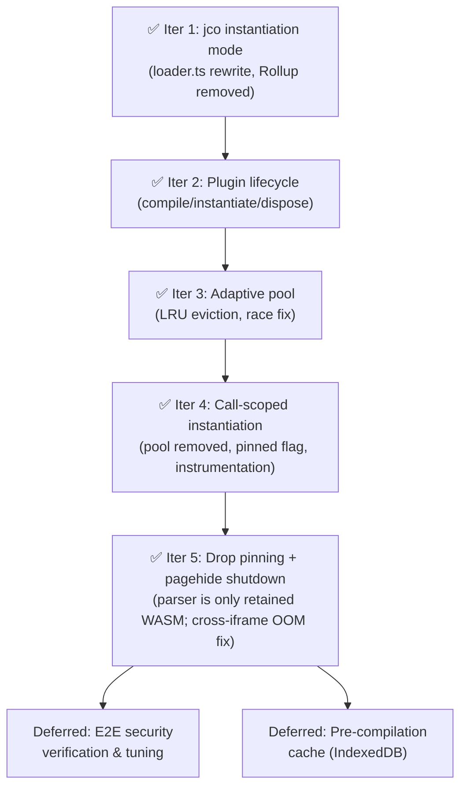

# WASM Plugin Memory: Call-Scoped Instantiation

> **History & Findings**: See [wasm-plugin-memory-history.md](wasm-plugin-memory-history.md) for the full investigation record including composition feasibility testing, alternative approach evaluations, the composition revisit analysis, decision log, and research references.

## Problem: Virtual Address Space Exhaustion

Each plugin is independently transpiled (via `jco generate`) and loaded as a separate ES module. Each triggers its own `WebAssembly.compile`/`instantiate`, creating a separate linear memory. On 64-bit systems, **each `WebAssembly.Memory` object reserves ~10GB of virtual address space** (guard regions for fast bounds-check-free execution). The guard pages don't consume physical RAM — only virtual address space — but V8 enforces a 1 TiB process-wide limit.

With system plugins (6), app plugins, their transitive dependencies, and auth plugins all loading, the browser exhausts its virtual address space budget. The error:

> `WebAssembly.instantiate(): Out of memory: Cannot allocate Wasm memory for new instance`

Standard memory tools (heap snapshots, Task Manager) show misleadingly small numbers because the bottleneck is **virtual address space reservation**, not physical RAM.

**Baseline** (Config app, single page load): 26 plugins → 49 core .wasm files → 97 `WebAssembly.instantiate` calls.

## Solution: Call-Scoped Instantiation

**Concept**: Plugins live only for the duration of a single `entry()` call. A small set of **system plugins** (and their transitive deps) is instantiated once during preload and pinned for the life of the supervisor — they are hit on nearly every call, so keeping them hot pays off. Every other plugin is instantiated lazily at the start of an `entry()` call, used during the synchronous call chain, and disposed immediately in the `finally` block. Virtual address space is returned to the browser between calls.

**Why it works**:

- `WebAssembly.compile()` creates a `WebAssembly.Module` without allocating Memory or reserving virtual address space. Pre-compile all known plugins cheaply during preload.
- `WebAssembly.instantiate()` is what creates the Memory object and reserves ~6-10GB of virtual address space. Deferring this to call-time is cheap and bounds peak VAS to "dep tree of the active call + pinned system plugins".
- When a WASM instance is garbage collected, V8's `WasmAllocationTracker::ReleaseAddressSpace()` decrements the address space counter. Disposing an instance (dropping all references) reclaims its virtual address space. Empirically, GC runs reliably between calls, so address space recovers before the next `entry()` begins.
- jco's `--instantiation async` mode generates code that exports an `instantiate()` function instead of auto-instantiating on module load.

**Why not the adaptive-pool approach** (previously implemented in Iter 3): holding ~24 non-system instances in memory indefinitely "just in case" wastes ~50–200GB of virtual address space for plugins that in practice are not reused between calls. Since GC has proven fast enough that we don't need to pre-warm anything except the frequently-hit system plugins, the cache is pure overhead. Collapsing it to "pinned system plugins + call-scoped dispose" is strictly simpler and saves memory without measurable latency cost.

## Current Architecture (Post-Iteration 5)

```mermaid
flowchart TD
    subgraph Preload [Preload Phase]
        fetch["Fetch + jco generate(async) + WebAssembly.compile()<br/>all plugins + transitive deps"]
        fetch --> phase0["Phase 0 (system): compile + instantiate<br/>for internal sync calls — NOT pinned"]
        phase0 --> phase12["Phase 1 + 2 (app / auth): compiled only"]
    end
    subgraph Entry [entry() call — Memory allocated for the call]
        e1["preload(target) — compile target + deps<br/>(leaves Phase 0 live)"] --> e2["ensureAllInstantiated()<br/>instantiate Phase 1 + 2 too"]
        e2 --> e3["Synchronous call chain"]
        e3 --> e4["finally: disposeAllUnpinned()<br/>drops every instantiated plugin"]
        e4 --> e5["GC reclaims Memory → VAS freed"]
    end
    subgraph Pagehide [window pagehide]
        ph1["supervisor.shutdown()<br/>disposeAll() on every live plugin,<br/>retain compiled Module handles"]
    end
```

The `pinned` flag is still present on each `Plugin` as dormant infrastructure for future re-use (e.g. `transact:plugin` retention if measurement justifies it), but no production code path currently sets it.

**Key files:**

- `[loader.ts](packages/user/Supervisor/ui/src/component-loading/loader.ts)` — `compilePlugin()` returns a `CompiledPlugin` handle (jco generate + WebAssembly.compile, no instantiation). `CompiledPlugin.instantiate()` allocates Memory on demand.
- `[plugin.ts](packages/user/Supervisor/ui/src/plugin/plugin.ts)` — lifecycle states (`compiled`/`instantiated`/`disposed`), `pinned` flag, `ensureInstantiated()`, `dispose()`
- `[plugin-loader.ts](packages/user/Supervisor/ui/src/plugin/plugin-loader.ts)` — multi-round dependency resolution; `awaitReady()` waits for compile, `ensureAllInstantiated()` instantiates
- `[plugins.ts](packages/user/Supervisor/ui/src/plugin/plugins.ts)` — `ensureAllInstantiated()`, `disposeAllUnpinned()`, and `forEachPlugin()` across all service contexts
- `[supervisor.ts](packages/user/Supervisor/ui/src/supervisor.ts)` — serialized preload (race-fix), phased compile, Phase 0 pin, call-scoped instantiate + dispose
- `[plugin-host.ts](packages/user/Supervisor/ui/src/plugin/plugin-host.ts)` — host bridge: HTTP, storage, call stack, crypto, prompts

---

### Key enabler — jco `--instantiation async`

Currently, `loader.ts` calls `generate(wasmBytes, opts)` without an `instantiation` option. The generated JS auto-instantiates all core WASM modules when the ES module is loaded via `import()`. By adding `instantiation: { tag: 'async' }` to `GenerateOptions`, the generated JS instead exports:

```typescript
export async function instantiate(
  getCoreModule: (path: string) => Promise<WebAssembly.Module>,
  imports: { [importName: string]: any },
  instantiateCore?: (module: WebAssembly.Module, imports: Record<string, any>) => Promise<WebAssembly.Instance>
): Promise<{ [exportName: string]: any }>;
```

This means:

1. `import()` the module → no Memory created (just JS code loaded)
2. Call `instantiate()` → Memory objects created, plugin exports available
3. Drop references to the return value → instances become GC-eligible → address space freed

### Trade-offs

| Aspect | Impact | Mitigation |
|--------|--------|------------|
| Per-`entry()` instantiation cost | N × (10–50ms) for the dep tree, parallelized via `Promise.all` — dominated by the slowest plugin | Compile happens at preload and is cached. Instantiation parallelism keeps wall-clock small (~tens of ms). |
| Plugin state loss between calls | Linear memory state is reset every call for non-pinned plugins | Plugins are designed to be stateless between calls. Persistent state goes through `clientdata` (IndexedDB). Cross-call state only survives inside pinned system plugins. |
| Call-chain concurrency | Every plugin in the dep tree is live simultaneously during the call | No longer bounded — the approach explicitly accepts peak VAS = "dep tree + pinned". This is the natural shape of a single call and is well within browser limits. |
| jco output structure changes | Future jco versions may change instantiation API | Pin jco version; integration tested in Iteration 1 with jco 1.10.2. |

---

## Security Model (Unchanged)

The lazy instantiation approach does NOT alter the security model:

| Concern | Status |
|---------|--------|
| **Linear memory isolation** | Preserved. Each plugin still gets its own Memory on instantiation. |
| **Call stack / caller identity** | Preserved. Same supervisor stack push/pop at each cross-plugin boundary. |
| **Storage namespace isolation** | Preserved. `get_sender()` still reads from correctly-maintained call stack. |
| **Permissions / is_authorized** | Preserved. Same code paths, same host bridge. |
| **Subdomain-based plugin retrieval** | Preserved. Plugins fetched from service subdomains before any instantiation. |

---

## Implementation Plan

Each iteration is a single reviewable PR with testable outcomes.

### Iteration 1: Switch loader.ts to jco instantiation mode ✅ COMPLETE

**What was done**: Replaced the entire Rollup-based loading pipeline with jco's `instantiation: { tag: 'async' }` mode. Rollup is no longer used. Import proxies are now built at runtime as plain JS objects instead of code-generated JS source files.

**Changes made**:

- `loader.ts`: Complete rewrite.
  - Added `instantiation: { tag: 'async' }` to `GenerateOptions`.
  - Replaced Rollup bundling with direct blob URL import of jco-generated JS.
  - Core `.wasm` files are pre-compiled via `WebAssembly.compile()` (cheap — no Memory allocated) and served to jco's `getCoreModule` callback.
  - Replaced code-generated proxy packages with runtime `buildProxiedImports()` that constructs import objects directly, including resource class proxies.
  - WASI shims are dynamically imported once at startup and provided directly.
  - For now, `instantiate()` is called eagerly to maintain current behavior.
- `index.ts`: Removed re-export of Rollup plugin.
- `package.json`: Removed `@rollup/browser` dependency.
- **Dead code removed**: `rollup-plugin.ts`, `proxy/proxy-package.ts`, `import-details.ts`, `privileged-api.js`, `shims/shim-wrapper.js`, `shims/README.md`, empty `proxy/` and `shims/` directories.
- **Also removed**: `feasibility-compose-test.sh` (one-off test script from investigation phase).

**Bugs found and fixed during integration**:

1. **camelCase vs kebab-case mismatch**: The WIT parser returns camelCase interface names (e.g., `hookHandlers`) but jco uses the original WIT kebab-case as import keys (e.g., `hook-handlers`). Fixed by adding a `toKebabCase()` conversion when building import keys.
2. **Type-only interfaces dropped**: Interfaces with no functions (e.g., `host:types/types`, `accounts:plugin/types`) were filtered out, but jco still destructures these keys from imports. Fixed by providing empty `{}` objects for them.
3. **Resource type name casing**: `syncCallResource` was passing lowercase type names (e.g., `"bucket"`) but the target plugin's jco exports use PascalCase (e.g., `"Bucket"`). Fixed by using the PascalCase `className`.

**Verified**: Config app loads and functions normally. Transactions execute successfully. Instantiation count matches baseline (76 for base plugins, 97 for Config with app-specific plugins).

---

### Iteration 2: Plugin lifecycle management ✅ COMPLETE

**What was done**: Split the loading pipeline into separate compile and instantiate phases. Plugins are now compiled during preload (no Memory allocated) and instantiated on demand. Added `dispose()` to drop instances back to compiled state.

**Changes made**:

- `loader.ts`: Renamed `loadPlugin` → `compilePlugin`. Returns a `CompiledPlugin` handle with an `instantiate()` method instead of eagerly instantiating. The internal `loadWasmComponent` → `compileWasmComponent` now pre-compiles core modules and imports the jco JS module, but does NOT call `instantiate()`. `loadBasic` (for the parser utility) still does eager instantiation since it's always needed.
- `plugin.ts`: Added `compiledPlugin` field. `doReady()` now calls `compilePlugin()` (compile-only, no Memory). Added `ensureInstantiated()` (async — calls `compiledPlugin.instantiate()` if not already instantiated), `dispose()` (drops pluginModule + clears resources), and `isInstantiated` getter. Removed `this.bytes === undefined` checks from `call()`/`resourceCall()` since bytes are no longer needed post-compile.
- `plugin-loader.ts`: Added `ensureAllInstantiated()` — instantiates all plugins tracked in the current round.
- `plugins.ts`: Added `ensureAllInstantiated()` — iterates all service contexts and instantiates every plugin globally.
- `service-context.ts`: Added `getAllPlugins()` to expose the plugin list.
- `supervisor.ts` `preload()`: Phase 0 (system plugins) now explicitly calls `ensureAllInstantiated()` after `awaitReady()` — these plugins need to be live for the sync calls between phases. Phase 1 (app plugins) and Phase 2 (auth plugins) only compile. At end of preload, `this.plugins.ensureAllInstantiated()` instantiates all remaining plugins before `entry()`'s synchronous call chain.
- `index.ts`: Updated exports (`compilePlugin` + `CompiledPlugin` type instead of `loadPlugin`).

**Verified**: Build succeeds. Runtime instrumentation confirmed: zero `WebAssembly.instantiate` calls during Phase 1/2 compile boundaries. App/auth plugins compile in Phase 1/2 but instantiate only at end of preload. Instantiate count matches Iter 1 baseline (97 for Config app). Config app loads and transactions execute successfully.

---

### Iteration 3: Adaptive pool with LRU eviction ✅ COMPLETE (superseded by Iter 4)

**What was done**: Created an `InstancePool` that tracks all instantiated plugins and evicts least-recently-used non-system plugins after each `entry()` call to keep the concurrent instance count within a budget. Also fixed a pre-existing race condition in concurrent `preload()` calls.

**Changes made**:

- New `instance-pool.ts`: `InstancePool` class with budget (default 24), LRU eviction, and pinning. System plugins are pinned and never evicted. After each `entry()` completes, `evictIdle()` disposes the oldest non-pinned plugins until the pool is at or below budget. Evicted plugins are transparently re-instantiated on the next `preload()`.
- `supervisor.ts`:
  - Pool is constructed in `Supervisor` constructor and wired into the preload/call/entry lifecycle.
  - Phase 0 plugins are registered as pinned after instantiation.
  - Phase 1+2 plugins are registered (not pinned) after bulk instantiation.
  - `call()` and `callResource()` touch the plugin in the pool (updates lastUsed timestamp).
  - `entry()` calls `pool.evictIdle()` in a `finally` block after each call completes.
  - **Race condition fix**: `preload()` is now serialized via a promise chain (`preloadLock`). Concurrent calls from `preloadPlugins()` and `entry()` no longer corrupt the loader's shared state.
- `plugins.ts`: Added `forEachPlugin()` for iterating all plugins across service contexts.

**Why superseded**: the pool held up to 24 non-system instances alive indefinitely between calls — ~50GB of virtual address space reserved for plugins that in practice were rarely reused before eviction. Iter 4 replaces the LRU/budget machinery with simple call-scoped dispose: only pinned system plugins survive between calls. The `preloadLock` race fix is preserved.

---

### Iteration 4: Call-scoped instantiation ✅ COMPLETE

**What was done**: Deleted the LRU pool. Non-system plugins are now instantiated at the start of each `entry()` call (if not already live) and disposed in the `finally` block. System plugins (and their transitive deps) continue to be instantiated once during Phase 0 and pinned for the supervisor's lifetime. Added performance instrumentation.

**Changes made**:

- `plugin.ts`:
  - Added `pinned: boolean` field (default false). Supervisor sets `pinned = true` on Phase 0 plugins after their first instantiation.
  - Removed the OOM retry loop from `ensureInstantiated()` — single attempt only. GC timing is empirically reliable in the call-scoped model.
  - Added fetch and compile timing instrumentation (see below).
- `supervisor.ts`:
  - Phase 0 unchanged: compile + instantiate + mark `pinned = true`.
  - Phase 1/2: **compile only**; no instantiation, no pool registration.
  - `entry()`: before the synchronous call chain, calls `plugins.ensureAllInstantiated()` to instantiate every non-pinned plugin needed for the call.
  - `entry()` `finally`: calls `plugins.disposeAllUnpinned()` to release every non-pinned instance.
  - Removed `pool.touch()` calls from `call()` / `callResource()`.
- `plugins.ts`: Added `disposeAllUnpinned()` returning the list of disposed plugin ids (used for logging).
- `instance-pool.ts`: **deleted**. No imports remain.

**Instrumentation** — all logs are aggregate reports; nothing is logged per cross-plugin call or per individual fetch/compile:

Per `doPreload()` (one report, fires only if new work happened):

```
[preload] wall=Tms fetched=N(total MB, Σ fetch ms) compiled=M(Σ compile ms) pinned=+K(total P)
    fetched: [a:x(120ms, 87KB), b:y(85ms, 45KB), ...]
    compiled: [a:x(210ms), b:y(105ms), ...]
```

Per `entry()` (one report in the `finally`):

```
[entry] {service}:{plugin} {intf}.{method} — total=Tms preload=Pms inst=Ims calls=N across K plugin(s)
    instantiated (M): [service:plugin, ...]
    disposed (M): [service:plugin, ...]
    pinned remaining: X
```

Per GC burst (batched via ~50ms debounce; clustered reclaims produce one line):

```
[gc] reclaimed N plugin(s): [service:plugin, ...]
```

Implementation notes:

- Plugin-level timings are stored on `Plugin.stats` (fetchMs, fetchBytes, compileMs, reported flag) and consumed once by `Plugins.collectPreloadStats()` at the end of `doPreload()`. Plugins loaded in earlier preloads are not re-reported.
- GC events are buffered through a module-level queue + `setTimeout(..., 50)` in `plugin.ts`, so V8's tendency to collect many disposed modules in one cycle produces a single console line.
- No per-call or per-fetch logs anywhere — cross-plugin call chains and parallel downloads are too dense to log individually.

**Expected runtime shape**:

- Idle concurrent instances between calls: ~19 (pinned system plugins + Phase 0 transitive deps) — down from up to 24 in Iter 3.
- Peak concurrent instances during a call: full dep tree (unchanged).
- Virtual address space between calls drops by roughly the evicted-cache size (~50GB for Config app).
- Per-`entry()` added latency: instantiation of all non-pinned plugins in parallel via `Promise.all`, dominated by slowest plugin (~10–50ms).

---

### Iteration 5: Drop pinning + pagehide shutdown ✅ COMPLETE

**What was done**: Stopped marking any plugin as pinned. Every plugin (including Phase 0 system plugins) is now disposed at the end of each supervisor entrypoint (`entry()`, `preloadPlugins()`, `getJson()`), leaving only the component-parser retained between calls. Added a `pagehide` handler that disposes all live plugin instances before the iframe enters bfcache or is destroyed. Directly addresses the cross-iframe VAS exhaustion OOM observed in Iter 4 testing.

**Changes made**:

- `supervisor.ts`:
  - `doPreload()`: Phase 0 still instantiates system plugins (the internal sync calls need live instances), but no longer marks them `pinned`. Dropped the `newlyPinned` counter. Comment clarifies that callers are responsible for disposal.
  - `preloadPlugins()` / `getJson()`: added `finally { plugins.disposeAllUnpinned(); }` to release the Phase 0 instances that `doPreload()` leaves live for its own sync calls.
  - `entry()`: unchanged pair of `ensureAllInstantiated()` + `disposeAllUnpinned()` — still works because every plugin is now non-pinned. Moved the `preInst` snapshot to *before* preload so the `instantiated` / `disposed` report lines are symmetrical.
  - Added `shutdown(): string[]`. Calls `plugins.disposeAll()` (ignores pinned) and returns the disposed label list. Retains `compiledPlugin` handles on every `Plugin` so bfcache restore can re-instantiate without re-fetching or re-compiling.
  - `[entry]` report: "pinned remaining" renamed to "retained" and the "(none — all X were already pinned)" branch simplified to "(none)", reflecting that the only retained allocation is the parser.
  - `[preload]` report: dropped the `pinned=+N` field.
- `plugins.ts`: added `disposeAll(): string[]` (same shape as `disposeAllUnpinned()`, ignores `pinned`).
- `main.ts`: registered `window.addEventListener("pagehide", …)` that invokes `supervisor.shutdown()` and logs a `[shutdown] disposed N plugin(s)` line.
- `plugin.ts`: `pinned: boolean = false` field kept as dormant infrastructure. No production path sets it.

**Expected / measured outcome**:

- Idle VAS per supervisor iframe: ~1 `WebAssembly.Memory` (parser only) ≈ ~10GB — down from ~20 Memories (~200GB) when the system set was pinned.
- Cross-iframe VAS headroom: 10 bfcached supervisor iframes × ~10GB ≈ 100GB, comfortably under V8's ~1TB renderer limit.
- Per-call latency: every entry now pays instantiation cost for Phase 0 plugins too (previously no-op). Measured in testing: adds ~tens of ms to cold calls, within the target budget. If measurement shows intolerable regression, re-enable `pinned` for `transact:plugin` (the single most frequently hit service).

**What was NOT done**: Option D step 2 (bfcache opt-out via `Cache-Control: no-store` or `unload` listener) was considered and rejected — Chrome propagates iframe bfcache-ineligibility to the parent page, which would tyrannize every host app (including third-party) by forcing full page reloads on Back/Forward. Revisit only if A + D-step-1 prove insufficient in practice.

---

### Iteration summary



---

## Risks and Mitigations

| Risk | Mitigation |
|------|------------|
| jco `--instantiation async` integration issues | ✅ Resolved in Iter 1 (camelCase/kebab-case mapping, type-only interfaces, resource PascalCase) |
| Some plugins rely on cross-call linear memory state | State is reset every call for non-pinned plugins. Audit if symptoms appear. Plugins should use `clientdata` for persistence. |
| Re-instantiation latency noticeable to users | Compile is cached; instantiation runs in parallel. Instrumentation (`[entry]`/`[call]` logs) lets us spot regressions. |
| Pinned system plugins accumulate resource handles across calls | Pre-existing concern (pinned lifetime > handle lifetime). Not introduced by Iter 4. Track separately if a leak materializes. |
| **Cross-iframe VAS collision during navigation** | See [Open Issue: Cross-iframe VAS exhaustion](#open-issue-cross-iframe-vas-exhaustion-during-navigation). |

---

## How to Measure Impact

The metric that matters is the **number of concurrent `WebAssembly.Memory` objects** (= concurrent instances). To measure, add temporary instrumentation to `main.ts` that monkey-patches `WebAssembly.instantiate` to count calls (see [history doc](wasm-plugin-memory-history.md) for the exact code used during investigation).

For the call-scoped approach (Iter 4 + 5), the built-in console instrumentation provides:
- **Peak per-call instance count** — from `[entry]`'s `retained + instantiated (M)` line (cores / memories).
- **Idle instance count between calls** — `retained: Np / Cc / Mm (parser)` in the same report; under Iter 5 this is always `1p / 1c / 1m`.
- **Fetch / compile timings** — aggregated per-plugin lists + totals in the `[preload]` report.
- **Instantiation latency** — `inst=Xms` in the `[entry]` report.
- **Actual reclaim timing** — `[gc] reclaimed …` batched lines show when V8 released the memory.
- **Pagehide teardown** — `[shutdown] disposed N plugin(s)` on navigation / bfcache entry.

**Success criterion**: Peak concurrent instances stays well below the threshold (~100) that triggers "Cannot allocate Wasm memory". With Iter 5, the steady-state between calls is 1 (parser) and peak is bounded by the dep tree of the active call.

### Known logging-quality follow-ups (Iter 5 observation, not fixed)

Deferred by choice — the logs are accurate enough to confirm Iter 5 is working. Revisit only if a future investigation needs more precision.

1. **Unhelpful error stringification in `[entry] ... FAILED`.** Observed once in an Iter 5 trace:
   ```
   [entry] accounts:plugin activeApp.connectAccount FAILED — total=30.7ms ...
       error: [object Object]
   ```
   The error displayer in `supervisor.ts`'s `finally` does `err instanceof Error ? err.message : String(err)`, which falls back to `"[object Object]"` for plain-object errors that carry `code` / `producer` / `message` fields only on their payload. Future fix: also serialize via `JSON.stringify(err)` (or a small helper that knows the psibase error shapes) when `err.message` is falsy.

2. **`instantiated` vs `disposed` asymmetry under concurrent entries.** Sample from a trace where two `packages:plugin` entries overlapped:
   ```
   [entry] packages:plugin queries.getSources — ... calls=0 across 0 plugin(s)
       instantiated (6p / 21c / 6m): [auth-any, branding, sites, packages, setcode, staged-tx]
       disposed (25p / 96c / 25m): [accounts, host/auth, ..., staged-tx]
   ```
   Cause: the second entry's `preInst` snapshot (taken at its `entry()` entry-point) captured the 20 system plugins already instantiated by the first entry's in-flight `preload()`, so they look "pre-existing" to the second entry's reporting filter even though its `finally` legitimately disposed them. The `disposed` count is the truthful one; `instantiated` under-reports by the overlap size. Purely cosmetic — lifecycle is correct. If fixed, options: (a) a per-`Plugins` sequence number carried into preInst to detect concurrent mutation, or (b) compute `instantiatedThisCall` as `disposed ∖ preInst` symmetrically.

3. **`[shutdown]` log is silent when there's nothing to dispose.** By design: the `pagehide` handler gates the log on `disposed.length > 0`, so steady-state navigations (plugins already disposed between entries) print nothing. Means we can't tell from the console whether the handler is wired or firing at all. If future debugging needs confirmation, either drop the length gate or always log `[shutdown] nothing to dispose` on the empty case.

---

## Debugging (Implementation Deferred)

Feasibility confirmed for all approaches. See [history doc](wasm-plugin-memory-history.md#phase-5-debugging-feasibility-assessment) for details.

- **jco `tracing: true`**: Low effort, logs every function entry/exit with WIT interface names. Just flip a flag.
- **`//# sourceURL`**: Already implemented. Each plugin's blob URL is tagged with `{service}.plugin.js` for meaningful filenames in DevTools.
- **WASM name sections**: Preserved through transpilation if not stripped at build time.

---

## Open Issue: Cross-iframe VAS exhaustion during navigation

### Observation

After the Iter 4 call-scoped work, the steady-state within a single supervisor iframe is healthy (~20 pinned plugins / ~20 `WebAssembly.Memory` / ~200 GiB VAS idle; per-call instantiation + dispose works as designed, with GC reliably reclaiming VAS in milliseconds).

However, an OOM was observed during **cross-subdomain navigation** on the same tab:

```
Navigated to http://faucet-tok.psibase.localhost:8080/common/plugin-tester
[entry] accounts:plugin FAILED api.getCurrentUser — total=825ms ...
    error: WebAssembly.instantiate(): Out of memory: Cannot allocate Wasm memory for new instance
    disposed (1p / ...): [clientdata/plugin]
    pinned remaining: 1p / 1c / 1m (incl. parser)
```

The new faucet-tok supervisor iframe's Phase 0 failed to instantiate a system plugin because the outgoing config supervisor iframe's ~20 `WebAssembly.Memory` objects (≈ 200 GiB VAS) were still reserved. A retry ~5 seconds later succeeded.

### Why an iframe's VAS isn't reclaimed promptly (even though in-page dispose works well)

Within a single supervisor iframe, the call-scoped approach works because:
- We explicitly `this.pluginModule = undefined` in `dispose()`.
- V8's isolate is actively allocating during continued use → minor GCs fire every few MB.
- Unreferenced `WebAssembly.Memory` finalizers run within ms-to-s, releasing the 10 GiB VAS reservation.

Cross-iframe navigation bypasses this mechanism entirely:

1. **Back-forward cache (bfcache)** is usually the dominant factor. Chrome preserves the outgoing page *and all its iframes* fully alive in memory for up to 10 minutes (or until memory-pressure eviction) so Back/Forward is instant. References are not dropped — the page is *deliberately retained*. Supervisor iframes piggyback on this: no dereference means no GC.
2. **Iframe lifetime is bound to the parent frame.** When the top-level document navigates, all nested iframes go into bfcache together as one unit. A supervisor iframe does not individually become GC-eligible.
3. **Async navigation teardown.** Even with `Cache-Control: no-store` or a `pagehide` handler that disqualifies bfcache, the shutdown sequence (pagehide/unload → detach → document discard → V8 context destroy → finalizers → munmap) runs asynchronously and is not prioritized ahead of the new page's JS. The new iframe can issue `WebAssembly.instantiate()` before the old one has finished tearing down.
4. **V8 freelist pooling of VAS.** Even after a Memory object's finalizer executes, V8 may hold the 10 GiB guard-page reservation in a freelist (arrays-buffer allocator, `WasmCodeManager`) rather than `munmap()`-ing eagerly. The reservation is returned to the OS under pressure or during major GCs, not immediately on destruction.
5. **No allocation pressure in the detached iframe.** The key enabler of in-page cleanup is continuous allocation driving GCs. A detached/bfcached iframe's isolate sits idle — there's nothing to push Memories toward finalization until the browser proactively evicts the whole frame.

**Short version**: Chrome optimizes navigation for UX (back button) over memory. Iframe JS objects leave the normal GC loop the moment the frame is detached. There's no equivalent to `dispose()` at the iframe level — the browser owns that timeline.

### Options under consideration

Listed from current direction to most-intrusive. **Current decision: Option A (pin nothing).**

**Option A — Don't pin anything (chosen for next iteration)**
Keep the `pinned` field on `Plugin` as dormant infrastructure (no caller sets it to `true`); leave `disposeAllUnpinned()` and related helpers untouched — with nothing pinned they naturally behave as "dispose all". Remove only the Phase 0 `ensureAllInstantiated()` + pin assignments in `doPreload()`. Every plugin, system or not, is now instantiated at the start of `entry()` and disposed in `finally`. `doPreload()`'s internal sync calls (`getActiveQueryToken`, `getActivePrompt`, `getAuthServices`) still need live instances of their targets at preload time; easiest approach is to `ensureAllInstantiated()` inside `doPreload()` before the sync calls and `disposeAllUnpinned()` at the end of `doPreload()` / `preloadPlugins()` / `getJson()`. `entry()`'s existing ensure+dispose pair already covers the call-time path.

- **Pros**: Simplest possible behavior. Eliminates all idle VAS between calls. A new supervisor iframe's initial footprint is ~0 Memory objects beyond the parser. No cross-iframe collision at steady state. Preserves `pinned` as a tool we can re-activate later without a second refactor.
- **Cons**: Each `entry()` pays full instantiation cost for its dep tree. Brief double-allocation window possible if `doPreload()` disposes system plugins and `entry()` immediately re-instantiates the same set — V8's allocator freelists should absorb it, but worth watching under instrumentation.
- **Unknowns**: per-call latency magnitude; whether the double-allocation window matters in practice.

**Option B — Pin a minimal "every entry" set**
Pin only plugins that are *provably* called by the supervisor on every entry. Audit:

| Plugin | Where supervisor calls it | Every entry? |
|---|---|---|
| `transact:plugin` | `startTx` + `finishTx` in `entry()` | **Yes** |
| `accounts:plugin` | `getCurrentUser`, `getAuthServices` in `doPreload()` | Per preload only |
| `host:auth` | `getActiveQueryToken` in `doPreload()` | Per preload only |
| `host:prompt` | `getActivePrompt` (embedded only) | Embedded + per preload |
| `clientdata:plugin` | Not called by supervisor | No |
| `webcrypto:plugin` | Host bridge only (opportunistic) | No |

Strict minimal: **`transact:plugin` + its transitive closure.** Optional extension (for repeat-preload speed): add `accounts:plugin`, `host:auth`, `host:prompt`.

- **Pros**: Keeps the one plugin supervisor uses on every entry hot. Much smaller VAS footprint (~5–10 Memories instead of ~20).
- **Cons**: Still has *some* idle VAS per iframe (~50–100 GiB). May not be enough to eliminate cross-iframe collision if many tabs/subdomains are alive at once. Transitive closure of `transact:plugin` could still be sizeable.
- **Retained as fallback** if Option A's per-call latency is unacceptable.

**Option C — Retry on OOM with GC hint**
Keep pinning as-is but wrap `ensureInstantiated()` in a retry loop that catches the "Cannot allocate Wasm memory" exception, yields to the microtask queue (and optionally forces GC via a large allocation+discard), and retries once or twice. Treats the symptom, not the cause.

- **Pros**: Minimal code change. Addresses only the cross-iframe race, not the steady-state cost.
- **Cons**: The 4.9 s observed retry wait is already the browser's recovery latency — a naive retry would just add more timeouts. To be effective, would need to detect when bfcache is holding memory and explicitly opt out (see Option D). Previously removed in Iter 4 precisely because in-page GC was reliable; still irrelevant for the in-page case.
- **Compatible with Option A/B** as belt-and-suspenders.

**Option D — Force prompt supervisor-iframe teardown on navigation**

**Step 1: `pagehide` handler that drops instance references.** Register on `window` in supervisor's `main.ts`. The handler calls a new `Supervisor.shutdown()` that walks every plugin and calls `dispose()` on it regardless of `pinned`. **Crucially, `compiledPlugin` (the `WebAssembly.Module` handle) is *retained* on each plugin** — Modules don't carry VAS, so keeping them is free, and retention makes bfcache restore correct: the next `entry()` after a `pageshow` can re-instantiate from the cached Module without re-fetching or re-compiling. Only `pluginModule` (the Instance and its Memory) is dropped.

`pagehide` fires for both bfcache entry (`persisted=true`) and destruction (`persisted=false`). Running dispose in both cases is always safe under the Module-retention approach: bfcache restore just pays a small re-instantiation cost on the next call.

Effect during bfcache: our `pagehide` runs *before* the heap is frozen, so the iframe enters bfcache with pluginModule references already dropped. V8 may not collect immediately (bfcache suspends GC), but on eventual eviction or restore, the cleanup path has far less to do.

**Step 2: Disqualify the supervisor iframe from bfcache entirely.** **Not pursued.** Both available mechanisms — `Cache-Control: no-store` on the supervisor HTML response, or registering an `unload` listener client-side — disqualify not just the supervisor iframe but the entire hosting app page (Chrome's rule: if any frame in the page is bfcache-ineligible, the whole page is; parent inherits from iframe). Forcing bfcache opt-out on host apps — especially third-party apps that embed psibase — is a UX cost (Back/Forward takes a full page-load instead of instant restore, local form state lost) we don't get to unilaterally impose. Skipped unless Option A + Option D step 1 prove insufficient in measurement.

- **Pros (Step 1 only)**: Promptly drops WebAssembly.Memory references before bfcache freeze, so cleanup on eventual eviction is fast. No impact on parent app bfcache eligibility. Cheap, purely additive code change.
- **Cons (Step 1 only)**: Doesn't directly prevent VAS retention during bfcache; relies on Option A keeping steady-state VAS small enough that bfcache retention doesn't matter.
- **Combined with Option A**: Under Option A's ~10 GiB idle footprint, even 10 bfcached supervisor iframes = ~100 GiB — well inside the 1 TiB limit. No collision at steady state. Step 1 handles the narrower case of navigation-during-active-call.

**Option E — Lazy pinning**
Pin-on-first-use instead of pin-at-preload. Phase 0 only compiles; the *first* call that references a system plugin instantiates it and marks it pinned. Amortizes startup cost across early calls.

- **Pros**: New iframes start with zero VAS footprint; cost paid as users interact.
- **Cons**: Adds complexity. First-call latency is worse than Option A (which pays the cost synchronously every call but doesn't pay startup). Doesn't actually help cross-iframe collision if both iframes converge on the same set of pinned plugins.
- **Low priority** unless Option A's per-call cost is actually problematic AND we can identify a hot subset that's worth warming.

### Decision for next iteration

- **Implement Option A.** Stop pinning (keep `pinned` as dormant field for future re-use). All plugins become call-scoped.
- **Implement Option D step 1** (`pagehide` → `shutdown()`) at the same time — `shutdown()` calls `dispose()` on every plugin but retains `compiledPlugin` handles so bfcache restore is cheap. Purely additive, small change.
- Measure per-call latency under Option A. If it regresses noticeably, fall back to **Option B** with the `transact:plugin` minimal set (re-activating the dormant `pinned` field).
- **Option D step 2 is off the table** unless measurements prove A + D-step-1 insufficient. It would force bfcache opt-out on hosting app pages — including third-party apps that embed psibase. The UX cost (Back/Forward becomes a full page-load for every app, not just psibase-native ones) is not ours to unilaterally impose.
- **Option C** is off the table: it treats symptoms, and Option A removes the symptom's root cause.

---
