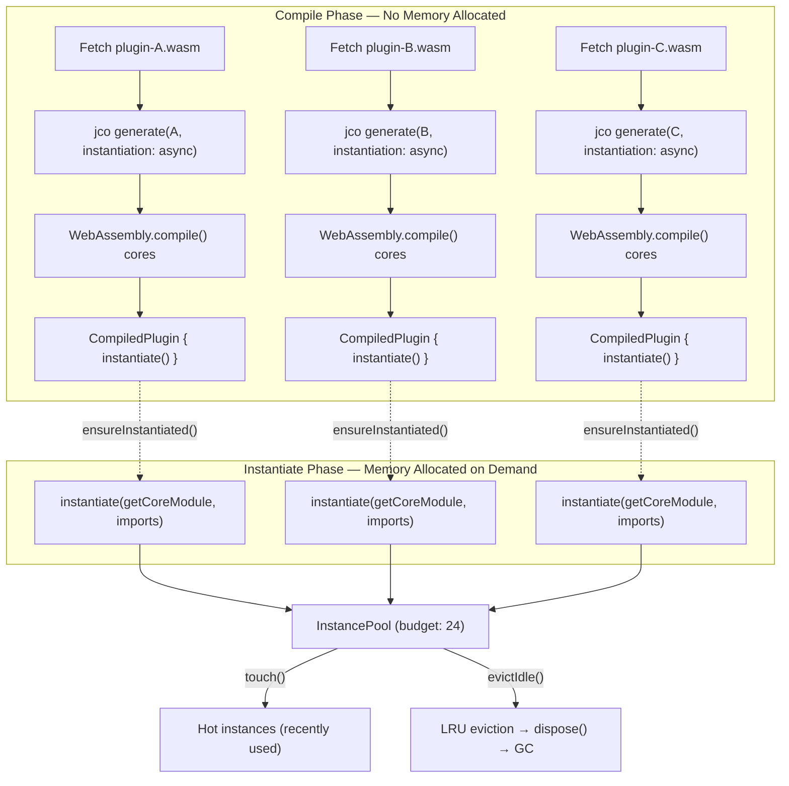
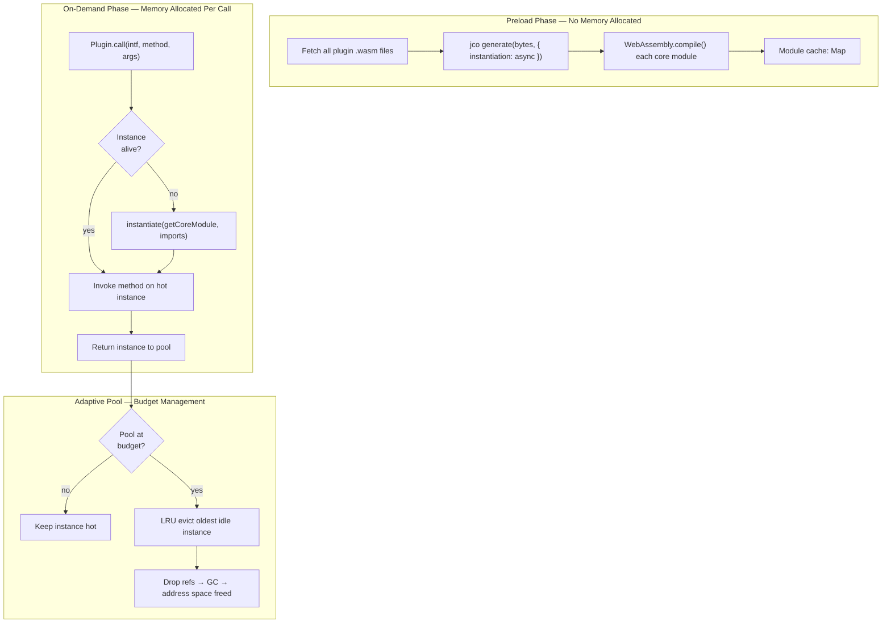
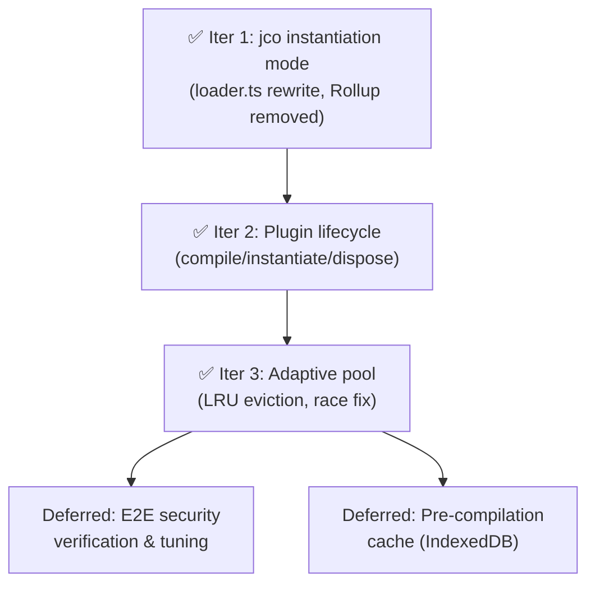

# WASM Plugin Memory: Lazy Instantiation with Adaptive Pool

> **History & Findings**: See [wasm-plugin-memory-history.md](wasm-plugin-memory-history.md) for the full investigation record including composition feasibility testing, alternative approach evaluations, the composition revisit analysis, decision log, and research references.

## Problem: Virtual Address Space Exhaustion

Each plugin is independently transpiled (via `jco generate`) and loaded as a separate ES module. Each triggers its own `WebAssembly.compile`/`instantiate`, creating a separate linear memory. On 64-bit systems, **each `WebAssembly.Memory` object reserves ~10GB of virtual address space** (guard regions for fast bounds-check-free execution). The guard pages don't consume physical RAM — only virtual address space — but V8 enforces a 1 TiB process-wide limit.

With system plugins (6), app plugins, their transitive dependencies, and auth plugins all loading, the browser exhausts its virtual address space budget. The error:

> `WebAssembly.instantiate(): Out of memory: Cannot allocate Wasm memory for new instance`

Standard memory tools (heap snapshots, Task Manager) show misleadingly small numbers because the bottleneck is **virtual address space reservation**, not physical RAM.

**Baseline** (Config app, single page load): 26 plugins → 49 core .wasm files → 97 `WebAssembly.instantiate` calls.

## Current Architecture (Post-Iteration 3)



**Key files:**

- `[loader.ts](packages/user/Supervisor/ui/src/component-loading/loader.ts)` — `compilePlugin()` returns a `CompiledPlugin` handle (jco generate + WebAssembly.compile, no instantiation). `CompiledPlugin.instantiate()` allocates Memory on demand.
- `[plugin.ts](packages/user/Supervisor/ui/src/plugin/plugin.ts)` — lifecycle states (`compiled`/`instantiated`/`disposed`), `ensureInstantiated()`, `dispose()`
- `[instance-pool.ts](packages/user/Supervisor/ui/src/plugin/instance-pool.ts)` — LRU pool with budget, pinning for system plugins, eviction after each `entry()` call
- `[plugin-loader.ts](packages/user/Supervisor/ui/src/plugin/plugin-loader.ts)` — multi-round dependency resolution; `awaitReady()` waits for compile, `ensureAllInstantiated()` instantiates
- `[plugins.ts](packages/user/Supervisor/ui/src/plugin/plugins.ts)` — `ensureAllInstantiated()` and `forEachPlugin()` across all service contexts
- `[supervisor.ts](packages/user/Supervisor/ui/src/supervisor.ts)` — serialized preload (race-fix), phased instantiation, pool registration/touch/eviction lifecycle
- `[plugin-host.ts](packages/user/Supervisor/ui/src/plugin/plugin-host.ts)` — host bridge: HTTP, storage, call stack, crypto, prompts

---

## Solution: Lazy Instantiation with Adaptive Pool

**Concept**: Only instantiate a plugin when its function is actually called. After the call completes, the instance stays alive in a hot cache. An adaptive pool caps the number of concurrent instances and evicts the least-recently-used idle instances when the budget is exceeded. Evicted instances are re-instantiated transparently on next call.

**Why it works**:

- `WebAssembly.compile()` creates a `WebAssembly.Module` without allocating Memory or reserving virtual address space. Pre-compile all plugins cheaply.
- `WebAssembly.instantiate()` is what creates the Memory object and reserves ~6-10GB of virtual address space. Deferring this to call-time avoids upfront cost.
- When a WASM instance is garbage collected, V8's `WasmAllocationTracker::ReleaseAddressSpace()` decrements the address space counter. Disposing an instance (dropping all references) reclaims its virtual address space.
- jco's `--instantiation async` mode generates code that exports an `instantiate()` function instead of auto-instantiating on module load.

**Key enabler — jco `--instantiation async`**:

Currently, `loader.ts` calls `generate(wasmBytes, opts)` without an `instantiation` option. The generated JS auto-instantiates all core WASM modules when the ES module is loaded via `import()`. By adding `instantiation: { tag: 'async' }` to `GenerateOptions`, the generated JS instead exports:

```typescript
export async function instantiate(
  getCoreModule: (path: string) => Promise<WebAssembly.Module>,
  imports: { [importName: string]: any },
  instantiateCore?: (module: WebAssembly.Module, imports: Record<string, any>) => Promise<WebAssembly.Instance>
): Promise<{ [exportName: string]: any }>;
```

This means:

1. `import()` the module → no Memory created (just JS code loaded)
2. Call `instantiate()` → Memory objects created, plugin exports available
3. Drop references to the return value → instances become GC-eligible → address space freed

### Proposed Architecture



### Trade-offs

| Aspect | Impact | Mitigation |
|--------|--------|------------|
| First-call latency | ~10-50ms per plugin on first call | Pre-compile during preload (compile is cheap). Keep hot cache for frequent plugins. |
| Plugin state loss on eviction | Linear memory state lost when instance is disposed and re-instantiated | Plugins are designed to be stateless between calls. Persistent state goes through `clientdata` (IndexedDB). Verify no plugins rely on cross-call linear memory state. |
| GC timing uncertainty | V8's GC doesn't run immediately when references are dropped | Use `FinalizationRegistry` to track reclamation. Evict proactively to keep headroom. |
| Concurrency during call chains | If A calls B, both must be instantiated simultaneously | Pool budget accommodates max call depth (typically 3-5). Budget of ~15-20 concurrent instances should suffice. |
| jco output structure changes | Future jco versions may change instantiation API | Pin jco version; integration tested in Iteration 1 with jco 1.10.2. |

---

## Security Model (Unchanged)

The lazy instantiation approach does NOT alter the security model:

| Concern | Status |
|---------|--------|
| **Linear memory isolation** | Preserved. Each plugin still gets its own Memory on instantiation. |
| **Call stack / caller identity** | Preserved. Same supervisor stack push/pop at each cross-plugin boundary. |
| **Storage namespace isolation** | Preserved. `get_sender()` still reads from correctly-maintained call stack. |
| **Permissions / is_authorized** | Preserved. Same code paths, same host bridge. |
| **Subdomain-based plugin retrieval** | Preserved. Plugins fetched from service subdomains before any instantiation. |

---

## Implementation Plan

Each iteration is a single reviewable PR with testable outcomes.

### Iteration 1: Switch loader.ts to jco instantiation mode ✅ COMPLETE

**What was done**: Replaced the entire Rollup-based loading pipeline with jco's `instantiation: { tag: 'async' }` mode. Rollup is no longer used. Import proxies are now built at runtime as plain JS objects instead of code-generated JS source files.

**Changes made**:

- `loader.ts`: Complete rewrite.
  - Added `instantiation: { tag: 'async' }` to `GenerateOptions`.
  - Replaced Rollup bundling with direct blob URL import of jco-generated JS.
  - Core `.wasm` files are pre-compiled via `WebAssembly.compile()` (cheap — no Memory allocated) and served to jco's `getCoreModule` callback.
  - Replaced code-generated proxy packages with runtime `buildProxiedImports()` that constructs import objects directly, including resource class proxies.
  - WASI shims are dynamically imported once at startup and provided directly.
  - For now, `instantiate()` is called eagerly to maintain current behavior.
- `index.ts`: Removed re-export of Rollup plugin.
- `package.json`: Removed `@rollup/browser` dependency.
- **Dead code removed**: `rollup-plugin.ts`, `proxy/proxy-package.ts`, `import-details.ts`, `privileged-api.js`, `shims/shim-wrapper.js`, `shims/README.md`, empty `proxy/` and `shims/` directories.
- **Also removed**: `feasibility-compose-test.sh` (one-off test script from investigation phase).

**Bugs found and fixed during integration**:

1. **camelCase vs kebab-case mismatch**: The WIT parser returns camelCase interface names (e.g., `hookHandlers`) but jco uses the original WIT kebab-case as import keys (e.g., `hook-handlers`). Fixed by adding a `toKebabCase()` conversion when building import keys.
2. **Type-only interfaces dropped**: Interfaces with no functions (e.g., `host:types/types`, `accounts:plugin/types`) were filtered out, but jco still destructures these keys from imports. Fixed by providing empty `{}` objects for them.
3. **Resource type name casing**: `syncCallResource` was passing lowercase type names (e.g., `"bucket"`) but the target plugin's jco exports use PascalCase (e.g., `"Bucket"`). Fixed by using the PascalCase `className`.

**Verified**: Config app loads and functions normally. Transactions execute successfully. Instantiation count matches baseline (76 for base plugins, 97 for Config with app-specific plugins).

---

### Iteration 2: Plugin lifecycle management ✅ COMPLETE

**What was done**: Split the loading pipeline into separate compile and instantiate phases. Plugins are now compiled during preload (no Memory allocated) and instantiated on demand. Added `dispose()` to drop instances back to compiled state.

**Changes made**:

- `loader.ts`: Renamed `loadPlugin` → `compilePlugin`. Returns a `CompiledPlugin` handle with an `instantiate()` method instead of eagerly instantiating. The internal `loadWasmComponent` → `compileWasmComponent` now pre-compiles core modules and imports the jco JS module, but does NOT call `instantiate()`. `loadBasic` (for the parser utility) still does eager instantiation since it's always needed.
- `plugin.ts`: Added `compiledPlugin` field. `doReady()` now calls `compilePlugin()` (compile-only, no Memory). Added `ensureInstantiated()` (async — calls `compiledPlugin.instantiate()` if not already instantiated), `dispose()` (drops pluginModule + clears resources), and `isInstantiated` getter. Removed `this.bytes === undefined` checks from `call()`/`resourceCall()` since bytes are no longer needed post-compile.
- `plugin-loader.ts`: Added `ensureAllInstantiated()` — instantiates all plugins tracked in the current round.
- `plugins.ts`: Added `ensureAllInstantiated()` — iterates all service contexts and instantiates every plugin globally.
- `service-context.ts`: Added `getAllPlugins()` to expose the plugin list.
- `supervisor.ts` `preload()`: Phase 0 (system plugins) now explicitly calls `ensureAllInstantiated()` after `awaitReady()` — these plugins need to be live for the sync calls between phases. Phase 1 (app plugins) and Phase 2 (auth plugins) only compile. At end of preload, `this.plugins.ensureAllInstantiated()` instantiates all remaining plugins before `entry()`'s synchronous call chain.
- `index.ts`: Updated exports (`compilePlugin` + `CompiledPlugin` type instead of `loadPlugin`).

**Verified**: Build succeeds. Runtime instrumentation confirmed: zero `WebAssembly.instantiate` calls during Phase 1/2 compile boundaries. App/auth plugins compile in Phase 1/2 but instantiate only at end of preload. Instantiate count matches Iter 1 baseline (97 for Config app). Config app loads and transactions execute successfully.

---

### Iteration 3: Adaptive pool with LRU eviction ✅ COMPLETE

**What was done**: Created an `InstancePool` that tracks all instantiated plugins and evicts least-recently-used non-system plugins after each `entry()` call to keep the concurrent instance count within a budget. Also fixed a pre-existing race condition in concurrent `preload()` calls.

**Changes made**:

- New `instance-pool.ts`: `InstancePool` class with budget (default 24), LRU eviction, and pinning. System plugins are pinned and never evicted. After each `entry()` completes, `evictIdle()` disposes the oldest non-pinned plugins until the pool is at or below budget. Evicted plugins are transparently re-instantiated on the next `preload()`.
- `supervisor.ts`:
  - Pool is constructed in `Supervisor` constructor and wired into the preload/call/entry lifecycle.
  - Phase 0 plugins are registered as pinned after instantiation.
  - Phase 1+2 plugins are registered (not pinned) after bulk instantiation.
  - `call()` and `callResource()` touch the plugin in the pool (updates lastUsed timestamp).
  - `entry()` calls `pool.evictIdle()` in a `finally` block after each call completes.
  - **Race condition fix**: `preload()` is now serialized via a promise chain (`preloadLock`). Concurrent calls from `preloadPlugins()` and `entry()` no longer corrupt the loader's shared state.
- `plugins.ts`: Added `forEachPlugin()` for iterating all plugins across service contexts.

**Design rationale**: Due to the synchronous call chain constraint (WASM cross-plugin calls can't await async instantiation), all plugins in the dependency tree must be instantiated before `entry()` starts. The pool can't reduce the peak during initial load, but it manages the steady-state across multiple `entry()` calls — unused plugins are evicted, and only the actively-used working set stays hot.

**Post-implementation fix**: `register()` had a pinning creep bug — re-registration calls during subsequent `doPreload()` rounds could upgrade non-pinned plugins to pinned. Fixed by making `register()` a no-op for already-registered plugins.

**Verified**: Build succeeds. Runtime verified: pinned count stable at 19, LRU rotation across 6 non-pinned plugins (`auth-any`, `sites`, `branding`, `setcode`, `staged-tx`), transparent re-instantiation confirmed (transactions succeed after eviction).

---

### Iteration summary



All three iterations are complete. Iteration 1 replaced Rollup with direct jco async instantiation. Iteration 2 separated compile from instantiate and added lifecycle management. Iteration 3 added the adaptive pool with LRU eviction and fixed a pre-existing race condition in concurrent preload calls.

---

## Risks and Mitigations

| Risk | Mitigation |
|------|------------|
| jco `--instantiation async` integration issues | ✅ Resolved in Iter 1 (camelCase/kebab-case mapping, type-only interfaces, resource PascalCase) |
| Some plugins rely on cross-call linear memory state | Audit plugins for statics/globals that survive across calls. Plugins should use `clientdata` for persistence. |
| GC doesn't reclaim address space fast enough | `FinalizationRegistry` tracking + proactive eviction with headroom below budget |
| Deep call chains exceed pool budget | Budget must accommodate max call depth. Typical: 3-5. Budget: 15-20. If insufficient, make budget configurable. |
| Re-instantiation latency noticeable to users | Pre-compile reduces instantiation to ~10-50ms. Hot cache keeps frequently-used plugins alive. Preemptive instantiation of known dependencies. |

---

## How to Measure Impact

The metric that matters is the **number of concurrent `WebAssembly.Memory` objects** (= concurrent instances). To measure, add temporary instrumentation to `main.ts` that monkey-patches `WebAssembly.instantiate` to count calls (see [history doc](wasm-plugin-memory-history.md) for the exact code used during investigation).

For the lazy approach (Iterations 2-3), key metrics:
- **Peak concurrent instances** (max alive at any one time)
- **Eviction count** (how often plugins are re-instantiated)
- **First-call latency** added by on-demand instantiation

**Success criterion**: Peak concurrent instances stays well below the threshold (~100) that triggers "Cannot allocate Wasm memory". With a pool budget of 15-20, this is guaranteed.

---

## Debugging (Implementation Deferred)

Feasibility confirmed for all approaches. See [history doc](wasm-plugin-memory-history.md#phase-5-debugging-feasibility-assessment) for details.

- **jco `tracing: true`**: Low effort, logs every function entry/exit with WIT interface names. Just flip a flag.
- **`//# sourceURL`**: Already implemented. Each plugin's blob URL is tagged with `{service}.plugin.js` for meaningful filenames in DevTools.
- **WASM name sections**: Preserved through transpilation if not stripped at build time.
