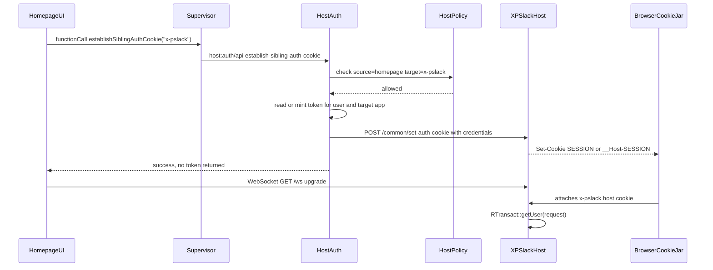

# WebSocket Auth Token Mechanism

## Purpose

`x-pslack` needs an authenticated browser WebSocket because the socket is the user session boundary for private chat. The service needs to know which account owns a socket so it can publish presence, authorize conversation membership, attribute messages, and clean up session state on disconnect.

The current experimental implementation authenticates the WebSocket by retrieving an active query token in Homepage JavaScript and passing it to `x-pslack` as a WebSocket subprotocol. That works, but it exposes a broadly useful root-host-scoped bearer token to app JavaScript.

This document outlines a safer sibling auth cookie approach: Host establishes an `HttpOnly`, host-scoped auth cookie on the `x-pslack` subdomain, then the browser automatically attaches that cookie to the WebSocket upgrade.

## Current Auth Facts

`transact` mints bearer tokens from `POST /login`. The token payload contains:

- `sub`: user account
- `aud`: root host
- `exp`: expiration

The token is not cryptographically scoped to a specific app. If extracted, it is useful as an `Authorization: Bearer ...` credential for services on the same root host that accept psibase query auth.

Host narrows use of that token by where it stores and places it:

- `host:auth` stores active query tokens in Host plugin storage keyed by user and app.
- `/common/set-auth-cookie` sets a browser cookie from an HTTP `Set-Cookie` response.
- The cookie is `HttpOnly`, `SameSite=Strict`, `Path=/`, and host-only.
- On localhost, the cookie name is `SESSION`; otherwise, it is `__Host-SESSION`.

Because the cookie is `HttpOnly`, frontend JavaScript cannot read it. Because it is host-only, a cookie set on `homepage.<root>` is not sent to `x-pslack.<root>`.

## Existing HTTP Query Path

Most app queries do not expose tokens to frontend JavaScript.

For example, Chainmail runs inside the Homepage UI, but its query path is plugin-mediated:

```text
homepage.<root> UI
  -> supervisor.functionCall(chainmail plugin)
  -> chainmail plugin
  -> host:common/server
  -> HTTP request with Authorization injected by Host
  -> chainmail endpoint
```

`host:common` reads the active query token from `host:auth` in privileged plugin code and injects it as an `Authorization` header. App JavaScript only sees the returned query data.

This does not solve `x-pslack` because a browser WebSocket is opened directly:

```text
homepage.<root> UI
  -> new WebSocket("ws://x-pslack.<root>/ws")
  -> x-pslack service
```

The browser WebSocket API does not let JavaScript set an `Authorization` header. Since the request bypasses `host:common`, Host cannot inject the header on the normal HTTP path.

## Proposed Sibling Auth Cookie Flow

The proposed flow keeps bearer tokens out of app JavaScript and uses the existing cookie authentication accepted by `RTransact::getUser`.



Detailed call sequence:

1. `homepage.<root>` calls a new privileged Host API through the supervisor:
   `host:auth/api.establish-sibling-auth-cookie(targetApp = "x-pslack")`.
2. Host determines the active source app and current user from existing host/accounts context.
3. Host checks a global authoritative grant policy for `(source = "homepage", target = "x-pslack")`.
4. Host reads an existing token for the target app/user from its bucket, or mints one with `transact::plugin/auth#get-query-token` in privileged code.
5. Host performs a credentialed request to `https?://x-pslack.<root>/common/set-auth-cookie` with `{ "accessToken": token }`.
6. `x-pslack.<root>` returns `Set-Cookie` for its own host.
7. Browser stores the `x-pslack.<root>` cookie. Frontend JavaScript cannot read it.
8. Homepage opens `new WebSocket("ws://x-pslack.<root>/ws", ["psibase.pslack.v1"])`.
9. The browser sends matching `x-pslack.<root>` cookies on the WebSocket HTTP upgrade automatically.
10. `x-pslack` authenticates the request with `RTransact::getUser(request)`.

## What Is Stored Where

Frontend JavaScript:

- Stores no bearer token.
- Receives only success or failure from `establish-sibling-auth-cookie`.
- Opens a normal WebSocket with the app subprotocol only.

Browser cookie jar:

- Stores `SESSION` on localhost or `__Host-SESSION` otherwise.
- Cookie is scoped to `x-pslack.<root>`.
- Cookie is `HttpOnly`, so app JavaScript cannot read it.
- Cookie is host-only, so it is not sent to `homepage.<root>` or arbitrary sibling services.

Host plugin storage:

- Continues to store active query tokens in Host-owned non-transactional storage keyed by user and app.
- Owns the global sibling-auth grant policy.

`x-pslack` subjective state:

- Stores only active WebSocket session state after authentication.
- Maps socket ids to authenticated accounts.
- Does not store durable chat auth tokens.

## Why The Cookie Is Issued To The Sibling

The WebSocket upgrade request goes to `x-pslack.<root>`, not `homepage.<root>`.

Current auth cookies are host-only. A cookie set for `homepage.<root>` is not sent to `x-pslack.<root>`. To let `RTransact::getUser` authenticate the WebSocket upgrade, the browser must have a matching auth cookie for `x-pslack.<root>`.

A parent-domain cookie would avoid this extra step, but it would weaken the current host-only cookie boundary. This design keeps the current host-scoped cookie model and only asks Host to place a cookie on an approved sibling host.

## Global Grant Policy

The sibling auth API must not allow arbitrary source-target pairs.

The bearer token is broadly useful if extracted, and any host receiving the cookie can authenticate the user for requests to that host. Without Host-enforced policy, two colluding services could use the mechanism to move user auth into a sibling origin the user did not intend to connect.

The initial policy should be a global Host-owned exception:

```text
source: homepage
target: x-pslack
purpose: Homepage-managed x-pslack subapp WebSocket auth
```

This policy should be enforced by Host every time it establishes a sibling auth cookie.

For the first experiment, the policy could be hard-coded or stored in a small Host-owned table. Long term, target package metadata could request the grant, but installation or governance should materialize the effective grant into Host-owned policy. Runtime self-declaration by the source or target app is not sufficient.

## Security Comparison

### Current HTTP Authed Queries

Normal HTTP query auth is strong because app JavaScript never receives the token. Calls go through supervisor/plugin APIs, and `host:common` injects `Authorization` in privileged code.

Security properties:

- Token not readable by app JS.
- Host mediates token access.
- Existing plugin authorization checks still apply.
- Requests are ordinary HTTP, so Host can inject headers.

### Current x-pslack Bearer Subprotocol Workaround

The current WebSocket workaround retrieves a token into Homepage JavaScript and passes it as a WebSocket subprotocol.

Security properties:

- Works with browser WebSocket constraints.
- Avoids CORS preflight problems for `Authorization`.
- But app JS sees a root-host-scoped bearer token.
- If an XSS bug or malicious app path can read that value, the token is more powerful than `x-pslack`-only auth.

### Proposed Sibling Auth Cookie

The sibling cookie approach is closer to the existing HTTP auth model.

Security properties:

- App JS does not receive the bearer token.
- Host performs token read or minting in privileged code.
- Browser stores the token as a host-only `HttpOnly` cookie for `x-pslack.<root>`.
- Browser automatically attaches that cookie to `x-pslack` WebSocket upgrades.
- Host enforces a global source-target grant policy.

Main residual risks:

- The JWT itself remains root-host-scoped if extracted from privileged code or server logs.
- The source-target grant table must be globally authoritative.
- Logout and app disconnect must clear any derived sibling cookies.
- CORS and credential behavior must be verified in browser tests.

## Third-Party Apps

This should not be exposed as a general third-party primitive by default.

The immediate need is unique to Homepage-managed subapps: Homepage is the system shell, and `x-pslack` is a subapp whose implementation service lives on a sibling subdomain. Ordinary apps should not be able to establish auth cookies across arbitrary sibling services.

If third-party cross-domain app composition becomes a supported use case, it should use a formal Host-managed capability model:

- target app declares desired source apps in trusted package metadata;
- source app declares the intended integration;
- user, admin, or package installation approves the pair;
- Host records `(source, target)` in a global policy table;
- Host enforces the table for every sibling auth establishment;
- Host never returns bearer tokens to frontend JavaScript.

Until then, the recommended policy is a narrow system exception for approved Homepage subapps.

## Implementation Sketch

Potential Host API:

```text
host:auth/api.establish-sibling-auth-cookie(targetApp: string) -> Result<(), Error>
```

Validation:

1. Determine `sourceApp = host:common/client.get_active_app()`.
2. Determine `user = accounts:plugin/api.get_current_user()`.
3. Reject if no current user.
4. Check Host-owned policy includes `(sourceApp, targetApp)`.
5. Read existing target token from Host bucket, or mint one with `transact::plugin/auth#get-query-token(targetApp, user)`.
6. Call `host:common/admin.post_with_credentials(targetApp, { endpoint: "/common/set-auth-cookie", body: { accessToken } })`.
7. Return success without returning the token.

`x-pslack` changes:

- Prefer cookie auth through `RTransact::getUser(request)`.
- Remove bearer-token WebSocket subprotocol once sibling cookie auth is proven.
- Keep the `psibase.pslack.v1` app subprotocol.

Frontend changes:

- Before connecting, call `establish-sibling-auth-cookie("x-pslack")`.
- Then call `new WebSocket(siblingWsUrl("x-pslack", "/ws"), ["psibase.pslack.v1"])`.
- Do not request or store an active query token.

## Open Questions

- Should the global policy be hard-coded for the experiment or stored in a Host table immediately?
- Should grants be derived from package metadata during install?
- Should the policy require both source opt-in and target opt-in, or only Host-approved target metadata?
- How should logout clear cookies on all derived sibling targets?
- Should the target endpoint remain `/common/set-auth-cookie`, or should there be a new endpoint whose name makes delegated sibling auth explicit?
